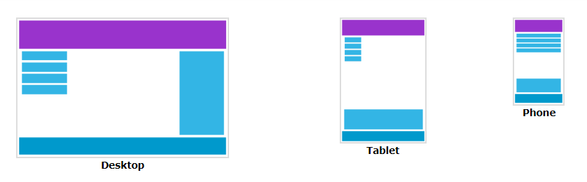

## Responsive Web Design – Introduction

**Content**

1\. What is Responsive Web Design?

2\. Designing for the best experience for all users

3\. References

## 1. What is Responsive Web Design?

-   Responsive web design makes your web page look good on all devices.
-   Responsive web design uses only HTML and CSS.
-   Responsive web design is not a program or a JavaScript.

## 2. Designing for the best experience for all users

-   Web pages can be viewed using many different devices: desktops, tablets, and phones.
-   Your web page should look good, and be easy to use, regardless of the device.
-   Web pages should not leave out information to fit smaller devices, but rather adapt its content to fit any device:

-   It is called responsive web design when you use CSS and HTML to resize, hide, shrink, enlarge, or move the content to make it look good on any screen.

## 3. References

1.  https://www.w3schools.com/css/css_rwd_intro.asp
