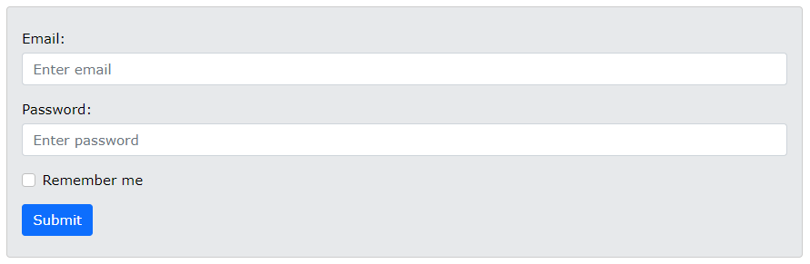

## Bootstrap 5 Forms

**Content**

**1. Stacked Form**

1.1 Form Row/Grid (Inline Forms)

**2. References**

## 1. Stacked Form

-   All textual \<input\> and \<textarea\> elements with class .form-control get proper form styling:

**Example**

\<form action="/action_page.php"\>  
\
  
\<label for="email" class="form-label"\>Email:\</label\>  
\<input type="email" class="form-control" id="email" placeholder="Enter email" name="email"\>  
\</div\>  
\
  
\<label for="pwd" class="form-label"\>Password:\</label\>  
\<input type="password" class="form-control" id="pwd" placeholder="Enter password" name="pswd"\>  
\</div\>  
\
  
\<label class="form-check-label"\>  
\<input class="form-check-input" type="checkbox" name="remember"\> Remember me  
\</label\>  
\</div\>  
\<button type="submit" class="btn btn-primary"\>Submit\</button\>  
\</form\>

-   **Note** that we add a .form-label class to each label element to ensure correct padding.
-   Checkboxes have different markup. They are wrapped around a container element with .form-check, and labels have a class of .form-check-label, while checkboxes and radio buttons use .form-check-input.

## 1.1 Form Row/Grid (Inline Forms)

-   If you want your form elements to appear side by side, use .row and .col:

**Example**

\<form\>  
\
  
\
  
\<input type="text" class="form-control" placeholder="Enter email" name="email"\>  
\</div\>  
\
  
\<input type="password" class="form-control" placeholder="Enter password" name="pswd"\>  
\</div\>  
\</div\>  
\</form\>

**Output**

-   For more information about Forms [clickhere](https://www.w3schools.com/bootstrap5/bootstrap_forms.php).

## 2. References

1.  https://www.w3schools.com/bootstrap5/bootstrap_forms.php
