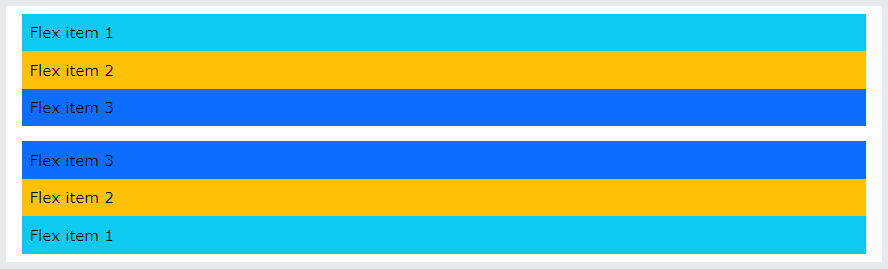

## Flexbox

**Content**

**1. Flexbox**

1.1 Horizontal Direction

1.2 Vertical Direction

1.3 Justify Content

**2. References**

## 1. Flexbox

-   The biggest difference between Bootstrap 3 and Bootstrap 4 & 5 is that Bootstrap 5 now uses flexbox, instead of floats, to handle the layout.
-   To create a flexbox container and to transform direct children into flex items, use the d-flex class:

**Example**

\
  
\
Flex item 1\</div\>  
\
Flex item 2\</div\>  
\
Flex item 3\</div\>  
\</div\>

**Output**

-   To create an inline flexbox container, use the d-inline-flex class:

**Example**

\
  
\
Flex item 1\</div\>  
\
Flex item 2\</div\>  
\
Flex item 3\</div\>  
\</div\>

**Output**

## 1.1 Horizontal Direction

-   Use .flex-row to display the flex items horizontally (side by side). This is default.

**Tip:** Use .flex-row-reverse to right-align the horizontal direction:

**Example**

\
  
\
Flex item 1\</div\>  
\
Flex item 2\</div\>  
\
Flex item 3\</div\>  
\</div\>

\
  
\
Flex item 1\</div\>  
\
Flex item 2\</div\>  
\
Flex item 3\</div\>  
\</div\>

**Output**

## 1.2 Vertical Direction

-   Use .flex-column to display the flex items vertically (on top of each other), or .flex-column-reverse to reverse the vertical direction:

**Example**

\
  
\
Flex item 1\</div\>  
\
Flex item 2\</div\>  
\
Flex item 3\</div\>  
\</div\>

\
  
\
Flex item 1\</div\>  
\
Flex item 2\</div\>  
\
Flex item 3\</div\>  
\</div\>

**Output**

## 1.3 Justify Content

-   Use the .justify-content-\* classes to change the alignment of flex items. Valid classes are start (default), end, center, between or around:

**Example**

\
...\</div\>  
\
...\</div\>  
\
...\</div\>  
\
...\</div\>  
\
...\</div\>

**Output**

-   To know more details about flexbox [Clickhere](https://www.w3schools.com/bootstrap5/bootstrap_flex.php)

## 2. References

https://www.w3schools.com/bootstrap5/bootstrap_flex.php
