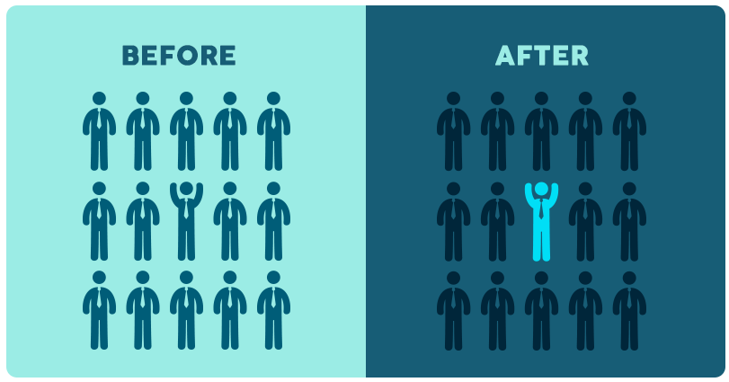

## Visual Hierarchy

Content

**1. What is Visual Hierarchy?**

**2. Visual Hierarchy Principles**

2.1 Size Impacts Visibility

2.2 Perspective Creates an Illusion of Depth

2.3 Color and Contrast Draw Attention

2.4 Fonts Organize Design

2.5 Space Provides Emphasis and Movement

2.6 Proximity Suggests Relationships

2.7 Negative Space Emphasizes

2.8 Alignment Directs Eyes

2.9 Odd-Numbered Groups Create Focus

2.10 Repetition Unifies a Composition

2.11 Lines Suggest Movement

2.12 Grids Organize a Design

**3. References**

## 1. What is Visual Hierarchy?

-   Visual hierarchy is a design principle that refers to how elements are arranged in a design.
-   Visual hierarchy helps designers and developers to lay out each element in a logical manner that helps the visual be digested properly.

## 2. Visual Hierarchy Principles

12 principles of visual hierarchy that every beginner designer needs to know.

-   Principle \#1: Size Impacts Visibility
-   Principle \#2: Perspective Creates an Illusion of Depth
-   Principle \#3: Color and Contrast Draw Attention
-   Principle \#4: Fonts Organize Design
-   Principle \#5: Space Provides Emphasis and Movement
-   Principle \#6: Proximity Suggests Relationships
-   Principle \#7: Negative Space Emphasizes
-   Principle \#8: Alignment Directs Eyes
-   Principle \#9: Odd-Numbered Groups Create Focus
-   Principle \#10: Repetition Unifies a Composition
-   Principle \#11: Lines Suggest Movement
-   Principle \#12: Grids Organize a Design

## 2.1 Size Impacts Visibility

-   Bigger is better, right? While the classic adage is still up for debate, **size** is arguably the most effective way to emphasize visual elements. Simply put, larger elements draw greater attention than smaller elements.

## 2.2 Perspective Creates an Illusion of Depth

-   By utilizing **perspective**, designers can create an illusion of depth ranging from a few inches to several miles. Because we see similar illusions in the real world, we generally perceive larger objects as being closer than similar smaller objects and, therefore, they usually command attention before any other object on a page.

## 2.3 Color and Contrast Draw Attention

-   Just as larger elements are perceived as more important than smaller elements, bright **colors** usually draw greater attention than duller hues. For example, if a single sentence in a block of text is highlighted with a bright color, it immediately grabs readers’ attention.

## 2.4 Fonts Organize Design

-   Think about an outline, a traditional resume or a table of contents. Generally, each is comprised of several **sizes** of type, with major headings in a larger point size than subsections and smaller details. Using a variety of type sizes not only emphasizes what’s most important, but also organizes the overall design of the document.

## 2.5 Space Provides Emphasis and Movement

**Rule of space**

-   One of the most basic tenets of visual composition deals with what you leave out of your design. According to the **Rule of Space**, an aesthetically-pleasing design requires its fair share of clutter-free negative space, often referred to as “white space,” regardless of the design’s actual background color.

## 2.6 Proximity Suggests Relationships

-   **Proximity,** or where elements appear in relation to one another, is one of the most basic elements of composition. Simply speaking, placing related elements close together suggests to readers that they are, in fact, related.

## 2.7 Negative Space Emphasizes

-   Just as grouping items near each other suggests their relation, including **white space** around elements singles them out as separate groups of information. Negative, empty space not only makes information easier for readers to digest by grouping it into compartments, but it also creates focus as it helps eyes zero in on individual items.

## 2.8 Alignment Directs Eyes

-   **Alignment** is part of the structure by which elements are placed in a design. It dictates that visual components, whether they be text or images, are not positioned arbitrarily throughout a composition. For example, a typical page of text is aligned to the left, so that objects share a left margin.

## 2.9 Odd-Numbered Groups Create Focus

-   The **Rule of Odds** allows designers to emphasize particular images by placing them in the center of a group. By placing an equal number of neighboring objects on either side of the main focal point—thus creating an odd-numbered group—the result clearly points to the most important visual element, located in the center.

## 2.10 Repetition Unifies a Composition

-   Think of most published texts. The page designs are organized in such a way that body text is all one font, chapter headings are another and footnotes are a third different font—all consistent throughout the entire publication. This style repetition creates a cohesive work, recognized as a whole.
-   For a unified design, repeat some element—whether it’s font, color, shape or size—throughout the entire composition. Consistent styles help clearly define the visual hierarchy of any design.

## 2.11 Lines Suggest Movement

-   **Movement** is one of the most effective ways to attract viewers’ attention, especially when it’s implied within a still design. Lines are obviously efficient in pointing to items of emphasis—just think about an arrow—but they don’t have to physically appear on the page to do the trick.

## 2.12 Grids Organize a Design

-   The most effective designs are composed through some type of **grid**. The most typical grid is the classic modular composition of crossing vertical and horizontal lines.
-   Artists, photographers and graphic designers have long employed the rule of thirds to improve the overall balance of their compositions. The rule involves mentally dividing a composition into a grid composed of two horizontal and two vertical lines—or nine separate sections.

## 3. References

1.  https://visme.co/blog/visual-hierarchy/
