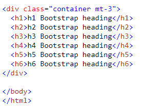
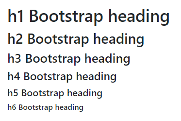
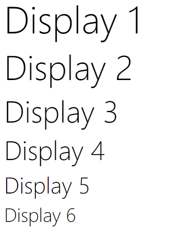
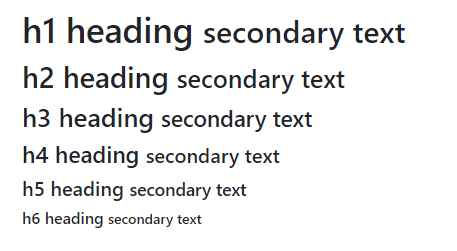

## Bootstrap 5 Text/Typography

**Contents**

1\. Bootstrap 5 Default Settings

1.1 \<h1\> - \<h6\>

1.2 Display Headings

1.3 \<small\>

2\. References

## 1. Bootstrap 5 Default Settings

-   Bootstrap 5 uses a default font-size of 1rem (16px by default), and its line-height is 1.5.
-   In addition, all \<p\> elements have margin-top: 0 and margin-bottom: 1rem (16px by default).

## 1.1 \<h1\> - \<h6\>

-   Bootstrap 5 styles HTML headings (\<h1\> to \<h6\>) with a bolder font-weight and a responsive font-size.

**Example-1**

****

**Output**

-   You can also use .h1 to .h6 classes on other elements to make them behave as headings if you want:

**Example-2**

\
h1 Bootstrap heading\</p\>  
\
h2 Bootstrap heading\</p\>  
\
h3 Bootstrap heading\</p\>  
\
h4 Bootstrap heading\</p\>  
\
h5 Bootstrap heading\</p\>  
\
h6 Bootstrap heading\</p\>

**Output**

## 1.2 Display Headings

-   Display headings are used to stand out more than normal headings (larger font-size and lighter font-weight), and there are six classes to choose from: .display-1 to .display-6:

**Example**

## 1.3 \<small\>

-   In Bootstrap 5 the HTML \<small\> element (and the .small class) is used to create a smaller, secondary text in any heading:

**Example**

-   To know more information about typography [clickhere](https://www.w3schools.com/bootstrap5/bootstrap_typography.php)

## 2. References

1.  https://www.w3schools.com/bootstrap5/bootstrap_typography.php
