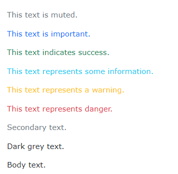
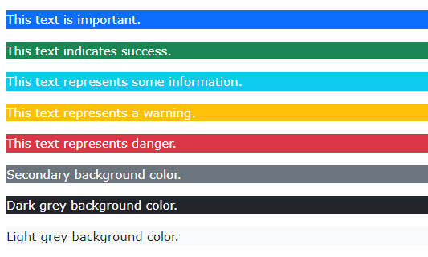

## Bootstrap 5 Colors

**Content**

1\. Text Colors

2\. Background Colors

3\. References

## 1. Text Colors

-   Bootstrap 5 has some contextual classes that can be used to provide "meaning through colors".
-   The classes for text colors are: .text-muted, .text-primary, .text-success, .text-info, .text-warning, .text-danger, .text-secondary, .text-white, .text-dark, .text-body (default body color/often black) and .text-light:

**Example-1**

-   You can also add 50% opacity for black or white text with the .text-black-50 or .text-white-50 classes:

**Example-2**

## 

## 2. Background Colors

-   The classes for background colors are: .bg-primary, .bg-success, .bg-info, .bg-warning, .bg-danger, .bg-secondary, .bg-dark and .bg-light.
-   **Note** that background colors do not set the text color, so in some cases you'll want to use them together with a .text-\* color class.

**Example**

## 3. References

1.  <https://www.w3schools.com/bootstrap5/bootstrap_colors.php>
