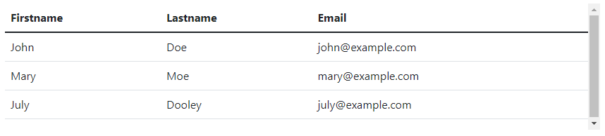
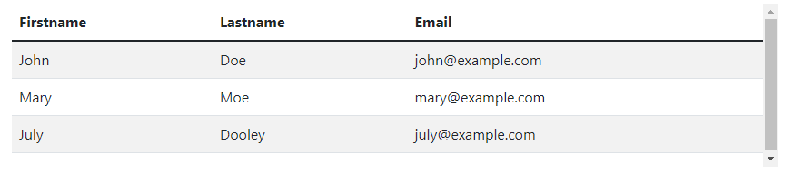
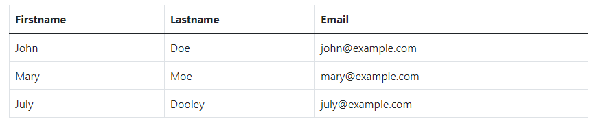

## Bootstrap 5 Tables

**Content**

**1. Basic Table**

1.1 Striped Rows

1.2 Bordered Table

**2. References**

## 1. Basic Table

-   A basic Bootstrap 5 table has a light padding and horizontal dividers.
-   The .table class adds basic styling to a table:

**Example**

## 1.1 Striped Rows

-   The .table-striped class adds zebra-stripes to a table:

**Example**

## 1.2 Bordered Table

-   The .table-bordered class adds borders on all sides of the table and cells:

**Example**

-   For more information about tables [clickhere](https://www.w3schools.com/bootstrap5/bootstrap_tables.php)

## 2. References

1.  https://www.w3schools.com/bootstrap5/bootstrap_tables.php
