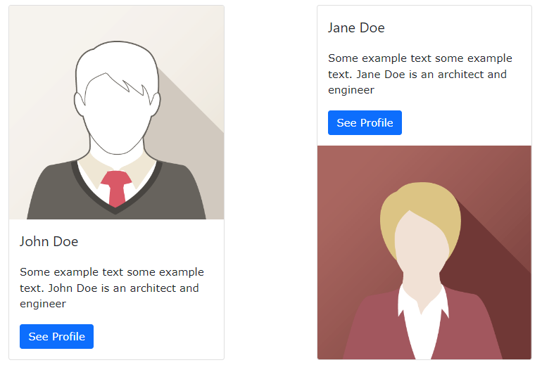

## Bootstrap 5 Cards

**Content**

**1. Cards**

1.1 Basic Card

1.2 Header and Footer

1.3 Card Images

**2. References**

## 1. Cards

-   A card in Bootstrap 5 is a bordered box with some padding around its content.
-   It includes options for headers, footers, content, colors, etc.

## 1.1 Basic Card

-   A basic card is created with the .card class, and content inside the card has a .card-body class:

**Example**

\
  
\
Basic card\</div\>  
\</div\>

**Output**

## 1.2 Header and Footer

-   The .card-header class adds a heading to the card and the .card-footer class adds a footer to the card:

**Example**

\
  
\
Header\</div\>  
\
Content\</div\>  
\
Footer\</div\>  
\</div\>

**Output**

## 1.3 Card Images

-   Add .card-img-top or .card-img-bottom to an \ to place the image at the top or at the bottom inside the card.
-   **Note** that we have added the image outside of the .card-body to span the entire width:

**Example**

\
  
\  
\
  
\<h4 class="card-title"\>John Doe\</h4\>  
\
Some example text.\</p\>  
\<a href="\#" class="btn btn-primary"\>See Profile\</a\>  
\</div\>  
\</div\>

For more information about cards [clickhere](https://www.w3schools.com/bootstrap5/bootstrap_cards.php)

## 2. References

1.  https://www.w3schools.com/bootstrap5/bootstrap_cards.php
