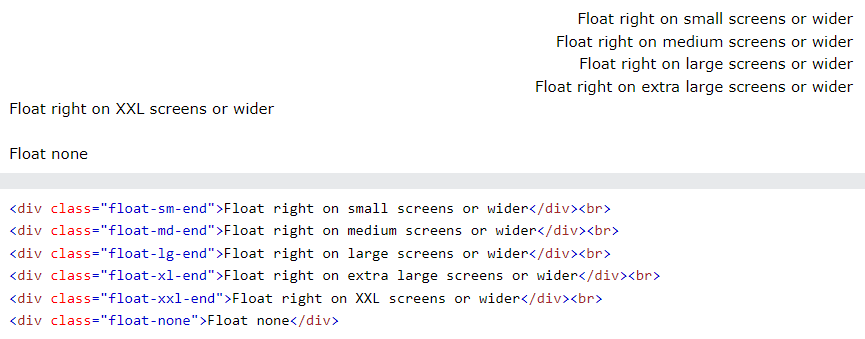
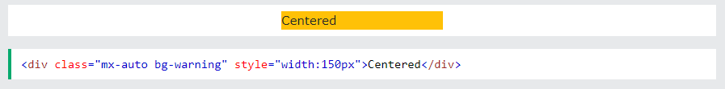
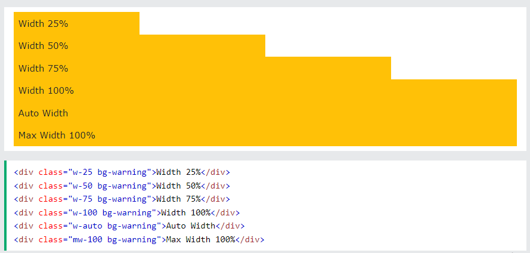
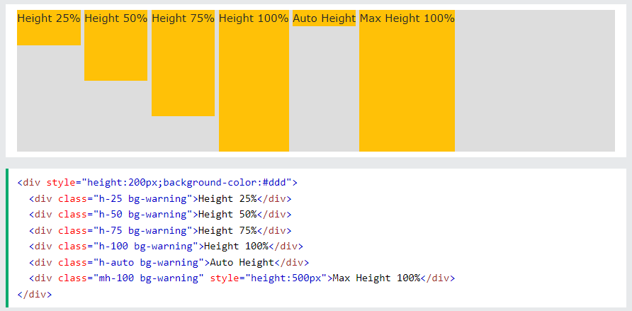
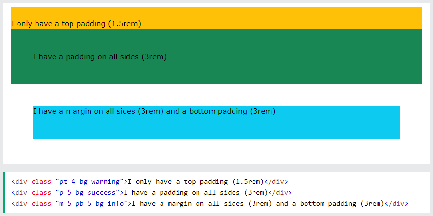

## Bootstrap 5 Utilities

**Content**

**1. Utilities / Helper Classes**

1.1 Responsive Floats

1.2 Center Align

1.3 Width

1.4 Height

1.5 Spacing

**2. References**

## 1. Utilities / Helper Classes

-   Bootstrap 5 has a lot of utility/helper classes to quickly style elements without using any CSS code.

## 1.1 Responsive Floats

-   Float an element to the left or to the right depending on screen width, with the responsive float classes (.float-\*-start\|end - where \* is sm (\>=576px), md (\>=768px), lg (\>=992px), xl (\>=1200px) or xxl (\>=1400px)):

**Example**

## 1.2 Center Align

-   Center an element with the .mx-auto class (adds margin-left and margin-right: auto):

**Example**

## 1.3 Width

-   Set the width of an element with the w-\* classes (.w-25, .w-50, .w-75, .w-100, .mw-auto, .mw-100):

**Example**

## 1.4 Height

-   Set the height of an element with the h-\* classes (.h-25, .h-50, .h-75, .h-100, .mh-auto, .mh-100):

**Example**

## 1.5 Spacing

-   Bootstrap 5 has a wide range of responsive margin and padding utility classes. They work for all breakpoints: xs (\<=576px), sm (\>=576px), md (\>=768px), lg (\>=992px), xl (\>=1200px) or xxl (\>=1400px)):
-   The classes are used in the format: {property}{sides}-{size} for xs and {property}{sides}-{breakpoint}-{size} for sm, md, lg, xl and xxl.

Where *property* is one of:

-   m - sets margin
-   p - sets padding

Where *sides* is one of:

-   t - sets margin-top or padding-top
-   b - sets margin-bottom or padding-bottom
-   s - sets margin-left or padding-left
-   e - sets margin-right or padding-right
-   x - sets both padding-left and padding-right or margin-left and margin-right
-   y - sets both padding-top and padding-bottom or margin-top and margin-bottom
-   blank - sets a margin or padding on all 4 sides of the element

Where *size* is one of:

-   0 - sets margin or padding to 0
-   1 - sets margin or padding to .25rem
-   2 - sets margin or padding to .5rem
-   3 - sets margin or padding to 1rem
-   4 - sets margin or padding to 1.5rem
-   5 - sets margin or padding to 3rem
-   auto - sets margin to auto

**Example**

## 2. References

1.  https://www.w3schools.com/bootstrap5/bootstrap_utilities.php
