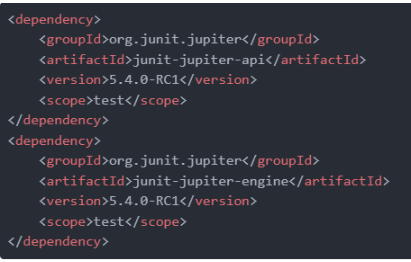
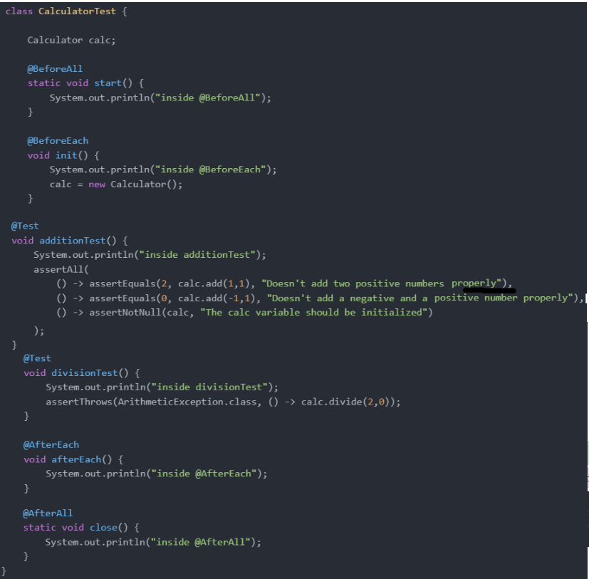
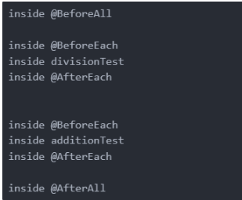

## JUNIT-5

**Contents**

**1. Overview**

**2. Architecture**

2.1. JUnit Platform

2.2. JUnit Jupiter

2.3. JUnit Vintage

**3. Basic Annotations**

3.1. @BeforeAll and @BeforeEach

3.2. @Test, @DisplayName and @Disabled

3.3. @AfterEach and @AfterAll

**4. Assertions**

**5. References**

## 1. Overview

-   **JUnit** is one of the most popular unit-testing frameworks in the Java ecosystem.
-   The JUnit 5 version contains a number of exciting innovations, with **the goal of supporting new features in Java 8 and above**, as well as enabling many different styles of testing.

## 2. Architecture

-   JUnit 5 comprises several different modules from three different sub-projects.

**2.1. JUnit Platform**

-   The platform is responsible for launching testing frameworks on the JVM.

**2.2. JUnit Jupiter**

This module includes new programming and extension models for writing tests in JUnit 5. New annotations in comparison to JUnit 4 are:

-   **@TestFactory** – denotes a method that's a test factory for dynamic tests
-   **@DisplayName** – defines a custom display name for a test class or a test method
-   **@Nested** – denotes that the annotated class is a nested, non-static test class
-   **@Tag** – declares tags for filtering tests
-   **@ExtendWith** – registers custom extensions
-   **@BeforeEach**– denotes that the annotated method will be executed before each test method (previously \*@Before\*)
-   **@AfterEach** – denotes that the annotated method will be executed after each test method (previously \*@After\*)
-   **@BeforeAll** – denotes that the annotated method will be executed before all test methods in the current class (previously \*@BeforeClass\*)
-   **@AfterAll** – denotes that the annotated method will be executed after all test methods in the current class (previously \*@AfterClass\*)
-   **@Disable** – disables a test class or method (previously \*@Ignore\*)

**2.3. JUnit Vintage**

-   JUnit Vintage supports running tests based on JUnit 3 and JUnit 4 on the JUnit 5 platform.

## 3. Basic Annotations

-   To discuss the new annotations, we divided this section into the following groups responsible for execution: before the tests, during the tests (optional), and after the tests:

**3.1. @BeforeAll and @BeforeEach**

-   Below is an example of the simple code to be executed before the main test cases:

**@BeforeAll**

**Static void setup()**

{

log.info("@BeforeAll - executes once before all test methods in this class");

}

**@BeforeEach**

**void init()**

{

log.info("@BeforeEach - executes before each test method in this class");

}

-   It's important to note that the method with the @BeforeAll annotation needs to be static, otherwise the code won't compile.

**3.2. @Test, @DisplayName and @Disabled**

-   Now let's move to new test-optional methods:

@DisplayName("Single test successful")

@Test

**void testSingleSuccessTest()**

{

log.info("Success");

}

@Test

@Disabled("Not implemented yet")

**void testShowSomething()**

{

}

-   As we can see, each test method is annotated with @Test annotation
-   Also, we can change the display name or disable the test method with a comment, using new annotations.

**3.3. @AfterEach and @AfterAll**

-   Finally, let's discuss the methods connected to operations after test execution:

**@AfterEach**

**void tearDown()**

{

log.info("@AfterEach - executed after each test method.");

}

**@AfterAll**

**Static void done()**

{

log.info("@AfterAll - executed after all test methods.");

}

-   Please note that the method with \*@AfterAll\* also needs to be a static method.

## 4. Assertions Methods

-   Assertions have been moved to \*org.junit.jupiter.api.Assertions,\* and have been significantly improved.
-   JUnit 5 comes with many assertion methods. Some of them are just convenience methods that can be easily replaced by an assertEquals() or assertSame() method. However, it's recommended to use these convenience methods instead, for readability and ease of maintenance.
-   For example, the call assertNull(object, message) can be replaced with assertSame(null, object, message), but the former form is recommended.

Let's take a look at the assertions at our disposal. They're generally pretty self-explanatory:

-   assertEquals() and assertNotEquals()
-   assertSame() and assertNotSame()
-   assertFalse() and assertTrue()
-   assertThrows() asserts that the method will throw a given exception, when faced with the return value of the tested method
-   assertArrayEquals(expectedArray, actualArray, optionalMsg) compares the two arrays and passes only if they have the same elements at the same positions, otherwise it fails. If both arrays are null, they are considered equal.
-   Further list of assertions please [click here](https://stackabuse.com/unit-testing-in-java-with-junit-5/)

**Example:** Calculator

-   Installing JUnit is as simple as including the dependencies:

-   We'll use a simple calculator class to demonstrate the basic capabilities of JUnit. Our Calculator class looks like this:

-   To illustrate when each of these methods is executed, we'll add some flavor to our CalculatorTest class, and while we're at it demonstrate the use of the assertThrows() method:

**How to run the program in JUNIT**

-   Right-Click on “Calculator Test” and select Run as JUINT, Which gives us the output of:

## 

## 5. References

1\. https://www.baeldung.com/junit-5

2\. https://stackabuse.com/unit-testing-in-java-with-junit-5/
