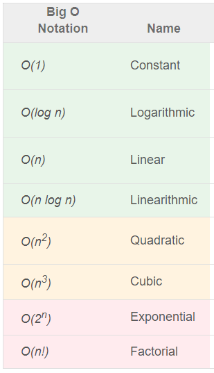

## DS&A: Time Complexity

**Content**

**1. What are Data Structures?**

**2. What is an Algorithm?**

2.1 Why to Learn Data Structure and Algorithms?

2.2 Algorithm Analysis

2.3 Why do we anlyze algorithms?

2.4 Algorithm Complexity

2.5 Space Complexity

2.6 Time Complexity

**3. Asymptotic Notations**

3.1 Big-O Notation (O-notation)

3.1.1 Constant time complexity: O(1)

3.1.2 Linear time complexity: O(n)

3.1.3 Logarithmic time complexity: O(log n)

3.2 Omega Notation (Ω-notation)

3.3 Theta Notation (Θ-notation)

**4. References**

## 1. What are Data Structures?

-   Data structure is a storage that is used to store and organize data.
-   It is a way of arranging data on a computer so that it can be accessed and updated efficiently.

# 2. What is an Algorithm?

-   Algorithm is a step-by-step procedure, which defines a set of instructions to be executed in a certain order to get the desired output.
-   An algorithm can be implemented in more than one programming language.
-   From the data structure point of view, following are some important categories of algorithms −
1.  **Search** − Algorithm to search an item in a data structure.
2.  **Sort** − Algorithm to sort items in a certain order.
3.  **Insert** − Algorithm to insert item in a data structure.
4.  **Update** − Algorithm to update an existing item in a data structure.
5.  **Delete** − Algorithm to delete an existing item from a data structure.

## 2.1 Why to Learn Data Structure and Algorithms?

-   As applications are getting complex and data rich, there are three common problems that applications face now-a-days.
1.  **Data Search**
2.  **Processor speed**
3.  **Multiple requests**
-   To solve the above-mentioned problems, data structures come to rescue. Data can be organized in a data structure in such a way that all items may not be required to be searched, and the required data can be searched almost instantly.

## 2.2 Algorithm Analysis

-   Algorithm analysis is deals with the execution or running time of various operations involved.
-   **Running time** of an operation can be defined as number of computer instructions executed per operation.
-   Efficiency of an algorithm can be analyzed at two different stages, **before implementation** and **after implementation,** as
-   A **priori analysis** – it is defined as theoretical analysis of an algorithm. Efficiency of algorithm is measured by assuming that all factors e.g. speed of processor, are constant and have no effect on implementation.
-   A **posterior analysis** − it is defined as empirical analysis of an algorithm. The chosen algorithm is implemented using programming language. The chosen algorithm is executed on target computer machine. In this analysis, actual statistics like running time and space needed are collected.

## 2.3 Why do we anlyze algorithms?

-   Deciding the efficient algorithm among more than one algorithm.
-   Estimating algorithm performance for different size of the input.
-   Understanding the nature of the code and finding scope for further optimization.

## 2.4 Algorithm Complexity

-   Suppose X is treated as an algorithm and N is treated as the size of input data, the time and space implemented by the Algorithm X are the two main factors which determine the efficiency of X.
-   Time Factor − The time is calculated or measured by counting the number of key operations such as comparisons in sorting algorithm.
-   Space Factor − The space is calculated or measured by counting the maximum memory space required by the algorithm.
-   The complexity of an algorithm f(N) provides the running time and / or storage space needed by the algorithm with respect of N as the size of input data.

## 2.5 Space Complexity

-   Space complexity of an algorithm represents the amount of memory space needed the algorithm in its life cycle.
-   Space needed by an algorithm is equal to the sum of the following two components
-   A **fixed part** that is a space required to store certain data and variables (i.e. simple variables and constants, program size etc.), that are not dependent of the size of the problem.
-   A **variable part** is a space required by variables, whose size is totally dependent on the size of the problem. For example, recursion stack space, dynamic memory allocation etc.
-   Space complexity S(p) of any algorithm p is **S(p) = A + Sp(I)**

Where A is treated as the fixed part

S(I) is treated as the variable part of the algorithm which depends on instance characteristic I.

Following is a simple example that tries to explain the concept

**Algorithm**

SUM(P, Q)

Step 1 - START

Step 2 - R ← P + Q + 10

Step 3 - Stop

-   Here we have three variables P, Q and R and one constant. Hence S(p) = 1+3. Now space is dependent on data types of given constant types and variables and it will be multiplied accordingly.

## 2.6 Time Complexity

-   Time Complexity of an algorithm is the representation of the amount of time required by the algorithm to execute to completion.
-   For example, addition of two n-bit integers takes **n** steps. Consequently, the total computational time is T(n) = c ∗ n, where c is the time taken for the addition of two bits. Here, we can see T(n) grows linearly as the input size increases.

## 3. Asymptotic Notations

-   Asymptotic notations are the mathematical notations used to describe the running time performance of an algorithm when the input tends towards a particular value or a limiting value.
-   Using asymptotic analysis, we can very well conclude the best case, average case, and worst case scenario of an algorithm.
-   Usually, the time required by an algorithm falls under three types −
1.  **Best Case** − Minimum time required for program execution.
2.  **Average Case** − Average time required for program execution.
3.  **Worst Case** − Maximum time required for program execution.

Following are the commonly used asymptotic notations to calculate the running time complexity of an algorithm.

-   Big-O notation
-   Omega notation
-   Theta notation

## 3.1 Big-O Notation (O-notation)

-   Big-O notation represents the upper bound of the running time of an algorithm. Thus, it gives the worst-case complexity of an algorithm.
-   It measures the worst case time complexity or the longest amount of time an algorithm can possibly take to complete.
-   **Popular time complexities in algorithms**

**3.1.1 Constant time complexity: O(1)**

-   Time complexity appears when our algorithm performs a constant numbers of operations.
-   The time complexity does not depend on the input size, i.e., regardless of the input size, the algorithm will have the same runtime. For example the following situation has O(1) time complexity:
1.  A loop or recursion that runs a constant number of times.
2.  If the algorithm doesn’t contain a loop, recursion and call to any other non-constant time function.
-   Best examples: accessing an element in an array, swapping two variables etc.

**3.1.2 Linear time complexity: O(n)**

-   Time complexity appears when we need to process each input in O(1) time. This is the frequently occurring efficient time complexity in coding problems because most of the time, it is usually necessary to access each input element at least once in constant time to get the output.
-   Such time complexity often contains a single loop or a series of single loops. Sometimes, we also find such time complexity in recursive algorithms where we access each element and perform constant operations at each recursion step.
-   Best examples: finding a max element in an array, merging two sorted arrays etc.

**3.1.3 Logarithmic time complexity: O(log n)**

-   A logarithm is the inverse of exponentiation.for example, logn with base 2 means the number of times n must be divided by 2 to get 1.such time complexity appears when input size decreases by some constant factor ( mostly by half) at each step.in such scenario, the algorithm will execute the O(log n) number of operations for the input size n.
-   Best examples: Binary search, divide and conquer solutions similar to binary search, Euclid algorithm of finding GCD etc.
-   To know more information about Big-O notation [clickhere](https://www.enjoyalgorithms.com/blog/time-complexity-analysis-in-data-structure-and-algorithms)

## 3.2 Omega Notation (Ω-notation)

-   Omega notation represents the lower bound of the running time of an algorithm. Thus, it provides the best case complexity of an algorithm.
-   It measures the best case time complexity or the best amount of time an algorithm can possibly take to complete.

## 3.3 Theta Notation (Θ-notation)

-   It represents both the upper and the lower bound of the running time of an algorithm, it is used for analyzing the average-case complexity of an algorithm.

## 4. References

1.  https://www.tutorialspoint.com/time-and-space-complexity-in-data-structure
2.  https://www.enjoyalgorithms.com/blog/time-complexity-analysis-in-data-structure-and-algorithms
