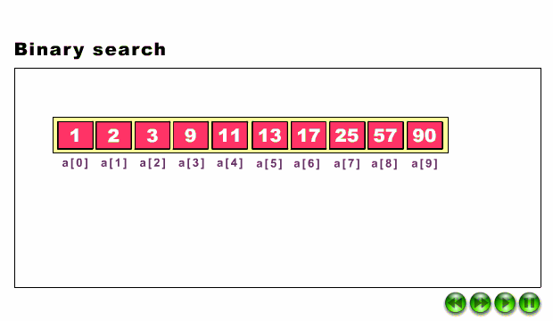
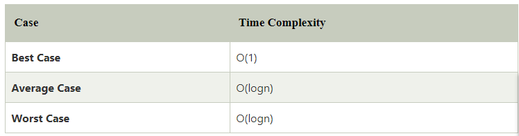

# Binary Search

**Content**

1\. Binary Search

2\. Working Binary Search

3\. Binary Search Algorithm

4\. Binary Search Algorithm implementation

4.1 Iteration Method

4.2 Recursive Method

5\. Working flow of binary search Vs linear search

6\. Binary Search complexity

6.1 Time Complexity

6.2 Space Complexity

7\. References

# 1. Binary Search

-   Binary Search is a searching algorithm for finding an element's position in a sorted array.
-   In this approach, the element is always searched in the middle of a portion of an array.
-   **Binary Search** used in a sorted array by **repeatedly dividing the search interval in half** and the key element is searched in the left or right half of the collection depending on whether the key is less than or greater than the mid element of the collection.
-   Binary search is the most frequently used technique as it is much faster than a linear search.

# 2. Working Binary Search

**NOTE:** Binary search can be implemented on sorted array elements. If the list elements are not arranged in a sorted manner, we have first to sort them.

# 3. Binary Search Algorithm

**Binary_Search(a, lower_bound, upper_bound, val)** // 'a' is the given array, 'lower_bound' is the index of the first array element, 'upper_bound' is the index of the last array element, 'val' is the value to search

**Step 1:** set beg = lower_bound, end = upper_bound, pos = - 1

**Step 2:** repeat steps 3 and 4 while beg **\<**=end

**Step 3:** set mid = (beg + end)/2

**Step 4:** if a[mid] = val

set pos = mid

print pos

go to step 6

else if a[mid] **\>** val

set end = mid - 1

else

set beg = mid + 1

[end of if]

[end of loop]

**Step 5:** if pos = -1

print "value is not present in the array"

[end of if]

**Step 6:** exit

# 4. Binary Search Algorithm implementation

-   Binary Search Algorithm can be implemented in the following two ways
1.  Iterative Method
2.  Recursive Method

**4.1 Iteration Method**

binarySearch(arr, x, low, high)

repeat till low = high

mid = (low + high)/2

if (x == arr[mid])

return mid

else if (x \> arr[mid]) // x is on the right side

low = mid + 1

else // x is on the left side

high = mid – 1

**4.2 Recursive Method**

-   The recursive method follows the divide and conquers approach.

binarySearch(arr, x, low, high)

if low \> high

return False

else

mid = (low + high) / 2

if x == arr[mid]

return mid

else if x \> arr[mid] // x is on the right side

return binarySearch(arr, x, mid + 1, high)

else // x is on the left side

return binarySearch(arr, x, low, mid - 1)

# 5. Working flow of binary search Vs linear search

# 6. Binary Search complexity

Now, let's see the time complexity of Binary search in the best case, average case, and worst case. We will also see the space complexity of Binary search.

**6.1 Time Complexity**

-   **Best Case Complexity -** In Binary search, best case occurs when the element to search is found in first comparison, i.e., when the first middle element itself is the element to be searched. The best-case time complexity of Binary search is **O(1).**
-   **Average Case Complexity -** The average case time complexity of Binary search is **O(logn).**
-   **Worst Case Complexity -** In Binary search, the worst case occurs, when we have to keep reducing the search space till it has only one element. The worst-case time complexity of Binary search is **O(logn).**

    

**6.2 Space Complexity**

-   The space complexity of binary search is O(1).

# 7. References

1.  <https://www.geeksforgeeks.org/binary-search/>
2.  https://www.javatpoint.com/binary-search
