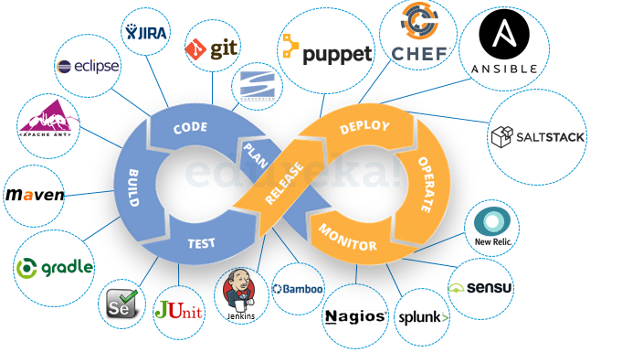

# DevOps

**Content**

1\. DevOps Model Defined

2\. How DevOps Works

3\. Benefits of DevOps

4\. Why DevOps Matters

5\. How to Adopt a DevOps Model

5.1 DevOps Cultural Philosophy

5.2 DevOps Practices Explained

6\. References

## 1. DevOps Model Defined

-   DevOps is the combination of cultural philosophies, practices, and tools that increases an organization’s ability to deliver applications and services at high velocity: evolving and improving products at a faster pace than organizations using traditional software development and infrastructure management processes.
-   This speed enables organizations to better serve their customers and compete more effectively in the market.

## 2. How DevOps Works

-   Under a DevOps model, development and operations teams are no longer “siloed.”
-   Sometimes, these two teams are merged into a single team where the engineers work across the entire application lifecycle, from development and test to deployment to operations, and develop a range of skills not limited to a single function.
-   In some DevOps models, quality assurance and security teams may also become more tightly integrated with development and operations and throughout the application lifecycle.
-   When security is the focus of everyone on a DevOps team, this is sometimes referred to as DevSecOps.
-   These teams use practices to automate processes that historically have been manual and slow.
-   They use a technology stack and tooling which help them operate and evolve applications quickly and reliably.
-   These tools also help engineers independently accomplish tasks (for example, deploying code or provisioning infrastructure) that normally would have required help from other teams, and this further increases a team’s velocity.

## 3. Benefits of DevOps

### 1) Speed

-   Move at high velocity so you can innovate for customers faster, adapt to changing markets better, and grow more efficient at driving business results.

    

### 2) Rapid Delivery

-   Increase the frequency and pace of releases so you can innovate and improve your product faster.
-   The quicker you can release new features and fix bugs, the faster you can respond to your customers’ needs and build competitive advantage.

### 3) Reliability

-   Ensure the quality of application updates and infrastructure changes so you can reliably deliver at a more rapid pace while maintaining a positive experience for end users.
-   Use practices like continuous integration and continuous delivery to test that each change is functional and safe.
-   Monitoring and logging practices help you stay informed of performance in real-time.

### 4) Scale

-   Operate and manage your infrastructure and development processes at scale.
-   Automation and consistency help you manage complex or changing systems efficiently and with reduced risk.

    

### 5) Improved Collaboration

-   Developers and operations teams collaborate closely, share many responsibilities, and combine their workflows.
-   This reduces inefficiencies and saves time.

### 6) Security

-   You can adopt a DevOps model without sacrificing security by using automated compliance policies, fine-grained controls, and configuration management techniques.
-   For example, using infrastructure as code and policy as code, you can define and then track compliance at scale.

## 4. Why DevOps Matters

-   Software and the Internet have transformed the world and its industries, from shopping to entertainment to banking.
-   Software no longer merely supports a business; rather it becomes an integral component of every part of a business.
-   Companies interact with their customers through software delivered as online services or applications and on all sorts of devices.
-   They also use software to increase operational efficiencies by transforming every part of the value chain, such as logistics, communications, and operations.
-   In a similar way that physical goods companies transformed how they design, build, and deliver products using industrial automation throughout the 20th century, companies in today’s world must transform how they build and deliver software.

## 5. How to Adopt a DevOps Model

## 5.1 DevOps Cultural Philosophy

-   Transitioning to DevOps requires a change in culture and mindset.
-   DevOps is about removing the barriers between two traditionally siloed teams, development and operations.
-   In some organizations, there may not even be separate development and operations teams; engineers may do both.
-   With DevOps, the two teams work together to optimize both the productivity of developers and the reliability of operations.
-   They strive to communicate frequently, increase efficiencies, and improve the quality of services they provide to customers.
-   They take full ownership for their services, often beyond where their stated roles or titles have traditionally been scoped by thinking about the end customer’s needs and how they can contribute to solving those needs.
-   Quality assurance and security teams may also become tightly integrated with these teams.
-   Organizations using a DevOps model, regardless of their organizational structure, have teams that view the entire development and infrastructure lifecycle as part of their responsibilities.

## 5.2 DevOps Practices Explained

-   There are a few key practices that help organizations innovate faster through automating and streamlining the software development and infrastructure management processes.
-   Most of these practices are accomplished with proper tooling.
-   One fundamental practice is to perform very frequent but small updates.
-   This is how organizations innovate faster for their customers.
-   These updates are usually more incremental in nature than the occasional updates performed under traditional release practices.
-   Frequent but small updates make each deployment less risky.
-   They help teams address bugs faster because teams can identify the last deployment that caused the error.
-   Although the cadence and size of updates will vary, organizations using a DevOps model deploy updates much more often than organizations using traditional software development practices.
-   Organizations might also use a microservices architecture to make their applications more flexible and enable quicker innovation.
-   The microservices architecture decouples large, complex systems into simple, independent projects.
-   Applications are broken into many individual components (services) with each service scoped to a single purpose or function and operated independently of its peer services and the application as a whole.
-   This architecture reduces the coordination overhead of updating applications, and when each service is paired with small, agile teams who take ownership of each service, organizations can move more quickly.
-   However, the combination of microservices and increased release frequency leads to significantly more deployments which can present operational challenges.
-   Thus, DevOps practices like continuous integration and continuous delivery solve these issues and let organizations deliver rapidly in a safe and reliable manner.
-   Infrastructure automation practices, like infrastructure as code and configuration management, help to keep computing resources elastic and responsive to frequent changes.
-   In addition, the use of monitoring and logging helps engineers track the performance of applications and infrastructure so they can react quickly to problems.

## 6. References

1.  https://aws.amazon.com/devops/what-is-devops/
