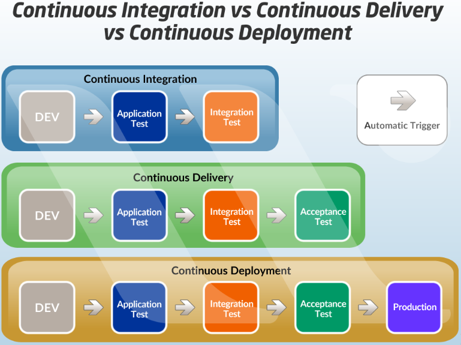

# Continuous integration, deployment and delivery

**Content**

1\. CI/CD Overview

2\. What is continuous integration (CI)?

3\. What is continuous delivery (CD)?

3.1 CI/CD fundamentals

4\. What is continuous deployment?

4.1 The benefits of CI/CD implementation for your company

5\. References

## 1. CI/CD Overview

-   CI/CD falls under DevOps (the joining of development and operations) and combines the practices of continuous integration and continuous delivery.
-   CI/CD automates much or all of the manual human intervention traditionally needed to get new code from a commit into production such as build, test, and deploy, as well as infrastructure provisioning.
-   With a CI/CD pipeline, developers can make changes to code that are then automatically tested and pushed out for delivery and deployment.
-   Get CI/CD right and downtime is minimized and code releases happen faster.

## 2. What is continuous integration (CI)?

-   Continuous integration is the practice of integrating all your code changes into the main branch of a shared source code repository early and often, automatically testing each change when you commit or merge them, and automatically kicking off a build.
-   With continuous integration, errors and security issues can be identified and fixed more easily, and much earlier in the software development lifecycle.
-   By merging changes frequently and triggering automatic testing and validation processes, you minimize the possibility of code conflict, even with multiple developers working on the same application.
-   A secondary advantage is that you don't have to wait long for answers and can, if necessary, fix bugs and security issues while the topic is still fresh in your mind.
-   Common code validation processes start with a static code analysis that verifies the quality of the code.
-   Once the code passes the static tests, automated CI routines package and compile the code for further automated testing.
-   CI processes should have a version control system that tracks changes, so you know the version of the code used.

## 3. What is continuous delivery (CD)?

-   Continuous delivery is a software development practice that works in conjunction with continuous integration to automate the infrastructure provisioning and application release process.
-   Once code has been tested and built as part of the CI process, continuous delivery takes over during the final stages to ensure it can be deployed’s packaged with everything it needs to deploy to any environment at any time.
-   Continuous delivery can cover everything from provisioning the infrastructure to deploying the application to the testing or production environment.
-   With continuous delivery, the software is built so that it can be deployed to production at any time.
-   Then you can trigger the deployments manually or move to continuous deployment where deployments are automated as well.

## 3.1 CI/CD fundamentals

-   There are eight fundamental elements of CI/CD that help ensure maximum efficiency for your development lifecycle.
-   They span development and deployment.
-   Include these fundamentals in your pipeline to improve your DevOps workflow and software delivery:

**1. A single source repository**

-   Source code management (SCM) that houses all necessary files and scripts to create builds.
-   The repository should contain everything needed for the build.
-   This includes source code, database structure, libraries, properties files and version control.
-   It should also contain test scripts and scripts to build applications.

**2. Frequent check-ins to main branch**

-   Integrating code in your trunk, mainline or master branch — i.e. trunk-based development — early and often.
-   Avoid sub-branches and work with the main branch only.
-   Use small segments of code and merge them into the branch as frequently as possible.
-   Don't merge more than one change at a time.

**3. Automated builds**

-   Scripts should include everything you need to build from a single command.
-   This includes web server files, database scripts and application software.
-   The CI processes should automatically package and compile the code into a usable application.

**4. Self-testing builds**

-   Testing scripts should ensure that the failure of a test results in a failed build.
-   Use static pre-build testing scripts to check code for integrity, quality and security compliance.
-   Only allow code that passes static tests into the build.

**5. Frequent iterations**

-   Multiple commits to the repository results in fewer places for conflicts to hide.
-   Make small, frequent iterations rather than major changes.
-   By doing this, it's possible to roll changes back easily if there's a problem or conflict.

**6. Stable testing environments**

-   Code should be tested in a cloned version of the production environment.
-   You can't test new code in the live production version.
-   Create a cloned environment that's as close as possible to the real environment.
-   Use rigorous testing scripts to detect and identify bugs that slipped through the initial pre-build testing process.

**7. Maximum visibility**

-   Every developer should be able to access the latest executables and see any changes made to the repository.
-   Information in the repository should be visible to all.
-   Use version control to manage handoffs, so developers know which is the latest version.
-   Maximum visibility means everyone can monitor progress and identify potential concerns.

**8. Predictable deployments anytime**

-   Deployments are so routine and low-risk that the team’s comfortable doing them anytime.
-   CI/CD testing and verification processes should be rigorous and reliable.
-   This gives the team confidence to deploy updates at any time.
-   Frequent deployments incorporating limited changes also pose lower risks and can be easily rolled back.

## 4. What is continuous deployment?

-   Continuous deployment enables organizations to automatically deploy their applications – eliminating the need for human intervention.
-   With continuous deployment, DevOps teams set the criteria for code releases ahead of time and when those criteria are met and validated, the code is deployed into the production environment.
-   Thanks to this type of automation, organizations are able to be more nimble and get new features into the hands of users faster.

**Is continuous integration needed before implementing continuous deployment?**

-   While you can do continuous integration without continuous delivery or deployment, you can’t really do CD without already having CI in place.
-   That’s because it would be extremely difficult to be able to deploy to production at any time if you aren’t practicing CI fundamentals like integrating code to a shared repo, automating testing and builds, and doing it all in small batches on a daily basis.

## 4.1 The benefits of CI/CD implementation for your company

-   Companies and organizations that adopt CI/CD tend to notice a lot of positive changes.
-   Here are some of the benefits you can look forward to as you implement CI/CD:

**Happier users and customers**

-   Fewer bugs and errors make it into production, so your users and customers have a better experience.
-   This leads to improved levels of customer satisfaction, confidence and reputation.

**Accelerated time-to-value**

-   When you can deploy anytime, you can bring products and new features to market faster.
-   Your development costs are lower, and a faster turnaround frees your team for other work.
-   Customers get results faster and gain a competitive edge.

**Less fire fighting**

-   Testing code more often, in smaller batches, and earlier in the development cycle can seriously cut down on fire drills.
-   This results in a smoother development cycle and less team stress.
-   Results are more predictable, and it's easier to find and fix bugs.

**Hit dates more reliably**

-   Removing deployment bottlenecks and making deployments predictable can remove a lot of the uncertainty around hitting key dates.
-   Breaking work into smaller, manageable bites means it's easier to complete each stage on time and track progress.
-   This approach gives plenty of time to monitor overall progress and determine completion dates more accurately.

**Free up developers’ time**

-   With more of the deployment process automated, the team has time for more rewarding projects.
-   It's estimated that developers spend between 35% and 50% of their time testing, validating and debugging code.
-   By automating these processes, developers significantly improve their productivity.

**Less context switching**

-   Getting real-time feedback on the code developers commit makes it easier to work on one thing at a time and minimize cognitive load.
-   By working with small sections of code that are automatically tested, developers can debug code quickly while their minds are still fresh from programming.
-   Finding bugs is easier because there's less code to review.

**Reduce burnout**

-   Research shows that continuous delivery measurably reduces deployment pain and team burnout.
-   Developers experience less frustration and strain when working with CI/-CD processes.
-   This directly leads to happier and healthier employees and less burnout.

**Recover faster**

-   CI/CD makes it easier to fix issues and recover from incidents (MTTR).
-   Continuous deployment practices mean frequent small software updates so when bugs appear, it's easier to pin them down.
-   Developers have the option of fixing bugs quickly or rolling back the change so that the customer can get back to work quickly.

## 5. References

1.  https://about.gitlab.com/topics/ci-cd/
