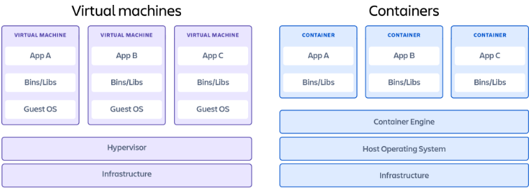

# Containers vs. Virtual Machines

**Content**

1\. Containers vs. Virtual Machines

2\. What is a Container?

2.1 Pros

2.2 Cons

2.3 Popular Container Providers

3\. What is a virtual machine?

3.1 Pros

3.2 Cons

3.3 Popular virtual machine providers

4\. Which option is better for you?

5\. References

## 1. Containers vs. Virtual Machines

-   Containers and virtual machines are very similar resource virtualization technologies.
-   Virtualization is the process in which a system singular resource like RAM, CPU, Disk, or Networking can be ‘virtualized’ and represented as multiple resources.
-   The key differentiator between containers and virtual machines is that virtual machines virtualize an entire machine down to the hardware layers and containers only virtualize software layers above the operating system level.

## 2. What is a Container?

-   Containers are lightweight software packages that contain all the dependencies required to execute the contained software application.
-   These dependencies include things like system libraries, external third-party code packages, and other operating system level applications.
-   The dependencies included in a container exist in stack levels that are higher than the operating system.

## 2.1 Pros

**1) Iteration speed**

-   Containers are lightweight and only include high level software, they are very fast to modify and iterate on.

**2) Robust ecosystem**

-   Most container runtime systems offer a hosted public repository of pre-made containers.
-   These container repositories contain many popular software applications like databases or messaging systems and can be instantly downloaded and executed, saving time for development teams

## 2.2 Cons

**1) Shared host exploits**

-   Containers all share the same underlying hardware system below the operating system layer, it is possible that an exploit in one container could break out of the container and affect the shared hardware.
-   Most popular container runtimes have public repositories of pre-built containers.
-   There is a security risk in using one of these public images as they may contain exploits or may be vulnerable to being hijacked by nefarious actors.

## 2.3 Popular Container Providers

**1) Docker**

-   Docker is the most popular and widely used container runtime.
-   Docker Hub is a giant public repository of popular containerized software applications.
-   Containers on Docker Hub can instantly downloaded and deployed to a local Docker runtime.

**2) RKT**

-   Pronounced "Rocket", RKT is a security-first focused container system.
-   RKT containers do not allow insecure container functionality unless the user explicitly enables insecure features.
-   RKT containers aim to address the underlying cross contamination exploitive security issues that other container runtime systems suffer from.

**3) Linux Containers (LXC)**

-   The Linux Containers project is an open-source Linux container runtime system.
-   LXC is used to isolate operating, system-level processes from each other.
-   Docker actually uses LXC behind the scenes.
-   Linux Containers aim to offer a vender neutral open-source container runtime.

**4) CRI-O**

-   CRI-O is an implementation of the Kubernetes Container Runtime Interface (CRI) that allows the use of Open Container Initiative (OCI) compatible runtimes.
-   It is a lightweight alternative to using Docker as the runtime for Kubernetes.

## 3. What is a virtual machine?

-   Virtual machines are heavy software packages that provide complete emulation of low level hardware devices like CPU, Disk and Networking devices.
-   Virtual machines may also include a complementary software stack to run on the emulated hardware.
-   These hardware and software packages combined produce a fully functional snapshot of a computational system.

## 3.1 Pros

**1) Full isolation security**

-   Virtual machines run in isolation as a fully standalone system.
-   This means that virtual machines are immune to any exploits or interference from other virtual machines on a shared host.
-   An individual virtual machine can still be hijacked by an exploit but the exploited virtual machine will be isolated and unable to contaminate any other neighboring virtual machines.

**2) Interactive development**

-   Containers are usually static definitions of the expected dependencies and configuration needed to run the container.
-   Virtual machines are more dynamic and can be interactively developed.
-   Once the basic hardware definition is specified for a virtual machine the virtual machine can then be treated as a bare bones computer.
-   Software can manually be installed to the virtual machine and the virtual machine can be snapshotted to capture the current configuration state.
-   The virtual machine snapshots can be used to restore the virtual machine to that point in time or spin up additional virtual machines with that configuration.

## 3.2 Cons

**1) Iteration speed**

-   Virtual machines are time consuming to build and regenerate because they encompass a full stack system.
-   Any modifications to a virtual machine snapshot can take significant time to regenerate and validate they behave as expected.

**2) Storage size cost**

-   Virtual machines can take up a lot of storage space.
-   They can quickly grow to several gigabytes in size.
-   This can lead to disk space shortage issues on the virtual machines host machine.

## 3.3 Popular virtual machine providers

**1) Virtualbox**

-   Virtualbox is a free and open source x86 architecture emulation system owned by Oracle.
-   Virtualbox is one of the most popular and established virtual machine platforms with an ecosystem of supplementary tools to help develop and distribute virtual machine images.

**2) VMware**

-   VMware is a publicly traded company that has built its business on one of the first x86 hardware virtualization technologies.
-   VMware comes included with a hypervisor which is a utility that will deploy and manage multiple virtual machines.
-   VMware has robust UI for managing virtual machines.
-   VMware is a great enterprise virtual machine option offering support.

**3) QEMU**

-   QEUM is the most robust hardware emulation virtual machine option.
-   It has support for any generic hardware architecture.
-   QEMU is a command line only utility and does not offer a graphical user interface for configuration or execution.
-   This trade-off makes QEMU one of the fastest virtual machine options.

## 4. Which option is better for you?

-   If you have specific hardware requirements for your project, or you are developing on one hardware platform and need to target another like Windows vs MacOS, you will need to use a virtual machine.
-   Most other 'software only' requirements can be met by using containers.

## 5. References

1.  https://www.atlassian.com/microservices/cloud-computing/containers-vs-vms
