# Docker Commands

**Content**

1\. Docker Commands

2\. References

## 1. Docker Commands

-   Some of the basic docker commands are listed below
1.  docker –version
2.  docker pull
3.  docker run
4.  docker ps
5.  docker ps -a
6.  docker exec
7.  docker stop
8.  docker kill
9.  docker images
10. docker rm
11. docker rmi
12. docker build
13. docker commit
14. docker login
15. docker push

## 1.1 docker –version

-   This command is used to get the currently installed version of docker.

    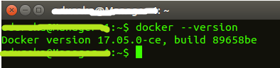

## 1.2 docker pull

-   This command is used to pull images from the **docker repository**(hub.docker.com).

    **Usage: docker pull \<image name\>**

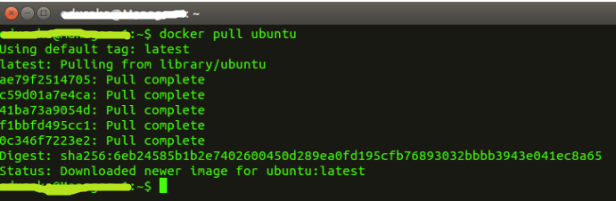

## 1.3 docker run

-   This command is used to create a container from an image.

    **Usage: docker run -it -d \<image name\>**

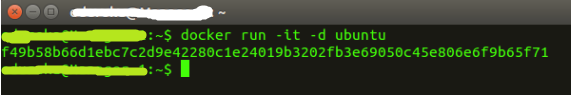

## 1.4 docker ps

-   This command is used to list the running containers.

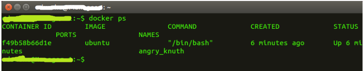

## 1.5 docker ps -a

-   This command is used to show all the running and exited containers.

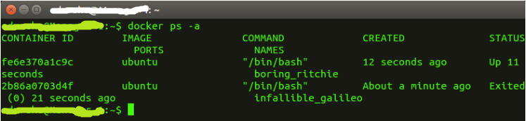

## 1.6 docker exec

-   This command is used to access the running container.

    **Usage: docker exec -it \<container id\> bash**

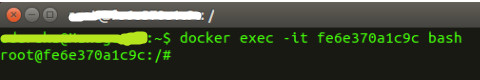

## 1.7 docker stop

-   This command stops a running container.

    **Usage: docker stop \<container id\>**

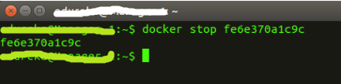

## 1.8 docker kill

-   This command kills the container by stopping its execution immediately.
-   The difference between ‘docker kill’ and ‘docker stop’ is that ‘docker stop’ gives the container time to shutdown gracefully, in situations when it is taking too much time for getting the container to stop, one can option to kill it.

    **Usage: docker kill \<container id\>**

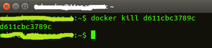

## 1.9 docker images

-   This command lists all the locally stored docker images.

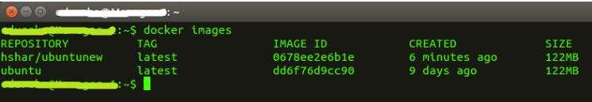

## 1.10 docker rm

-   This command is used to delete a stopped container.

    **Usage: docker rm \<container id\>**

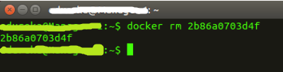

## 1.11 docker rmi

-   This command is used to delete an image from local storage.

    **Usage: docker rmi \<image-id\>**

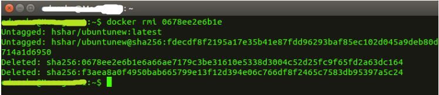

## 1.12 docker build

-   This command is used to build an image from a specified docker file.

    **Usage: docker build \<path to docker file\>**

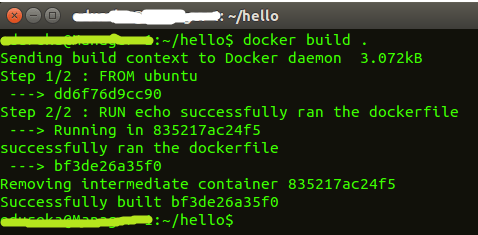

## 1.13 docker commit

-   This command creates a new image of an edited container on the local system.

    **Usage: docker commit \<conatainer id\> \<username/imagename\>**

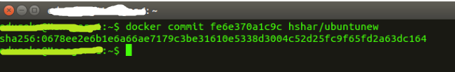

## 1.14 docker login

-   This command is used to login to the docker hub repository.

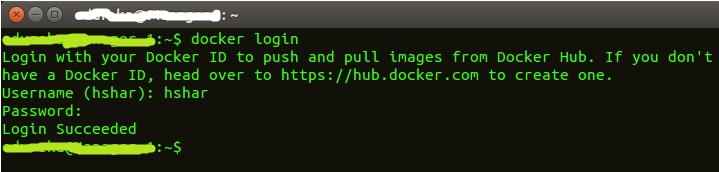

## 1.15 docker push

-   This command is used to push an image to the docker hub repository.

**Usage: docker push \<username/image name\>**

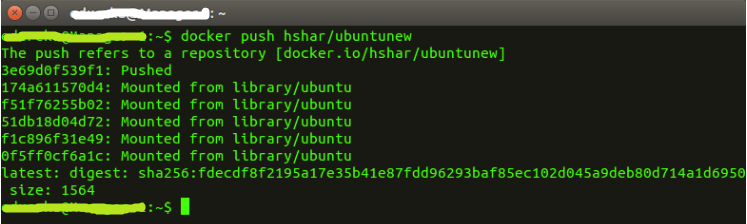

## 2. References

1.  https://www.edureka.co/blog/docker-commands/
