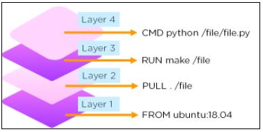
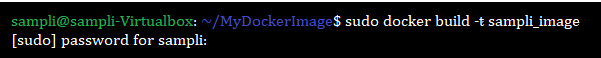

# DockerFile

**Content**

1\. Docker Image

2\. Dockerfile

3\. List of Docker Commands for Creating a Dockerfile

4\. Some of the most common Docker commands

5\. How to Build a Docker Image and Docker Container Using Dockerfile?

6\. Build a Docker Image with Dockerfile

7\. References

## 1. Docker Image

-   A Docker Image is a read-only file with a bunch of instructions.
-   When these instructions are executed, it creates a Docker container.

## 2. Dockerfile

-   Dockerfile is a simple text file that consists of instructions to build Docker images.

**Syntax**

\# comments

command argument argument1...

**Example**

\# Print "Get Certified. Get Ahead"

Run echo "Get Certified. Get Ahead"

## 3. List of Docker Commands for Creating a Dockerfile

-   Dockerfile consists of specific commands that guide you on how to build a specific Docker image.
-   The specific commands you can use in a dockerfile are: FROM, PULL, RUN, and CMD.
1.  FROM - Creates a layer from the ubuntu:18.04
2.  PULL - Adds files from your Docker repository
3.  RUN - Builds your container
4.  CMD - Specifies what command to run within the container

**Example of the dockerfile with the important commands**

FROM ubuntu:18.04

PULL. /file

RUN make /file

CMD python /file/file.py

-   Have a look at the diagrammatic representation of how a dockerfile looks in a docker image:

## 4. Some of the most common Docker commands

**1) ENTRYPOINT**

-   It allows specifying a command along with the parameters.

**Syntax**

ENTRYPOINT application "arg, arg1".

**Example**

ENTRYPOINT echo "Hello, \$name".

**2) ADD**

-   ADD command helps in copying data into a Docker image.

**Syntax**

ADD /[source]/[destination]

**Example**

ADD /root_folder/test_folder

**3) ENV**

-   ENV provides default values for variables that can be accessed within the container.

**Syntax**

ENV key value

**Example**

ENV value_1

**4) MAINTAINER**

-   MAINTAINER declares the author field of the images.

**Syntax**

MAINTAINER [name]

**Example**

MAINTAINER author_name

## 5. How to Build a Docker Image and Docker Container Using Dockerfile?

**Step1:**

-   You should create a directory in order to store all the Docker images you build.
-   We will create a directory named ‘samplidocker’ with the command: **mkdir samplidocker**

**Step2:**

-   Move Docker image into that directory and create a new empty file (Dockerfile) in it:

**cd samplidocker**

**touch Dockerfile**

**Step3:**

-   Open the file with the editor.
-   In this example, we opened the file using vi: **vi Dockerfile**

**Step 4:**

-   Add the following commands:

**FROM ubuntu**

**MAINTAINER sampli**

**RUN apt-get update**

**CMD ["echo", "Welcome to Samplilearn"]**

**Step 5:**

-   Save and exit the file.

## 6. Build a Docker Image with Dockerfile

-   Build a basic image using a Dockerfile: **docker build [location of your dockerfile]**
-   By adding -t flag, the new image can be tagged with a name: **docker build -t sampli_image**

-   Once the Docker image is created, you can verify by executing the command: **docker images**
-   The output should show sampli_docker available in the repository.

## 7. References

1.  https://www.simplilearn.com/tutorials/docker-tutorial/what-is-dockerfile
