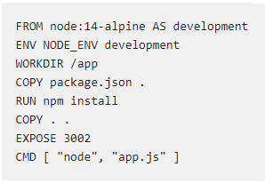

# Dockerfile Best Practices

**Content**

1\. Dockerfile Best Practices

2\. Some of the Best Practices

‍2.1 Do not use your Dockerfile as a build script

‍2.2 Use ENV to define environment variables

‍2.3 Commit your Dockerfile to the repository

2.4 Be mindful of your base image and its size

‍2.5 Do not expose secrets

‍2.6 Be mindful of which ports are exposed

3\. Example for Best Practices

4\. References

## 1. Dockerfile Best Practices

-   Dockerfiles, as simple as they may seem, are super complex from a developer’s perspective.
-   They must be documented with enough details so that anyone can run them and get a working container in the end.
-   Comprehensive documentation of development processes is also a best practice, especially if your team (or organization) has more than one developer working on code simultaneously.

## 2. Some of the Best Practices

## ‍2.1 Do not use your Dockerfile as a build script

-   A Dockerfile is a set of instructions that can be used to create a custom image.
-   It should never be used as a build script because it will make your builds unnecessarily long.
-   When you must compile or bundle software in your Dockerfile, you should use the ADD instruction.
-   This will copy the files necessary for compilation into the image before it starts running commands.
-   This will let you keep the Dockerfile short and manage any dependencies required for compilation separately from the Dockerfile.

## ‍2.2 Use ENV to define environment variables

-   Setting environment variables is a best practice for Dockerfiles.
-   Although it might seem like a small detail, defining your environment variables will make your containers more portable.
-   This is because your environment variables are the only thing that can change from one execution to the next.
-   Note that Docker containers are an abstraction of the software application, meaning that you can’t change anything about the Linux operating system within the container without changing the host system’s operating system.
-   If you have a variable that must be different both inside and outside of your container, then you must define it using ENV.

## ‍2.3 Commit your Dockerfile to the repository

-   One of the best practices of Dockerfiles is committing them to your repository.
-   This lets you easily and quickly reference it later without remembering all of the commands that you used or what their order was.

## ‍2.4 Be mindful of your base image and its size

-   One of the most important things to consider when creating your Dockerfile is the base image that you’re using.
-   It will increase your Docker image's size if you have a lot of extraneous code.
-   This will make it much slower for your container to start up or, even worse, prevent it from starting at all.
-   The best way to avoid this is by being mindful of which packages and scripts you use.
-   If it doesn’t seem necessary to include it in the base image, try and find a way to install it when the container starts up instead.
-   This will save space on your container, thus making it run more quickly and efficiently.

## ‍2.5 Do not expose secrets

-   Never share or copy the application credentials or any sensitive information in the Dockerfile.
-   Instead, use the **.dockerignore** file to prevent copying files that might contain sensitive information.
-   The .dockerignore file acts as equivalent to the .gitignore file, and it lets you specify the files that you want the build process to ignore.

## ‍2.6 Be mindful of which ports are exposed

-   When designing your Dockerfile, make sure that you know which ports are exposed.
-   By default, Docker will expose all of the containers to a range of random internal ports.
-   This is problematic, as it can expose critical services to the outside world and leave them open for attack.
-   If you’re using a service that must be exposed to the public internet, then you must create an entry in the Dockerfile.
-   This is done by adding 'EXPOSE' in your Dockerfile.

## 3. Example for Best Practices

**FROM node:14**-**alpine AS development**

-   From the base image node, with the version 14-alpine variant.
-   We’re essentially using Node:14-alpine as the template for our image.

**ENV NODE_ENV development**

-   NODE_ENV is a system environment variable that Node exposes to running scripts.
-   It’s used by convention to determine dev-vs-prod behavior.
-   Here we have set it to development.

**WORKDIR /app**

-   We’re setting up the working directory in the container to /app.
-   We’re mentioning that the directory called app is going to hold our project [files and all of the related things].

**COPY package.json .**

-   We’re copying our package.json file to know the dependencies.

**RUN npm install**

-   This command installs all of the dependencies mentioned in our package.json file.

**COPY . .**

-   We copy all of the contents from our current working directory in the Docker image.

**EXPOSE 3002**

-   We’re specifying to expose the port 3002.

**CMD [“node”, “app.js”]**

-   We’re specifying to run the application with the command ‘node app.js’.
-   A final best practice to remember is to keep your Dockerfile as simple as possible.
-   Don't try to add unnecessary complexity.
-   You should make it so simple that the other developer can easily understand and execute it without any help.

## 4. References

1.  https://harness.io/blog/best-practices-for-docker
