# Docker Cheat Sheet

**Content**

**1. Docker Cheat Sheet**

1.1 Container Management CLIs

1.2 Inspecting the Container

1.3 Interacting with Container

1.4 Image Management Commands

1.5 Builder Main Commands

**2. Docker-Compose**

2.1 Basic Example

2.2 Docker Compose Commands

2.3 Reference-Building

2.4 Ports

2.5 Commands to Exceute

2.6 Environment Variables

2.7 Dependencies

2.8 Other options

**3. References**

## 1. Docker Cheat Sheet

## 1.1 Container Management CLIs

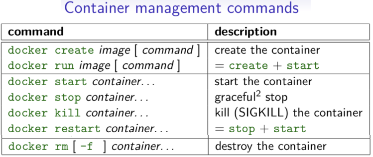

**Note:**

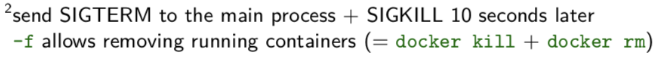

## 1.2 Inspecting the Container

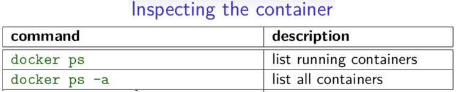

## 1.3 Interacting with Container

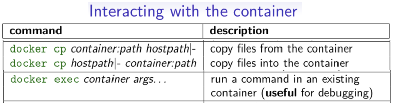

## 1.4 Image Management Commands

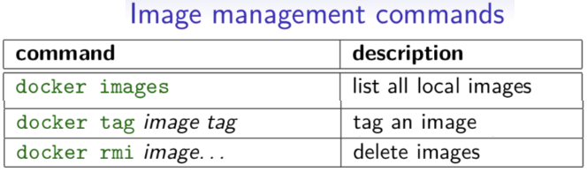

## 1.5 Builder Main Commands

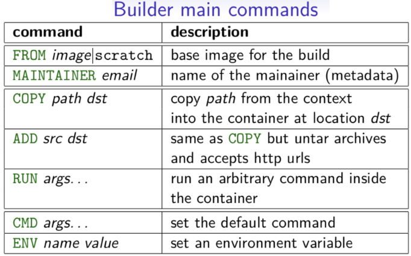

## 2. Docker-Compose

## 2.1 Basic Example

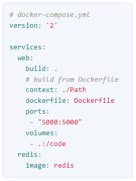

## 2.2 Docker Compose Commands

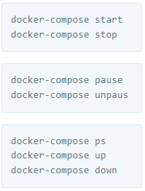

## 2.3 Reference-Building

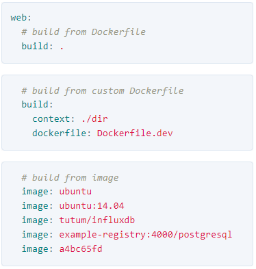

## 2.4 Ports

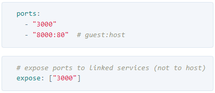

## 2.5 Commands to Exceute

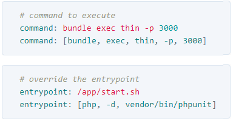

## 2.6 Environment Variables

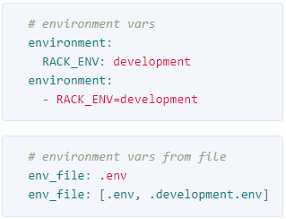

## 2.7 Dependencies

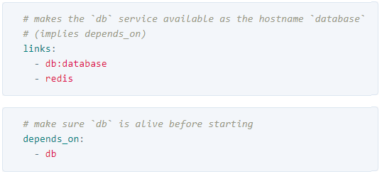

## 2.8 Other options

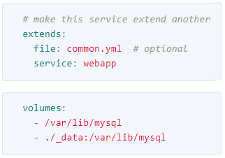

## 3. References

1.  https://dockerlabs.collabnix.com/docker/cheatsheet/
