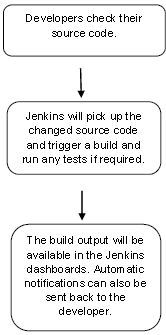
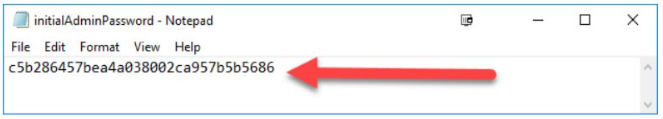
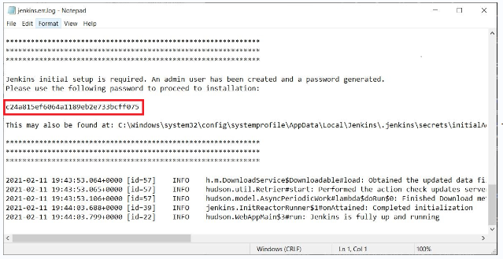
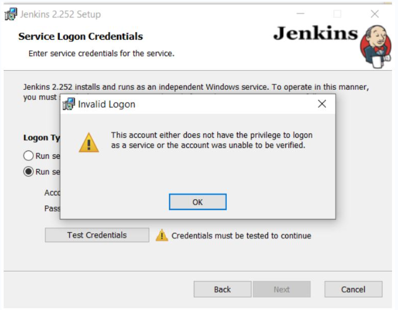

# JENKINS

**Content**

**1. What is Jenkins?**

1.1 Work Flow

1.2 History of Jenkins

1.3 What is Continuous Integration?

1.4 Continuous Integration with Jenkins

1.5 Advantages and Disadvantages of using Jenkins

**2. Installing Jenkins**

2.1 Prerequisites

**2.2 Installation steps using Windows MSI installer**

2.2.1 Post-installation setup wizard

2.2.2 Customizing Jenkins with plugins

2.2.3 Creating the first administrator user

2.2.4 Troubleshooting Windows Installation

**2.3 WAR files**

2.3.1 Installation steps using WAR file

2.3.2 Post-installation setup wizard

2.3.3 Customizing Jenkins with plugins

2.3.4 Creating the first administrator user

3\. References

## 1. What is Jenkins?

-   Jenkins is an open source automation tool written in Java programming language that allows continuous integration.
-   Jenkins **builds** and **tests** our software projects which continuously making it easier for developers to integrate changes to the project, and making it easier for users to obtain a fresh build.
-   It also allows us to continuously **deliver** our software by integrating with a large number of testing and deployment technologies.
-   Jenkins offers a straight forward way to set up a continuous integration or continuous delivery environment for almost any combination of languages and source code repositories using pipelines, as well as automating other routine development tasks.
-   With the help of Jenkins, organizations can speed up the software development process through automation.
-   Jenkins adds development life-cycle processes of all kinds, including build, document, test, package, stage, deploy static analysis and much more.
-   Jenkins achieves CI (Continuous Integration) with the help of plugins.
-   Plugins is used to allow the integration of various DevOps stages.
-   If you want to integrate a particular tool, you have to install the plugins for that tool. For example: Maven 2 Project, Git, HTML Publisher, Amazon EC2, etc.
-   **For example:** If any organization is developing a project, then **Jenkins** will continuously test your project builds and show you the errors in early stages of your development.

Possible steps executed by Jenkins are for example:

-   Perform a software build using a build system like Gradle or Maven Apache
-   Execute a shell script
-   Archive a build result
-   Running software tests

## 1.1 Work Flow

## 1.2 History of Jenkins

-   Kohsuke Kawaguchi, who is a Java developer, working at SUN Microsystems, was tired of building the code and fixing errors repetitively.
-   In 2004, he created an automation server called **Hudson** that automates build and test task.
-   In 2011, Oracle who owned Sun Microsystems had a dispute with Hudson open source community, so they forked Hudson and renamed it as **Jenkins**.
-   Both Hudson and Jenkins continued to operate independently.
-   But in short span of time, Jenkins acquired a lot of contributors and projects while Hudson remained with only 32 projects. Then with time, Jenkins became more popular, and Hudson is not maintained anymore.

## 1.3 What is Continuous Integration?

-   Continuous Integration *(CI)* is a development practice in which the developers are needs to commit changes to the source code in a shared repository at regular intervals.
-   Every commit made in the repository is then built. This allows the development teams to detect the problems early.
-   Continuous integration requires the developers to have regular builds.
-   The general practice is that whenever a code commit occurs, a build should be triggered.

## 1.4 Continuous Integration with Jenkins

-   Let's consider a scenario where the complete source code of the application was built and then deployed on test server for testing. It sounds like a perfect way to *develop software*, but this process has many problems.
1.  Developer teams have to wait till the complete software is developed for the test results.
2.  There is a high prospect that the test results might show multiple bugs.
3.  It was tough for developers to locate those bugs because they have to check the entire source code of the application.
4.  It slows the software delivery process.
5.  Continuous feedback pertaining to things like architectural or coding issues, build failures, test status and file release uploads was missing due to which the quality of software can go down.
6.  The whole process was manual which increases the threat of frequent failure.
-   It is obvious from the above stated problems that not only the software delivery process became slow but the quality of software also went down. This leads to customer dissatisfaction.
-   So to overcome such problem there was a need for a system to exist where developers can continuously trigger a build and test for every change made in the source code.
-   This is what Continuous Integration (CI) is all about. Jenkins is the most mature Continuous Integration tool available so let us see how Continuous Integration with Jenkins overcame the above shortcomings.
-   Let's see a generic flow diagram of Continuous Integration with Jenkins:

**Let's see how Jenkins works**. The above diagram is representing the following functions:

-   First of all, a developer commits the code to the source code repository. Meanwhile, the Jenkins checks the repository at regular intervals for changes.
-   Soon after a commit occurs, the Jenkins server finds the changes that have occurred in the source code repository. Jenkins will draw those changes and will start preparing a new build.
-   If the build fails, then the concerned team will be notified.
-   If built is successful, then Jenkins server deploys the built in the test server.
-   After testing, Jenkins server generates a feedback and then notifies the developers about the build and test results.
-   It will continue to verify the source code repository for changes made in the source code and the whole process keeps on repeating.

## 1.5 Advantages and Disadvantages of using Jenkins

**Advantages of Jenkins**

-   It is an open source tool.
-   It is free of cost.
-   It does not require additional installations or components. Means it is easy to install.
-   Easily configurable.
-   It supports 1000 or more plugins to ease your work. If a plugin does not exist, you can write the script for it and share with community.
-   It is built in java and hence it is portable.
-   It is platform independent. It is available for all platforms and different operating systems. Like OS X, Windows or Linux.
-   Jenkins also supports cloud based architecture so that we can deploy Jenkins in cloud based platforms.

**Disadvantages of Jenkins**

-   Its interface is out dated and not user friendly compared to current user interface trends.
-   Not easy to maintain it because it runs on a server and requires some skills as server administrator to monitor its activity.
-   CI regularly breaks due to some small setting changes. CI will be paused and therefore requires some developer's team attention.

## 2. Installing Jenkins

## 2.1 Prerequisites

Minimum hardware requirements:

-   256 MB of RAM
-   1 GB of drive space (although 10 GB is a recommended minimum if running Jenkins as a Docker container)

Software requirements:

-   Java: Jenkins requires Java 11 or 17 since Jenkins 2.357 and LTS 2.361.1.
-   Web browser: see the [Web Browser Compatibility](https://www.jenkins.io/doc/administration/requirements/web-browsers) page
-   For Windows operating system: [Windows Support Policy](https://www.jenkins.io/doc/administration/requirements/windows)
-   For Linux operating system: [Linux Support Policy](https://www.jenkins.io/doc/administration/requirements/linux)

**They are two ways to install Jenkins**

1.  Windows
2.  WAR files

## 2.2 Installation steps using Windows MSI installer

**How to install Jenkins on Windows**

-   Refer to the Windows section of the [Downloading Jenkins](https://www.jenkins.io/download/#downloading-jenkins) page to download either an LTS release or a weekly release of the Windows installer.
-   After the download completes, open the Windows installer and follow the steps below to install Jenkins.

**Step 1: Setup wizard**

-   On opening the Windows Installer, an **Installation Setup Wizard** appears, Click **Next** on the Setup Wizard to start your installation.

**Step 2: Select destination folder**

-   Select the destination folder to store your Jenkins Installation and click **Next** to continue.

**Step 3: Service logon credentials**

-   When Installing Jenkins, it is recommended to install and run Jenkins as an independent windows service using a **local or domain user** as it is much safer than running Jenkins using **LocalSystem(Windows equivalent of root)** which will grant Jenkins full access to your machine and services.
-   To run Jenkins service using a **local or domain user**, specify the domain user name and password with which you want to run Jenkins, click on **Test Credentials** to test your domain credentials and click on **Next**.

**Step 4: Port selection**

-   Specify the port on which Jenkins will be running, **Test Port** button to validate whether the specified port if free on your machine or not. Consequently, if the port is free, it will show a green tick mark as shown below, then click on **Next**.

**Step 5: Select Java home directory**

-   The installation process checks for Java on your machine and prefills the dialog with the Java home directory.
-   If the needed Java version is not installed on your machine, you will be prompted to install it.
-   Once your Java home directory has been selected, click on **Next** to continue.

**Step 6: Custom setup**

-   Select other services that need to be installed with Jenkins and click on **Next**.

**Step 7: Install Jenkins**

-   Click on the **Install** button to start the installation of Jenkins.

-   Additionally, clicking on the **Install** button will show the progress bar of installation, as shown below:

**Step 8: Finish Jenkins installation**

-   Once the installation completes, click on **Finish** to complete the installation.
-   Jenkins will be installed as a **Windows Service**. You can validate this by browsing the **services** section, as shown below:

## 2.2.1 Post-installation setup wizard

-   After downloading, installing and running Jenkins, the post-installation setup wizard begins.
-   This setup wizard takes you through a few quick "one-off" steps to unlock Jenkins, customize it with plugins and create the first administrator user through which you can continue accessing Jenkins.

**Unlocking Jenkins**

-   When you first access a new Jenkins instance, you are asked to unlock it using an automatically-generated password.

**Step 1**

-   Browse to http://localhost:8080 (or whichever port you configured for Jenkins when installing it) and wait until the **Unlock Jenkins** page appears.

**Step 2**

-   The initial Administrator password should be found under the Jenkins installation path (set at Step 2 in Jenkins Installation).
-   For default installation location to C:\\Program Files\\Jenkins, a file called **initialAdminPassword** can be found under C:\\Program Files\\Jenkins\\secrets.
-   However, If a custom path for Jenkins installation was selected, then you should check that location for **initialAdminPassword** file.

**Step 3**

-   Open the highlighted file and copy the content of the **initialAdminPassword** file.

**Step 4**

On the **Unlock Jenkins** page, paste this password into the **Administrator password** field and click **Continue**.  
**Notes:**

-   You can also access Jenkins logs in the **jenkins.err.log** file in your Jenkins directory specified during the installation.
-   The Jenkins log file is another location (in the Jenkins home directory) where the initial password can also be obtained.

-   This password must be entered in the setup wizard on new Jenkins installations before you can access Jenkins’s main UI.
-   This password also serves as the default administrator account’s password (with username "admin") if you happen to skip the subsequent user-creation step in the setup wizard.

## 2.2.2 Customizing Jenkins with plugins

After **unlocking Jenkins**, the **Customize Jenkins** page appears. Here you can install any number of useful plugins as part of your initial setup.

Click one of the two options shown:

-   **Install suggested plugins** - to install the recommended set of plugins, which are based on most common use cases.
-   **Select plugins to install** - to choose which set of plugins to initially install. When you first access the plugin selection page, the suggested plugins are selected by default.

-   The setup wizard shows the progression of Jenkins being configured and your chosen set of Jenkins plugins being installed. This process may take a few minutes.

## 2.2.3 Creating the first administrator user

Finally, after **customizing Jenkins with plugins**, Jenkins asks you to create your first administrator user.

1.  When the **Create First Admin User** page appears, specify the details for your administrator user in the respective fields and click **Save and Finish**.
2.  When the **Jenkins is ready** page appears, click **Start using Jenkins**.  
    **Notes:**
-   This page may indicate **Jenkins is almost ready!** instead and if so, click **Restart**.
-   If the page does not automatically refresh after a minute, use your web browser to refresh the page manually.
1.  If required, log in to Jenkins with the credentials of the user you just created and you are ready to start using Jenkins!

## 2.2.4 Troubleshooting Windows Installation

**Invalid service logon credentials**

-   When installing a service to run under a domain user account, the account must have the right to logon as a service. This logon permission applies strictly to the local computer and must be granted in the Local Security Policy.
-   Perform the following steps below to edit the Local Security Policy of the computer you want to define the ‘logon as a service’ permission:
1.  Logon to the computer with administrative privileges.
2.  Open the **Administrative Tools** and open the **Local Security Policy**
3.  Expand **Local Policy** and click on **User Rights Assignment**
4.  In the right pane, right-click **Log on as a service** and select properties.
5.  Click on the **Add User or Group…** button to add the new user.
6.  In the **Select Users or Groups** dialogue, find the user you wish to enter and click **OK**
7.  Click **OK** in the **Log on as a service Properties** to save changes.

After completing the steps above, try logging in again with the added user.

## 2.3 WAR files

-   The Web application ARchive (WAR) file version of Jenkins can be installed on any operating system or platform that runs a version of Java supported by Jenkins.

## 2.3.1 Installation steps using WAR file

The Jenkins Web application ARchive (WAR) file can be started from the command line like this:

1.  Download the [latest stable Jenkins WAR file](https://www.jenkins.io/download) to an appropriate directory on your machine.
2.  Open up a terminal/command prompt window to the download directory.
3.  Run the command java -jar jenkins.war.
4.  Browse to http://localhost:8080 and wait until the **Unlock Jenkins** page appears.
5.  Continue on with the Post-installation setup wizard below.

**Notes:**

-   Unlike downloading and running Jenkins with Blue Ocean in Docker (above), this process does not automatically install the Blue Ocean features, which would need to installed separately via the [**Manage Jenkins**](https://www.jenkins.io/doc/book/managing) \> [**Manage Plugins**](https://www.jenkins.io/doc/book/managing/plugins/) page in Jenkins.
-   You can change the port by specifying the --httpPort option when you run the java -jar jenkins.war command.
-   For example, to make Jenkins accessible through port 9090, then run Jenkins using the command:  
    java -jar jenkins.war --httpPort=9090

## 2.3.2 Post-installation setup wizard

-   After downloading, installing and running Jenkins using one of the procedures above (except for installation with Jenkins Operator), the post-installation setup wizard begins.
-   This setup wizard takes you through a few quick "one-off" steps to unlock Jenkins, customize it with plugins and create the first administrator user through which you can continue accessing Jenkins.

**Unlocking Jenkins**

-   When you first access a new Jenkins instance, you are asked to unlock it using an automatically-generated password.
-   Browse to http://localhost:8080 (or whichever port you configured for Jenkins when installing it) and wait until the **Unlock Jenkins** page appears.

-   From the Jenkins console log output, copy the automatically-generated alphanumeric password (between the 2 sets of asterisks).

**Note:**

1.  The command: sudo cat /var/lib/jenkins/secrets/initialAdminPassword will print the password at console.
    1.  If you are running Jenkins in Docker using the official jenkins/jenkins image you can use sudo docker exec \${CONTAINER_ID or CONTAINER_NAME} cat /var/jenkins_home/secrets/initialAdminPassword to print the password in the console without having to exec into the container.
-   On the **Unlock Jenkins** page, paste this password into the **Administrator password** field and click **Continue**.

    **Notes:**

-   You can always access the Jenkins console log from the Docker logs (above).
-   The Jenkins console log indicates the location (in the Jenkins home directory) where this password can also be obtained.
-   This password must be entered in the setup wizard on new Jenkins installations before you can access Jenkins’s main UI.
-   This password also serves as the default administrator account’s password (with username "admin"). if you happen to skip the subsequent user-creation step in the setup wizard.

## 2.3.3 Customizing Jenkins with plugins

-   After **unlocking Jenkins**, the **Customize Jenkins** page appears. Here you can install any number of useful plugins as part of your initial setup.

Click one of the two options shown:

-   **Install suggested plugins** - to install the recommended set of plugins, which are based on most common use cases.
-   **Select plugins to install** - to choose which set of plugins to initially install. When you first access the plugin selection page, the suggested plugins are selected by default.

-   The setup wizard shows the progression of Jenkins being configured and your chosen set of Jenkins plugins being installed. This process may take a few minutes.

## 2.3.4 Creating the first administrator user

Finally, after customizing Jenkins with plugins, Jenkins asks you to create your first administrator user.

1.  When the **Create First Admin User** page appears, specify the details for your administrator user in the respective fields and click **Save and Finish**.
2.  When the **Jenkins is ready** page appears, click **Start using Jenkins**.  
    **Notes:**
    -   This page may indicate **Jenkins is almost ready!** instead and if so, click **Restart**.
    -   If the page does not automatically refresh after a minute, use your web browser to refresh the page manually.
3.  If required, log in to Jenkins with the credentials of the user you just created and you are ready to start using Jenkins!

## 3. References

1.  https://www.jenkins.io/doc/
2.  https://www.javatpoint.com/jenkins
