# GitHub Setup for Jenkins

**Content**

1\. GitHub Setup for Jenkins

2\. Integrating Jenkins with GitHub

3\. References

## 1. GitHub Setup for Jenkins

-   Jenkins is a CI (Continuous Integration) server and this means that it needs to check out source code from a source code repository and build code.
-   Jenkins has outstanding support for various source code management systems like Subversion, CVS etc.
-   Github is the fast becoming one of the most popular source code management systems.
-   It is a web based repository of code which plays a major role in DevOps.

To do the GitHub setup, make sure that internet connectivity is present in the machine where Jenkins is installed.

-   In the Home screen of the Jenkins (Jenkins Dashboard), click on the **Manage Jenkins** option on the left hand side of the screen.

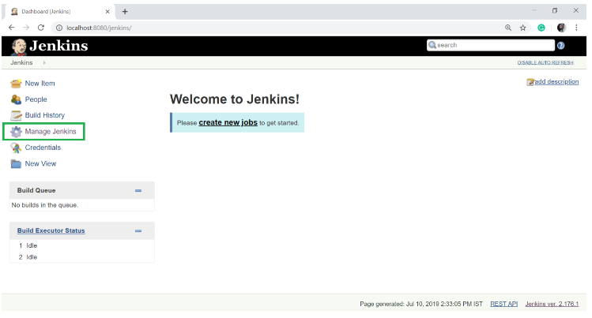

-   Now, click on the **Manage Plugins** option.

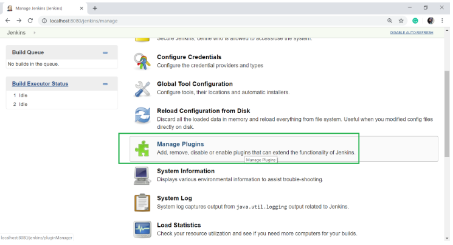

-   In the next page, click on the "**Available tab**".

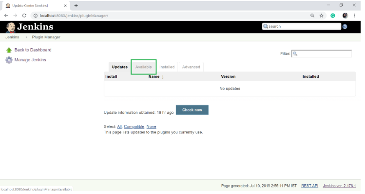

-   The "Available" tab gives a list of plugins which are available for downloading. In the **Filter tab** type, type the "**Git Plugin**".
-   Select the **Git Plugin**.
-   Click on the "**install without restart**".
-   The plugin will take some time to finish downloading depending on your internet connection, and will be installed automatically.
-   You can also click on "**Download now and install after restart**" button in which the git plugin is installed after restart.
-   If you already have the Git plugin installed then go to "**Installed**" tab and in filter option type Git plugin.

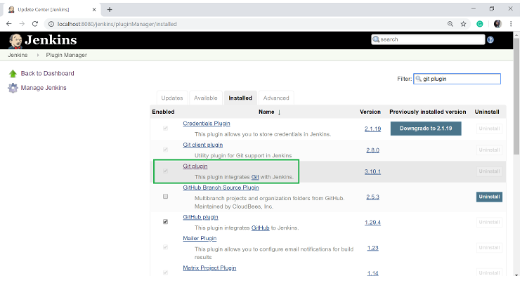

-   Once all the installations are completed, restart Jenkins by giving the following command in the browser. <http://localhost:8080/jenkins/restart>
-   After Jenkins is restarted, Git will available as an option while configuring jobs.

## 2. Integrating Jenkins with GitHub

Let's see the process of integrating GitHub into Jenkins in a windows system.

-   First create a new job in Jenkins, open the **Jenkins Dashboard** and click on "**create new jobs**".

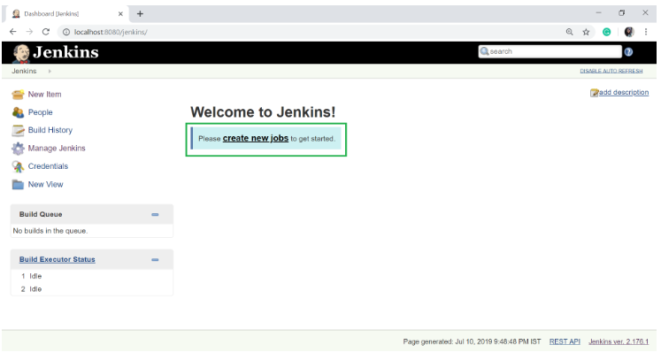

-   Now enter the item name and select the job type. For example, item name is **javaTpoint**" and job type is "**Freestyle project**".
-   Click on **OK**.

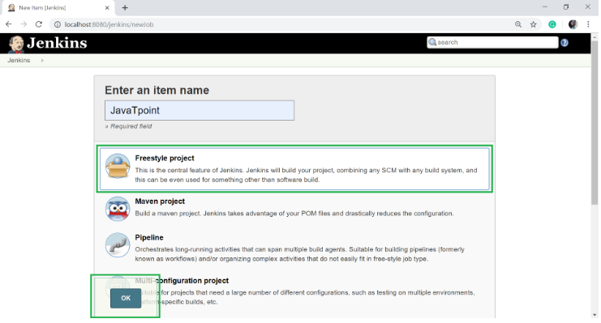

-   Once you click OK, the page will be redirected to its **project configuration**. Enter the project information:

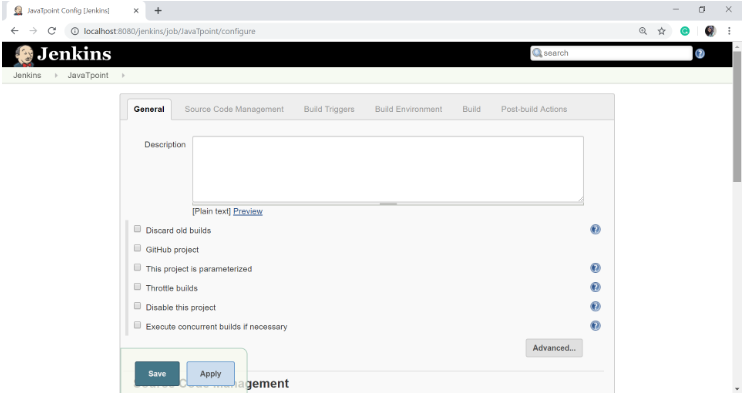

-   Now, under the "Source Code Management" you will see the Git option, if your **Git** plugin has been installed in Jenkins:

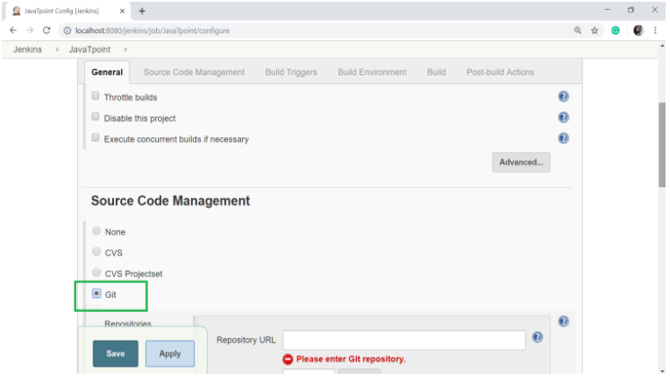

-   Enter the Git repository URL on the "Repository URL" option to pull the code from GitHub.

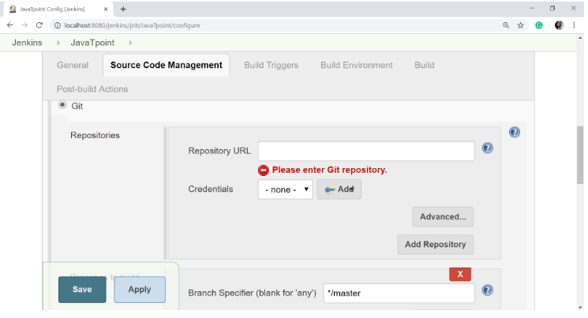

-   You might get an error when first time you enter the repository URL. For example:

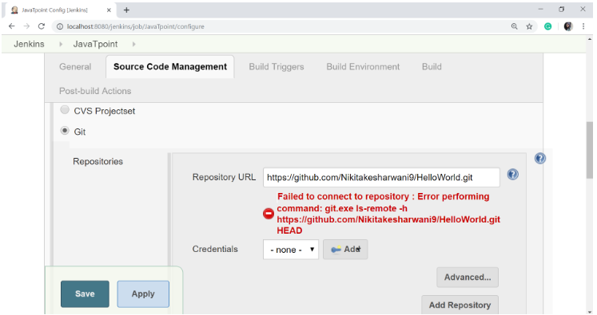

-   This happens if you don't have Git installed in your system.
-   To install the Git in your system, download the appropriate Git setup according to your operating system.
-   I am installing for windows. Once the download is completed, install the Git.

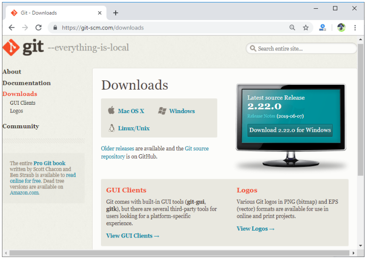

-   Complete the following instructions to install the Git:

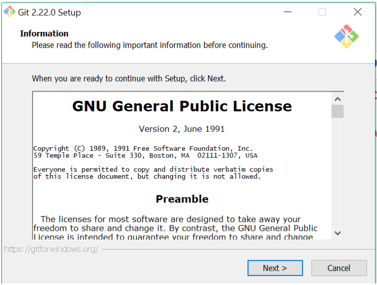

-   You can execute Git repositories in your Jenkins once Git has been installed on your system.
-   To check if the Git has been installed on your system, open the command prompt, type Git and press Enter.

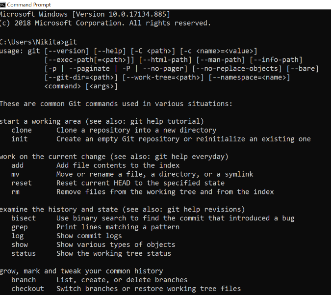

In the above screen, you observe that syntax and different options come up for Git. This means that Git has been installed in your machine.

-   Now try to add the Git URL into Jenkins.
-   Git is now successfully configured on your system.

## 3. References

1.  https://www.javatpoint.com/github-setup-for-jenkins
