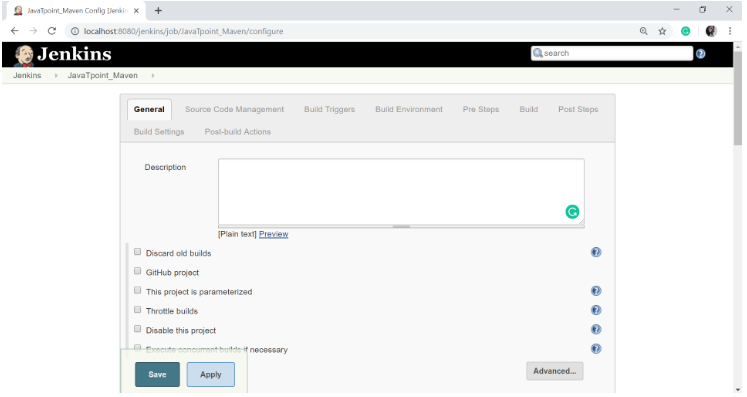

# Maven Setup for Jenkins

**Content**

1\. Maven

2\. Downloading Maven

3\. Setting up Java and Maven in Jenkins

4\. References

## 1. Maven

-   **Maven** is a powerful project management and comprehension tool that provides complete build life cycle framework to assist developers.
-   It is based on the concept of a POM (Project Object Model) that includes project information and configuration information for Maven such as construction directory, source directory, test source directory, dependency, Goals, plugins etc.
-   Maven is build automation tool used basically for Java projects, though it can also be used to build and manage projects written in C\#, Scala, Ruby, and other languages.
-   Maven addresses two aspects of building software: 1st it describes how software is build and 2nd it describes its dependencies.

## 2. Downloading Maven

-   The official website for Apache Maven is <https://maven.apache.org/download.cgi>. Click on the given link to **download** the Maven.
-   When you click on the given link, you will get the home page of the official Maven website as given below:

-   Go to the **files** section and **download** the Maven by the given link for **Binary zip archive file.**

-   Once the file is downloaded, extract the file into your system.

## 3. Setting Up Java and Maven in Jenkins

-   First of all, you have to set the JAVA_HOME and MAVEN_HOME environment variable in your system.
-   To set the JAVA_HOME and MAVEN_HOME path, [**click here**](https://www.mkyong.com/maven/how-to-install-maven-in-windows/).
-   You can verify that the JAVA_HOME environment variable is properly configured or not by using the following command:

-   Similarly, you can verify that the JAVA_HOME environment variable is properly configured or not by using the following command:

-   Now, in the **Jenkins dashboard** (Home screen) click on **manage Jenkins** from the left-hand side menu.

-   Click on "**Global Tool Configuration**" option.

-   To configure Java, click on "**Add JDK**" button in the JDK section.

-   Give a **Name** and **JAVA_HOME** path, or check on **install automatically** checkbox.

-   And now, to configure Maven, click on "**Add Maven**" button in the Maven section, give any **Name** and **MAVEN_HOME** path or check to install automatically checkbox.

-   Then, click on the "**Save**" button at the end of the screen.
-   Now, you can create a job with the Maven project. To do that, click on the **New Item** option or **create a new job** option.

-   Enter the **Item Name** and select the **Maven Project**. Click OK.

-   Now configure the job. Give the description and in the **Source Code Management** section, select the required option.

-   In the **Build Triggers** section, there are multiple options, select the required one.
-   Add the pom.xml file's path in the **Root POM** option in **Pre Steps** Section.

-   Configure the other fields as per your requirement and then click on the **Save** button.

## 4. References

1.  https://www.javatpoint.com/jenkins-maven-setup
