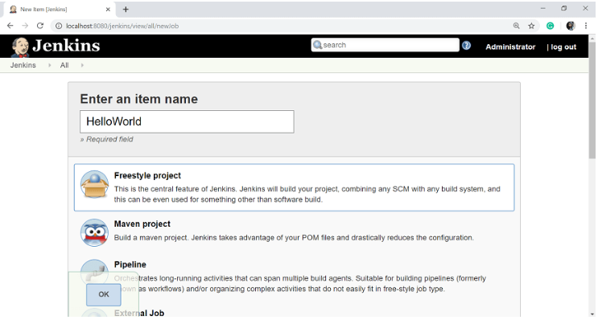
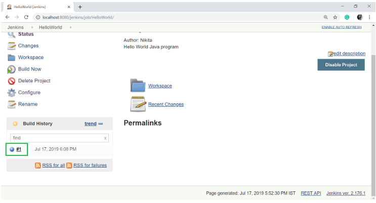

# Jenkins - Setup Build Jobs

**Content**

1\. Jenkins - Setup Build Jobs

2\. References

## 1. Jenkins - Setup Build Jobs

-   Let's create and run a job in Jenkins for simple **HelloWorld** in Java.

**Step 1:** Go to the **Jenkins dashboard** and click on the **New Item**.

**Step 2:** In the next page, enter the **item name**, and select the **'Freestyle project'** option. And click OK.

-   Here, my item name is HelloWorld.

**Step 3:** When you click OK, you will get a **configuration page**.

-   Enter the details of the project in the **Description section**.

**Step 4:** On the **Source Code Management section**, select the **Git** option, and specify the **Repository URL**.

-   To do that you should have proper github setup on your system.

**To do the github setup:**

-   First, you have to create a project in java.
-   Here, I created a simple **HelloWorld** program and saved it to one folder i.e. C:\\GitRepo.
-   Compile the HelloWorld.java file.

-   Now create a project/repository in your GitHub account and give the Repository name.
-   Here my repository name is HelloWorld.

-   Click on **Create repository**.

-   Your repository is created. Copy the repository URL.
-   Open the command prompt in your Windows and go to the path where your java file is created.
-   Then run the following command.

-   Configure your GitHub account in your system.

-   Commit it and add the repository URL.

-   Now, when you refresh your GitHub account, the helloWorld file will be added in your repository.

**Step 5:** Add the Repository URL in the **Source Code Management** section.

-   You can also use a local repository.
-   And if your GitHub repository is private, Jenkins will first validate your login credentials with GitHub and only then access the source code from your GitHub repository.

**Step 6:** Now, it is time to build the code.

-   Click on "**Add build step**" and select the "**Execute Windows batch command**".

**Step 7:** Enter the following command to compile the java code.

**Step 8:** Click **Apply** and then **Save** button.

**Step 9:** Once you saved the configuration, then now can click on **Build Now** option on left-hand side.

**Step 10:** After clicking on **Build Now**, you can see the status of the build on the Build History section.

-   Once the build is completed, a status of the build will show if the build was successful or not.
-   If the build is failed then it will show in **red** color. **Blue** symbol is for success.

-   Click on the build number **\#1** in the **Build History section** to see the details of the build.

**Step 11:** Click on **Console Output** from the left side of the screen to see the status of the build you run.

-   It should show the success message.

## 2. References

1.  https://www.javatpoint.com/jenkins-setup-build-jobs
