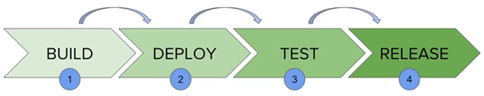
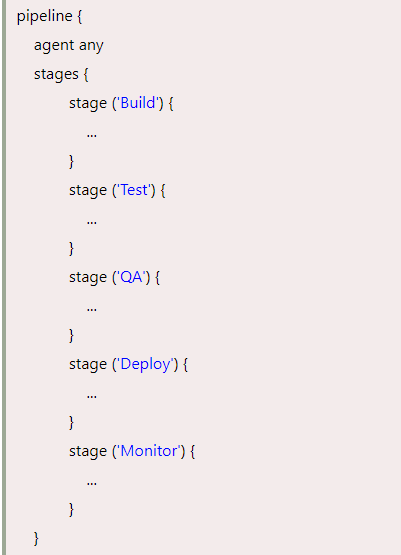
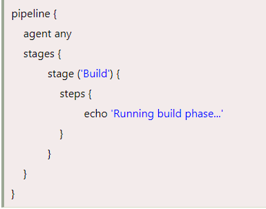

# Jenkins Pipeline

**Content**

1\. Jenkins Pipeline Overview

1.1 What is Continuous Delivery Pipeline?

2\. Jenkins File

3\. Pipeline Syntax

3.1 Why Use Jenkins Pipeline?

4\. Jenkins Pipeline Concepts

5\. References

## 1. Jenkins Pipeline Overview

-   In Jenkins, a pipeline is a collection of events or jobs which are interlinked with one another in a sequence.
-   It is a combination of plugins that support the integration and implementation of **continuous delivery pipelines** using Jenkins.
-   In other words, a Jenkins Pipeline is a collection of jobs or events that brings the software from version control into the hands of the end users by using automation tools.
-   It is used to incorporate continuous delivery in our software development workflow.
-   A pipeline has an extensible automation server for creating simple or even complex delivery pipelines "as code", via DSL (Domain-specific language).

## 1.1 What is Continuous Delivery Pipeline?

-   In a Jenkins Pipeline, every job has some sort of dependency on at least one or more jobs or events.

-   The above diagram represents a continuous delivery pipeline in Jenkins.
-   It contains a collection of states such as build, deploy, test and release.
-   These jobs or events are interlinked with each other.
-   Every state has its jobs, which work in a sequence called a continuous delivery pipeline.
-   A continuous delivery pipeline is an automated expression to show your process for getting software for version control.
-   Thus, every change made in your software goes through a number of complex processes on its manner to being released.
-   It also involves developing the software in a repeatable and reliable manner, and progression of the built software through multiple stages of testing and deployment.

## 2. Jenkins File

-   Jenkins Pipeline can be defined by a text file called JenkinsFile.
-   You can implement pipeline as code using JenkinsFile, and this can be defined by using a DSL (Domain Specific Language).
-   With the help of JenkinsFile, you can write the steps required for running a Jenkins Pipeline.
-   JenkinsFile can be defined by using either Web UI or with a JenkinsFile.

**The benefits of using JenkinsFile are:**

-   You can make pipelines automatically for all branches and can execute pull requests with just one JenkinsFile.
-   You can review your code on the pipeline.
-   You can review your Jenkins pipeline.
-   This is the singular source for your pipeline and can be customized by multiple users.

## 3. Pipeline Syntax

-   Two types of syntax are used for defining your JenkinsFile.
1.  Declarative
2.  Scripted

**1) Declarative**

-   Declarative pipeline syntax offers a simple way to create pipelines.
-   It consists of a predefined hierarchy to create Jenkins pipelines.
-   It provides you the ability to control all aspects of a pipeline execution in a simple, straightforward manner.

**2) Scripted**

-   Scripted Jenkins pipeline syntax runs on the Jenkins master with the help of a lightweight executor.
-   It uses very few resources to convert the pipeline into atomic commands.

Both scripted and declarative syntax are different from each other and are defined totally differently.

## 3.1 Why Use Jenkins Pipeline?

-   Jenkins is a continuous integration server which has the ability to support the automation of software development processes.
-   You can create several automation jobs with the help of use cases, and run them as a Jenkins pipeline.

**Here are the reasons why you should use Jenkins pipeline:**

-   Jenkins pipeline is implemented as a code which allows several users to edit and execute the pipeline process.
-   Pipelines are robust. So if your server undergoes an unpredicted restart, the pipeline will be automatically resumed.
-   You can pause the pipeline process and make it wait to continue until there is an input from the user.
-   Jenkins Pipelines support big projects. You can run many jobs, and even use pipelines in a loop.

## 4. Jenkins Pipeline Concepts

**Pipeline**

-   This is the user-defined block, which contains all the processes such as build, test, deploy, etc.
-   It is a group of all the stages in a JenkinsFile.
-   All the stages and steps are defined in this block.
-   It is used in declarative pipeline syntax.

**Node**

-   The node is a machine on which Jenkins runs is called a node.
-   A node block is used in scripted pipeline syntax.

**Stage**

-   This block contains a series of steps in a pipeline. i.e., build, test, and deploy processes all come together in a stage.
-   Generally, a stage block visualizes the Jenkins pipeline process.
-   Let's see an example for multiple stages, where each stage performs a specific task:

**Step**

-   A step is a single task that executes a specific process at a defined time.
-   A pipeline involves a series of steps defined within a stage block.

## 5. References

1.  https://www.javatpoint.com/jenkins-pipeline
