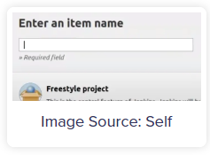
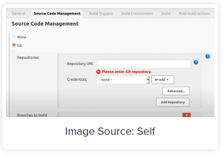
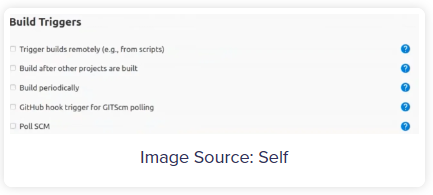
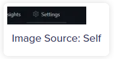
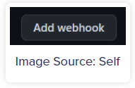
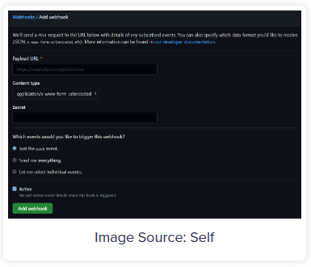
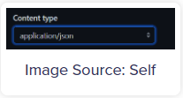

# Set Up Jenkins GitHub Webhook

**Content**

1\. Steps to Set up Jenkins GitHub Webhook

1.1 Configuring Jenkins for GitHub

2\. Setting up GitHub Webhook

1.3 Benefits of Jenkins GitHub Webhook

2\. References

## 1. Steps to Set up Jenkins GitHub Webhook

-   The steps to set up Jenkins GitHub Webhook. The following steps are listed below:

Step 1: Configuring Jenkins for GitHub

Step 2: Setting Up GitHub Webhook

## 1.1 Configuring Jenkins for GitHub

-   Log in to Jenkins.
-   Click on the “**New Item**” option to create a new job, as shown in the image below.

<https://res.cloudinary.com/hevo/image/upload/e_blur:2000,q_1,f_auto/hevo-learn/Screenshot-2021-10-05-083506.png>

-   Then, select the “**Freestyle Project**” option and click on the “**Ok**” button, as shown in the image below.

-   It will open the configurations for the new Jenkins GitHub Webhook project you just created.
-   Go to the “**Source Code Management**” tab to change the settings for Jenkins GitHub Webhook.
-   Scroll down and under the “**Source Code Management**” section, choose the “**Git**” option to let Jenkins know that the new job is for Jenkins GitHub Webhook.
-   Log in to your GitHub account.
-   Open the repository that you want to sync with Jenkins for Continous Integration.
-   Go to your GitHub account and copy the URL of your repository from the address bar of the browser.
-   Switch back to your Jenkins GitHub Webhook tab and paste the URL in the field of “**Repository URL**“, as shown in the image below.

-   Now, go to the “**Build Triggers**” tab where you can configure what action Jenkins GitHub Webhook should perform if any change is detected by Jenkins in the GitHub repository.
-   Here, choose the “**GitHub** **hook trigger for GITScm pulling**” option, which will listen for triggers from the given GitHub repository, as shown in the image below.

-   Now, click on the “**Apply**” button to save the changes and create a new Jenkins GitHub Webhook for your repository.

## 2. Setting up GitHub Webhook

-   Switch to your GitHub account.
-   Now, go to the “**Settings**” option on the right corner, as shown in the image below.

-   Here, select the “**Webhooks**” option and then click on the “**Add Webhook**” button, as shown in the image below.

-   It will provide you the blank fields to add the Payload URL where you will paste your Jenkins address, Content type, and other configuration.
-   Go to your Jenkins tab and copy the URL then paste it in the text field named “**Payload URL**“, as shown in the image below.

-   Append the “**/github-webhook/**” at the end of the URL.
-   The final URL will look like in this format “**http://address:port/github-webhook/**“.
-   Select the “**Content type**” to “**application/json**” format, as shown in the image below.

-   The “**Secret**” field is optional. Let’s leave it blank for this Jenkins GitHub Webhook.
-   Next, choose one option under “**Which events would you like to trigger this webhook?**“. The 3 options will do the following events listed below:
    -   **Just the Push Event**: It will only send data when someone push into the repository.
    -   **Send Me Everything:** It will trigger, if there is any pull or push the event into the repository.
    -   **Let Me Select Individual Events**: You can configure for what events you want your data.
-   Now, click on the “**Add Webhook**” button to save Jenkins GitHub Webhook configurations.

That’s it! You completed Jenkins GitHub Webhook. Now for any commit in the GitHub repository, Jenkins will trigger the event specified.

## 1.3 Benefits of Jenkins GitHub Webhook

-   Jenkins GitHub Webhook provides an environment for Continuous Integration (CI) and is widely used in the DevOps process.

**A few benefits of Jenkins GitHub Webhook are listed below:**

-   Jenkins GitHub Webhook makes the development process faster as it allows Developers to automatically perform a specified action when any commit is done to the source code.
-   It helps Developers detect issues and resolve them almost right away which keeps the application in a state to deploy safely.
-   Jenkins GitHub Webhook automates the build, test, and deployment of projects on any platform.

## 2. References

1.  https://hevodata.com/learn/jenkins-github-webhook/
