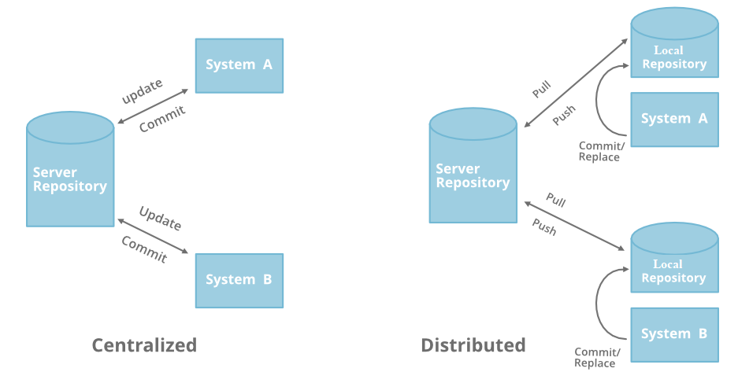
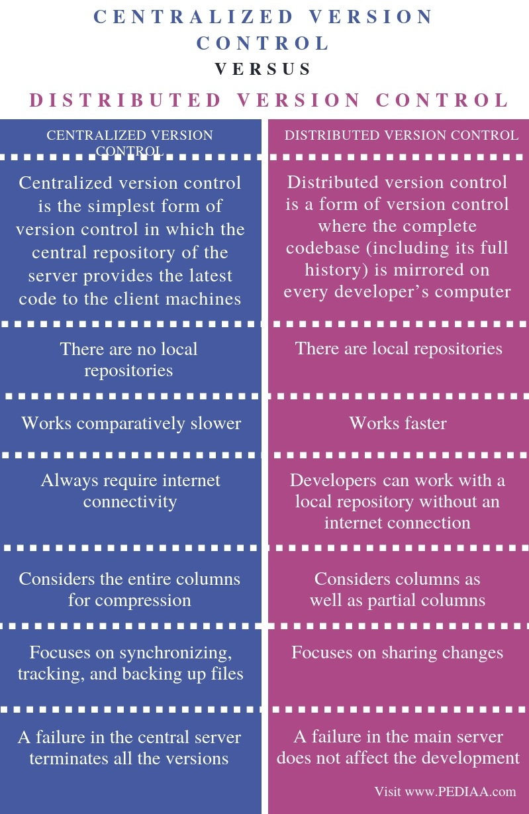
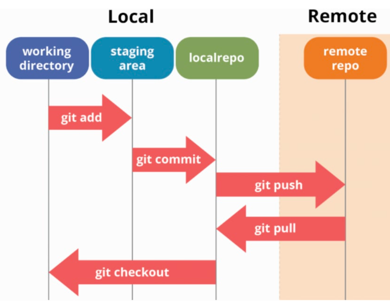

## Git Fundamentals

## Contents

1.  Git
2.  Version Control System

    2.1 Advantages of VCS

3.  Distributed VCS vs Centralized VCS
4.  Repository
5.  How Github works?
6.  Workflow of a project
7.  Basic Git Commands

## 1. Git

-   Git is a version control system (VCS).
-   To be more specific Git is a Distributed VCS.
-   Since its birth in 2005, Git has evolved and matured to be easy to use.
-   It’s amazingly fast, it’s very efficient with large projects, and it has an incredible branching system for non-linear development

## 2.Version Control System

-   A version control system, or VCS, tracks the history of changes as people and teams collaborate on projects together.
-   As developers make changes to the project, any earlier version of the project can be recovered at any time.
-   Developers can review project history to find out:
    -   Which changes were made?
    -   Who made the changes?
    -   When were the changes made?
    -   Why were changes needed?

## 2.1 Advantages of Version Control System

1.  **Storing Versions:** If we encounter some error in our project code we always have the option to revert back to the previous version with the help of git it is easy to store version. If we try to store them manually it will be a hard task.
2.  **Collaboration:** In the software industry, multiple employees are working on the same project so with the help of version control system the main copy is stored on central remote server fetched by employees and after changes which are to be made are made employee uploads its own version to the central repository so others can fetch code updated by employees.
3.  **Backup:** In case if a central repository is crashed then anyone can push its local copy to the central server. As while making changes it has to be made on the local repository.

## 3. Distributed VCS vs Centralized VCS

## 4.Repository

-   A repository, or Git project, encompasses the entire collection of files and folders associated with a project, along with each file's revision history.
-   The file history appears as snapshots in time called commits.
-   The commits can be organized into multiple lines of development called branches. Because Git is a DVCS, repositories are self-contained units and anyone who has a copy of the repository can access the entire codebase and its history.
-   Using the command line or other ease-of-use interfaces, a Git repository also allows for: interaction with the history, cloning the repository, creating branches, committing, merging, comparing changes across versions of code, and more.
-   Platforms like GitHub, Git also provides more opportunities for project transparency and collaboration.

## 5.How GitHub works?

-   GitHub is the service that will host your Git repositories. Think of GitHub like the cloud server that hosts your source code. The repository for your project consists of all branches, commit, merge history, any licensing or readme files, rake/gem files, etc.
-   GitHub builds collaboration directly into the development process.
-   Work is organized into repositories where developers can outline requirements or direction and set expectations for team members. Then, using the GitHub flow, developers simply create a branch to work on updates, commit changes to save them, open a pull request to propose and discuss changes, and merge pull requests once everyone is on the same page.
-   The partnership between Git and GitHub grant teams an invaluable asset - any and every modification to code is tracked through the two tools. Therefore, in the case of a mistake the code can efficiently and quickly be rolled back to its previous state prior to the error.
-   For more information, [click here](https://docs.github.com/en/get-started/quickstart/github-flow)

## 6.Workflow of a Project

-   Let's review a simple project workflow and the CLI commands that help us move from one step to the next.
-   Below is a diagram of a workflow including Git & Github. This diagram most closely represents the flow of group project.

**git clone**

-   The very first step (not included on diagram) is to clone the repository to your local machine.
-   By cloning with Git, you get the entire repository - all files, all branches, and all commits.
-   Cloning a repository is typically only done once, at the beginning of your interaction with a project. Once a repository already exists on a remote, like on GitHub, then you would clone that repository so you could interact with it locally. Once you have cloned a repository, you won't need to clone it again to do regular development.

**git add**

-   After your code has been tested and is complete, add your new/modified files to the staging area.

**git commit**

-   Commit your changes back to the repository.
-   Add a brief, but detailed comment about the changes that were made, code that was written, or bug that was fixed. Make it easy for your team members and future team members to understand what the alterations were.

**git push**

-   Push your new/changed files to the repository.
-   Now transferred your code up to GitHub.
-   The code you've pushed up lives in the current branch you've worked on.

**git pull**

-   Pull down from the remote repository (reminder, this lives on GitHub) to make sure you have up to date information.
-   Believe it or not, changes could have been made by a team member in the time it took you to clone down the repository to your computer.

**git checkout**

-   If you’re working in a group project, create a new branch for the feature you are working on.
-   Make sure you are titling your branch according to the standards of your workplace expectations.
-   Now you have your own little place to experiment with code without immediately affecting changes on the main branch.

    Note: you might not need to create a new branch if you are intentionally editing an existing branch. In that case, be sure you are on the correct branch and not the main prior to making any changes. Always check with your teammates before creating/editing branches.

**git status**

-   git status confirms that your files have been added to the staging area.

## 6.Basic Git commands

-   To use Git, developers use specific commands to copy, create, change, and combine code. These commands can be executed directly from the command line or by using an application like GitHub Desktop. Here are some common commands for using Git:

**1.git init**

-   Initializes a brand new Git repository and begins tracking an existing directory.
-   It adds a hidden subfolder within the existing directory that houses the internal data structure required for version control.

**Syntax:** git init

**2.git clone**

-   Creates a local copy of a project that already exists remotely.
-   The clone includes all the project's files, history, and branches.

**Syntax:** git clone "Remote_repository_url"

**3.git add**

-   Stages a change. Git tracks changes to a developer's codebase, but it's necessary to stage and take a snapshot of the changes to include them in the project's history.
-   This command performs staging, the first part of that two-step process. Any changes that are staged will become a part of the next snapshot and a part of the project's history.
-   Staging and committing separately gives developers complete control over the history of their project without changing how they code and work.

**Syntax:** git add

**4.git commit**

-   Saves the snapshot to the project history and completes the change-tracking process.
-   In short, a commit functions like taking a photo. Anything that's been staged with git add will become a part of the snapshot with git commit.

**Syntax:** git commit -m " message"

**5.git status**

-   It shows the status of changes as untracked, modified, or staged.

**Syntax:** git status

**6.git branch**

-   This command allows to create a branch for the project.
-   A branch is like exact copy of the project.
-   I t allows you to duplicate the source code for yourself. You will then work on your own branch so your edits do not immediately affect the original source code.

**Syntax:** git branch branch_name

**7.git merge**

-   This command is typically used to joining your branch with the original source code after complete testing.

    **Syntax:** git merge branch_name

**8.git pull**

-   It updates the local line of development with updates from its remote counterpart.
-   Developers use this command if a teammate has made commits to a branch on a remote, and they would like to reflect those changes in their local environment.

    **Syntax:** git pull Repository_URL

**9.git push**

-   Updates the remote repository with any commits made locally to a branch.

**Syntax:** git push origin main

-   For more information, see the [full reference guide to Git commands](https://git-scm.com/docs).

## References

1.  https://docs.github.com/en/get-started
2.  https://git-scm.com/book/en/v2/Getting-Started-About-Version-Control
3.  <https://www.geeksforgeeks.org/using-git-on-commandline/?ref=lbp>
4.  https://dev.to/mollynem/git-github--workflow-fundamentals-5496
