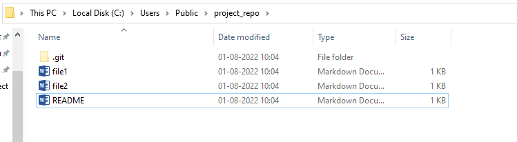
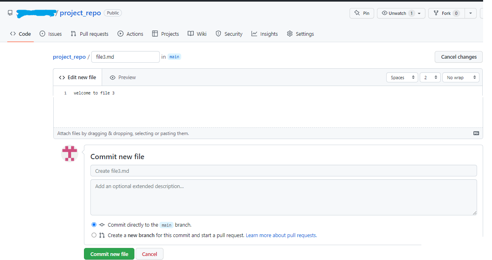

## Git Initializing and Pushing Files Into Remote Repository

## Contents

**1. To get Started**

1.1 How to Open GitBash

1.2 How to Work with Git Config

**2. Initializing a Local and Remote Repository**

2.1 Creating a Remote Repository

2.2 Creating a Local Repository Using Git Bash Command Line

2.3 Checking the Status of Files

2.4 Adding Files to Staging Area

2.5 Committing Files to Local Repository

**3. Pushing Files from Local Repository into Remote Repository**

**4. Pulling Files from Remote Repository to Local Repository**

**5.Conclusion**

## 1.To get Started

## 1.1 How to Open GitBash

-   They are 2 methods to open git bash

**Method 1:**

-   Go to your working directory. Right-click and choose Git Bash Here option.

****

-   The Git Bash opens up and points to your current working Directory.

****

**Method 2:**

-   Open Git Bash and change the current working directory to your local project by using cd command.

    **Syntax:** cd \<directory_name\>

    **Output:**

****

## How to Work with Git Config

-   Configure local git with user name and email so we will know who pushed the code to github

**Syntax:** git config –global user.name “[name]”

git config –global user.email “[email address]”

**Output:**

## 

## 2.Initializing a Local and Remote Repository

You have two repositories

1.  Remote Repository
2.  Local Repository

## 2.1 Creating a Remote Repository

Follow the steps given below to initialize your remote repository with Github.

**Step 1:**

-   First step, Sign into Github with your GitHub account. The below diagram shows a Githhub account.

****

**Step 2:**

-   To create a new remote repository on Github, click on the new button on the top left side.

    ****

**Step 3:**

-   Give a suitable name for your repository and click on create repository

****

**Note:**

-   You can choose to initialize your git repository with a README file, and further, you can mention your project details in it. It helps people to know what this repository is about. It is higly recomended to have a README file in th project.

**Step 4:**

-   Now a Remote repository has been created as shown in the below diagram.

****

## 2.2 Creating a Local Repository using GitBash Command Line

-   There are two ways to create a local repository using Gitbash command line.
-   Now run the commands in the following sequence.

**Method 1:**

**Git clone**:

-   Using git clone will create a copy of the remote repository into a new directory in the local computer.
-   This new directory becomes your working directory.
-   When you clone a remote repository, it will copy all the files, branches and commits into the local.

**Syntax:** git clone [remote-repository-url]

**How to get the remote repository URL?**

-   Go to your remote repo on Github, Click on the code button.

    You can copy the remote repository url from there.

****

-   Before executing git clone command, you can see that there was no folder with name **project_repo**

**Output:**

****

-   Now go to the location where you used the git clone command and you can see that **project_repo** directory (working directory) is created in the name of the remote repository.

    ****

-   Open the directory and you will see that it has a hidden .git folder and README.md file

    

-   The **.git folder** contains all information that is necessary for the project and all information relating commits, remote repository address, etc. It also contains a log that stores the commit history. This log can help you to roll back to the desired version of the code.
-   This .git folder is your local repository. Deleting the .git folder means you are deleting your local repository.
-   In the README.md file, add any instructions that you want to share with others. Use Markdown to format headings, lists, links, etc. Here are some guides for the Markdown syntax:

[guides.github.com/features/mastering-markdown](https://guides.github.com/features/mastering-markdown/)

-   When updations are done, commit the changes and push them to the remote repository. GitHub will display the nicely formatted ReadMe on the project page for the repository.

**Method 2:**

**Step 1:**

-   Initialize the new/existing local (working) directory as your local repository.

**Syntax:** git init

**Output:**

****

-   Now go to your working directory, a hidden .git folder can be viewed.
-   This is your local repository.

    ****

**Step 2:**

-   Add an empty README.md file in the working directory because the remote repository has a README.md file

    ****

**Step 3:**

-   Rename the master branch of local repo to main. This has to be done in newer versions of git.

    **Synatax:** git branch -m main

    **Output:**

    ****

## 2.3 Checking the Status of Files

-   By using the command “git status” you can view the status of your local repository.

**Syntax :** git status

****

## 2.4 Adding Files to Staging Area

-   Add all the files of current folder(.) to staging

    **Syntax:** git add .

    **Output:**

    ****

## 2.5 Committing Files to Local Repository

-   Commit all the files from staging to local repo with a commit message.
-   Commit message is mandatory to understand why these files are commited.

**Syntax:** git commit -m " file1 completed"

**Output:**

****

## 3. Pushing Files from Local Repository into Remote Repository

**Step 1:**

-   In Gitbash, add the URL to specify the remote Github repo to which we would want to push the files.

**syntax:** git remote add origin remote_repo_URL

**Output:**

****

**Step 2:**

-   Push the files from your local repo to the remote repo.
-   Now the two files i.e., file1.md and file2.md are pushed from the local reposotory to the remote repository.

**syntax:** git push

**Output:**

-   Here the files have been pushed to the main branch of your repository.
-   Now in the GitHub remote repository, the pushed files can be seen/verified.

    

## 4.Pulling Files from Remote Repository to Local Repository

**Step 1:**

-   Click on **Add file** button, you we will get two options, Create new file and Upload files

    ****

**Step 2:**

-   Click on Create new file, give suitable file name with .md extension, and then click on **commit new file** button.

    ****

**Step 3:**

-   Here the file3.md have been created to the main branch of your remote repository.

    ****

**Step 4:**

-   Go to your local repo, there is no file file3.md
-   Your remote repo have the file file3.md

    ****

-   Now pull the file file3.md from remote repo to local repo using the pull command.

    **Syntax:** git pull [remote_repository_url]

    **Output:**

    ****

-   After executing pull command file3.md have been pulled from the main branch of your remote repository to local repository.

    ****

## 5.Conclusion

-   To conclude it can be said that git bash is a command line platform which helps in enabling git and its elements in your system.
-   There are a bunch of commands which are used in git bash.
-   Git Bash is very easy to use and makes it easy to work on repositories and projects.

**References:**

[**https://phoenixnap.com/kb/what-is-git-bash**](https://phoenixnap.com/kb/what-is-git-bash)

**https://dev.classmethod.jp/articles/git-bash-commands/**

**https://www.geeksforgeeks.org/working-on-git-bash/**

## 
