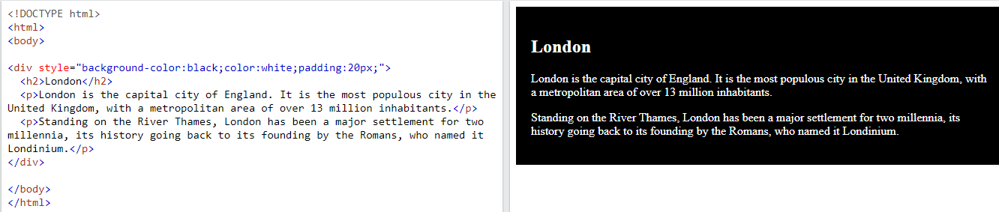
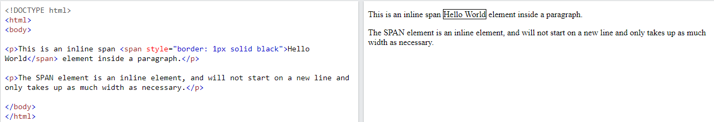
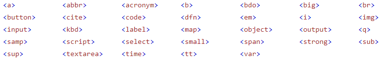
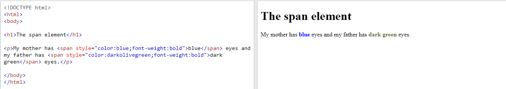

## HTML Block and Inline Elements

**Content**

1.Block-level Elements

1.1 The \<div\> Element

2\. Inline Elements

2.1 The \<span\> Element

3\. References

## HTML Elements

-   Every HTML element has a default display value, depending on what type of element it is.
-   There are two display values: block and inline.

## 1.Block-level Elements

-   A block-level element always starts on a new line, and the browsers automatically add some space (a margin) before and after the element.
-   A block-level element always takes up the full width available (stretches out to the left and right as far as it can).
-   Two commonly used block elements are: \<p\> and \<div\>.
-   The \<p\> element defines a paragraph in an HTML document.
-   The \<div\> element defines a division or a section in an HTML document.

**Example**

-   Here some of the block-level elements in HTML

## 1.1 The \<div\> Element

-   The \<div\> element is often used as a container for other HTML elements.
-   The \<div\> element has no required attributes, but style, class and id are common.
-   When used together with CSS, the \<div\> element can be used to style blocks of content.

**Example**

## 2.Inline Elements

-   An inline element does not start on a new line.
-   An inline element only takes up as much width as necessary.
-   This is a \<span\> element inside a paragraph.

**Example**

-   Here are the inline elements in HTML:

**Note:** An inline element cannot contain a block-level element.

## 2.1 The \<span\> Element

-   The \<span\> element is an inline container used to mark up a part of a text, or a part of a document.
-   The \<span\> element has no required attributes, but style, class and id are common.
-   When used together with CSS, the \<span\> element can be used to style parts of the text:

**Example**

## 3. References

1\. https://www.w3schools.com/html/html_blocks.asp
