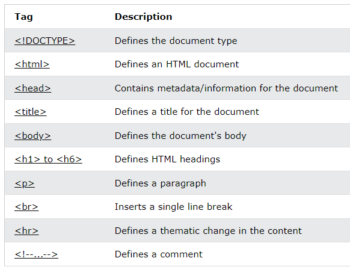
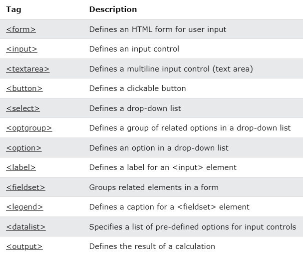
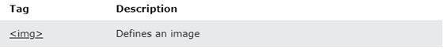
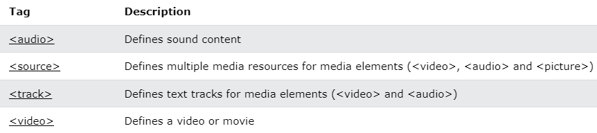
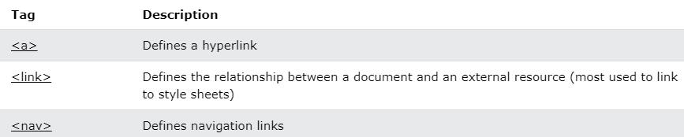
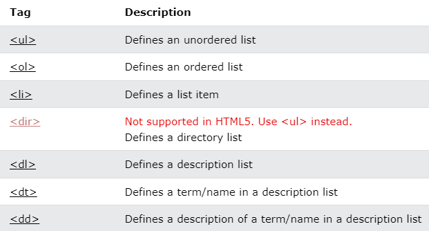
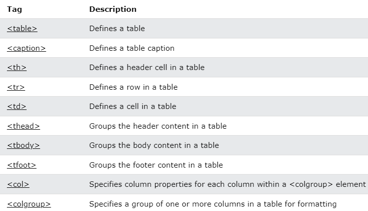
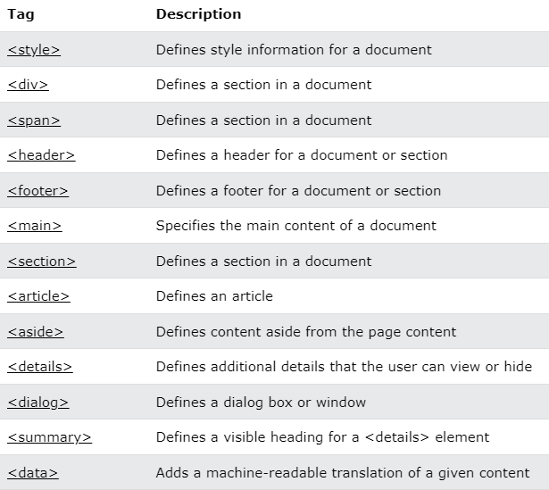

## Common HTML Tags

**Content**

1.  Basic HTML,
2.  Forms and Input
3.  Frames
4.  Images
5.  Audio / Video
6.  Links
7.  Lists
8.  Tables
9.  Styles and Semantics
10. Meta Info
11. References

## Common HTML Tags

-   The table below lists all HTML tags.
-   Categories of HTML tags are
1.  Basic HTML,
2.  Forms and Input
3.  Frames
4.  Images
5.  Audio / Video
6.  Links
7.  Lists
8.  Tables
9.  Styles and Semantics
10. Meta Info

## 1.Basic HTML

## 

## 2.Forms and Input

## 

## 3.Frames

## 4.Images

## 5.Audio / Video

## 6.Links

## 7.Lists

## 8.Tables

## 9.Styles and Semantics

## 10.Meta Info

-   To know more details about each and every tag [click here](https://www.w3schools.com/tags/ref_byfunc.asp)

## 11. References

1\. https://www.w3schools.com/tags/ref_byfunc.asp
