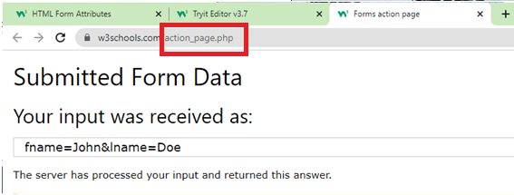

## HTML Forms, Elements and Attributes

**Content**

1.HTML Forms

2.The HTML \<form\> Elements

2.1 The \<input\> Element

2.2 The \<label\> Element

2.3 The \<select\> Element

2.3.1 Visible Values

2.3.2 Multiple Selections

2.4 The \<textarea\> Element

2.5 The \<button\> Element

2.6 The \<fieldset\> and \<legend\> Elements

2.7 The \<datalist\> Element

3\. HTML Form Attributes

3.1 The Action Attribute

3.2 The Target Attribute

3.3 The Method Attribute

4\. References

## 1.HTML Forms

-   An HTML form is used to collect user input.
-   The user input is most often sent to a server for processing.

**Syntax**

\<form\>  
.  
*form elements*  
.  
\</form\>

## 2.The HTML \<form\> Elements

-   The HTML \<form\> element is used to create an HTML form for user input.
-   The HTML \<form\> element can contain one or more of the following form elements:

## 2.1 The \<input\> Element

-   One of the most used form element is the \<input\> element.
-   The \<input\> element can be displayed in several ways, depending on the type attribute, such as text fields, checkboxes, radio buttons, submit buttons, etc.
-   To know more details about the different input elements [click here](https://www.w3schools.com/html/html_form_input_types.asp).

**Example**

-   To know more details about the different values of input type attribute [click here](https://www.w3schools.com/html/html_form_input_types.asp).

## 2.2 The \<label\> Element

-   The \<label\> element defines a label for several form elements.
-   The \<label\> element is useful for screen-reader users, because the screen-reader will read out loud the label when the user focus on the input element.
-   The \<label\> element also help users who have difficulty clicking on very small regions (such as radio buttons or checkboxes) - because when the user clicks the text within the \<label\> element, it toggles the radio button/checkbox.
-   The for attribute of the \<label\> tag should be equal to the id attribute of the \<input\> element to bind them together.

## 2.3 The \<select\> Element

-   The \<select\> element defines a drop-down list:

**Example**

-   The \<option\> elements defines an option that can be selected.
-   By default, the first item in the drop-down list is selected.
-   To define a **pre-selected** option, add the selected attribute to the option:

**Example**

### 2.3.1 Visible Values

-   Use the size attribute to specify the number of visible values:

### 2.3.2 Multiple Selections

-   Use the multiple attribute to allow the user to select more than one value:

## 2.4 The \<textarea\> Element

-   The \<textarea\> element defines a multi-line input field (a text area):
-   The rows attribute specifies the visible number of lines in a text area.
-   The cols attribute specifies the visible width of a text area.

**Example**

-   You can also define the size of the text area by using CSS:

**Example**

## 2.5 The \<button\> Element

-   The \<button\> element defines a clickable button:

**Example**

**Note:**

-   Always specify the type attribute for the button element.
-   Different browsers may use different default types for the button element.

## 2.6 The \<fieldset\> and \<legend\> Elements

-   The \<fieldset\> element is used to group related data in a form.
-   The \<legend\> element defines a caption for the \<fieldset\> element.

**Example**

## 2.7 The \<datalist\> Element

-   The \<datalist\> element specifies a list of pre-defined options for an \<input\> element.
-   Users will see a drop-down list of the pre-defined options as they input data.
-   The list attribute of the \<input\> element, must refer to the id attribute of the \<datalist\> element.

**Example**

## 3.HTML Form Attributes

-   The different attributes for the HTML \<form\> element are action,target,method, Autocomplete, Novalidate.

## 3.1 The Action Attribute

-   The action attribute defines the action to be performed when the form is submitted.
-   Usually, the form data is sent to a file on the server when the user clicks on the submit button.
-   In the example below, the form data is sent to a file called "action_page.php". This file contains a server-side script that handles the form data.

**Example**

-   On submit, send form data to "action_page.php":

**Note:**

-   If the action attribute is omitted, the action is set to the current page.

## 3.2 The Target Attribute

-   The target attribute specifies where to display the response that is received after submitting the form.
-   The target attribute can have one of the following values:

-   The default value is \_self which means that the response will open in the current window.

**Example**

-   Here, the submitted result will open in a new browser tab:

## 3.3 The Method Attribute

-   The method attribute specifies the HTTP method to be used when submitting the form data.
-   The form-data can be sent as URL variables (with method="get") or as HTTP post transaction (with method="post").
-   The default HTTP method when submitting form data is GET.

**Example**

-   Example uses the GET method when submitting the form data.

\<form action="/action_page.php" method="get"\>

**Notes on GET:**

-   Appends the form data to the URL, in name/value pairs
-   NEVER use GET to send sensitive data! (the submitted form data is visible in the URL!)
-   The length of a URL is limited (2048 characters)
-   Useful for form submissions where a user wants to bookmark the result
-   GET is good for non-secure data, like query strings in Google.

**Example**

-   Example uses the POST method when submitting the form data:

\<form action="/action_page.php" method="post"\>

**Notes on POST:**

-   Appends the form data inside the body of the HTTP request (the submitted form data is not shown in the URL)
-   POST has no size limitations, and can be used to send large amounts of data.
-   Form submissions with POST cannot be bookmarked

**Note:** Always use POST if the form data contains sensitive or personal information.

## 4.Reference

1.https://www.w3schools.com/html/html_forms.asp

2.https://www.w3schools.com/html/html_form_elements.asp

3.https://www.w3schools.com/html/html_forms_attributes.asp
