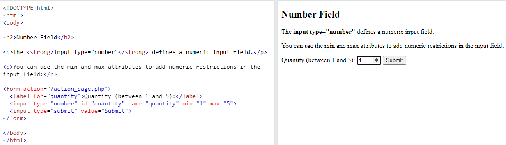

## HTML Input Types

**Contents**

1\. .HTML Input Types

1.1 Input Type Text

1.2 Input Type Password

1.3 Input Type Submit

1.4 HTML Image

1.5 Input Type Reset

1.6 Input Type Radio

1.7 Input Type Checkbox

1.8 Input Type Button

1.9 Input Type Date

1.10 Input Type Email

1.11 Input Type File

1.12 Input Type Number

1.13 Input Type Search

2\. References

## 1.HTML Input Types

-   Here are the different input types you can use in HTML:
1.  \<input type="button"\>
2.  \<input type="checkbox"\>
3.  \<input type="date"\>
4.  \<input type="email"\>
5.  \<input type="file"\>
6.  \<input type="image"\>
7.  \<input type="number"\>
8.  \<input type="password"\>
9.  \<input type="radio"\>
10. \<input type="reset"\>
11. \<input type="search"\>
12. \<input type="submit"\>
13. \<input type="text"\>

**Note:** The default value of the type attribute is "text".

## 1.1 Input Type Text

-   \<input type="text"\> defines a **single-line text input field**:

**Example**

## 1.2 Input Type Password

-   \<input type="password"\> defines a **password field**:

**Example**

-   The characters in a password field are masked (shown as asterisks or circles).

## 1.3 Input Type Submit

-   \<input type="submit"\> defines a button for **submitting** form data to a **form-handler**.
-   The form-handler is typically a server page with a script for processing input data.
-   The form-handler is specified in the form's action attribute:

**Example**

-   If you omit the submit button's value attribute, the button will get a default text:

**Example**

## 1.4 HTML Image

-   The HTML \ tag is used to embed an image in a web page.
-   Images are not technically inserted into a web page; images are linked to web pages.
-   The \ tag creates a holding space for the referenced image.
-   The \ tag is empty, it contains attributes only, and does not have a closing tag.
-   The \ tag has two required attributes:
1.  src - Specifies the path to the image
2.  alt -The alt attribute provides an alternate text for an image, if the user for some reason cannot view it (because of slow connection, an error in the src attribute, or if the user uses a screen reader).

**Note:**

-   A screen reader is a software program that reads the HTML code, and allows the user to "listen" to the content. Screen readers are useful for people who are visually impaired or learning disabled.

**Syntax**

\

**Note:** When a web page loads, it is the browser, at that moment, that gets the image from a web server and inserts it into the page. Therefore, make sure that the image actually stays in the same spot in relation to the web page, otherwise your visitors will get a broken link icon. The broken link icon and the alt text are shown if the browser cannot find the image.

**Example**

## 1.5 Input Type Reset

-   \<input type="reset"\> defines a **reset button** that will reset all form values to their default values:

**Example**

-   If you change the input values and then click the "Reset" button, the form-data will be reset to the default values.

## 1.6 Input Type Radio

-   \<input type="radio"\> defines a **radio button**.
-   Radio buttons let a user select ONLY ONE of a limited number of choices:

**Example**

## 1.7 Input Type Checkbox

-   \<input type="checkbox"\> defines a **checkbox**.
-   Checkboxes let a user select ZERO or MORE options of a limited number of choices.

**Example**

## 1.8 Input Type Button

\<input type="button"\> defines a **button**:

**Example**

## 1.9 Input Type Date

-   The \<input type="date"\> is used for input fields that should contain a date.
-   Depending on browser support, a date picker can show up in the input field.

**Example**

## 1.10 Input Type Email

-   The \<input type="email"\> is used for input fields that should contain an e-mail address.
-   Depending on browser support, the e-mail address can be automatically validated when submitted.
-   Some smartphones recognize the email type, and add ".com" to the keyboard to match email input.

**Example**

## 1.11 Input Type File

-   The \<input type="file"\> defines a file-select field and a "Browse" button for file uploads.

**Example**

## 1.12 Input Type Number

-   The \<input type="number"\> defines a **numeric** input field.
-   You can also set restrictions on what numbers are accepted.
-   The following example displays a numeric input field, where you can enter a value from 1 to 5:

**Example**

## 1.13 Input Type Search

-   The \<input type="search"\> is used for search fields (a search field behaves like a regular text field).

**Example**

## 2. References

1\. https://www.w3schools.com/html/html_form_input_types.asp
