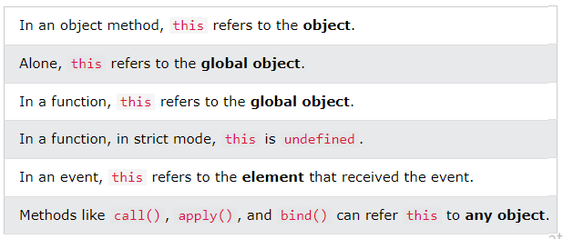

## JS Classes

**Content**

**1. JS Classes**

1.1 Creating an Objects for a Class

1.2 The Constructor Method

1.3 Class Methods

**2. JS Class Inheritance**

2.1 Getters and Setters

**3. JS this Keyword**

3.1 Object Method Binding

3.2 this Alone

3.3 this in a Strict Mode

3.4 this in a Function (Default)

3.5 this in a Function (Strict)

**4. References**

## 1. JS Classes

-   JS Classes are templates for JS Objects.
-   Use the keyword class to create a class.
-   Always add a method named constructor():

**Syntax**

class ClassName

{  
constructor()

{ ... }  
}

**Example**

class Car

{  
constructor(name, year)

{  
this.name = name;  
this.year = year;  
}  
}

-   The example above creates a class named "Car".
-   The class has two initial properties: "name" and "year".
-   A JavaScript class is **not** an object.
-   It is a **template** for JavaScript objects.

## 1.1 Creating an Objects for a Class

-   When you have a class, you can use the class to create objects:

**Example**

let myCar1 = new Car("Ford", 2014);  
let myCar2 = new Car("Audi", 2019);

-   The example above uses the **Car class** to create two **Car objects**.
-   The constructor method is called automatically when a new object is created.

## 1.2 The Constructor Method

The constructor method is a special method:

-   It has to have the exact name "constructor"
-   It is executed automatically when a new object is created
-   It is used to initialize object properties
-   If you do not define a constructor method, JavaScript will add an empty constructor method.

## 1.3 Class Methods

-   Class methods are created with the same syntax as object methods.
-   Use the keyword class to create a class.
-   Always add a constructor() method.
-   Then add any number of methods.

**Syntax**

class ClassName

{  
constructor() { ... }  
method_1() { ... }  
method_2() { ... }  
method_3() { ... }  
}

**Create a Class method named "age", that returns the Car age:**

**Example**

class Car

{  
constructor(name, year)

{  
this.name = name;  
this.year = year;  
}  
age()

{  
let date = new Date();  
return date.getFullYear() - this.year;  
}  
}

let myCar = new Car("Ford", 2014);  
document.getElementById("demo").innerHTML =  
"My car is " + myCar.age() + " years old.";

# 2. JS Class Inheritance

-   To create a class inheritance, use the extends keyword.
-   A class created with a class inheritance inherits all the methods from another class:

**Example**

-   Create a class named "Model" which will inherit the methods from the "Car" class:

class Car

{  
constructor(brand)

{  
this.carname = brand;  
}  
present()

{  
return 'I have a ' + this.carname;  
}  
}

class Model extends Car

{  
constructor(brand, mod)

{  
super(brand);  
this.model = mod;  
}  
show()

{  
return this.present() + ', it is a ' + this.model;  
}  
}

let myCar = new Model("Ford", "Mustang");  
document.getElementById("demo").innerHTML = myCar.show();

-   The super() method refers to the parent class.
-   By calling the super() method in the constructor method, we call the parent's constructor method and gets access to the parent's properties and methods.
-   Inheritance is useful for code reusability: reuse properties and methods of an existing class when you create a new class.

## 2.1 Getters and Setters

-   Classes also allows you to use getters and setters.
-   It can be smart to use getters and setters for your properties, especially if you want to do something special with the value before returning them, or before you set them.
-   To add getters and setters in the class, use the get and set keywords.

**Example-1**

**Create a getter and a setter for the "carname" property:**

class Car

{  
constructor(brand)

{  
this.carname = brand;  
}  
get cnam()

{  
return this.carname;  
}  
set cnam(x)

{  
this.carname = x;  
}  
}

let myCar = new Car("Ford");

document.getElementById("demo").innerHTML = myCar.cnam;

**Note:**

-   Even if the getter is a method, you do not use parentheses when you want to get the property value.
-   The name of the getter/setter method cannot be the same as the name of the property, in this case carname.
-   Many programmers use an underscore character \_ before the property name to separate the getter/setter from the actual property:

**Example-2**

**You can use the underscore character to separate the getter/setter from the actual property:**

class Car {  
constructor(brand) {  
this._carname = brand;  
}  
get carname() {  
return this._carname;  
}  
set carname(x) {  
this._carname = x;  
}  
}

let myCar = new Car("Ford");

document.getElementById("demo").innerHTML = myCar.carname;

-   **To use a setter, use the same syntax as when you set a property value, without parentheses:**

**Example-3**

-   Use a setter to change the carname to "Volvo":

class Car {  
constructor(brand) {  
this._carname = brand;  
}  
get carname() {  
return this._carname;  
}  
set carname(x) {  
this._carname = x;  
}  
}

let myCar = new Car("Ford");  
**myCar.carname = "Volvo";**  
document.getElementById("demo").innerHTML = myCar.carname;

# 3. JS this Keyword

**What is this?**

-   In JavaScript, the this keyword refers to an **object**.
-   **Which** object depends on how this is being invoked (used or called).
-   The this keyword refers to different objects depending on how it is used:

**Note**

-   this is not a variable. It is a keyword. You cannot change the value of this.

## 3.1 Object Method Binding

-   When used in an object method, this refers to the **object**.
-   In the example, this refers to the **person** object.
-   Because the **fullName** method is a method of the **person** object.

**Example**

const **person** = {  
firstName: "John",  
lastName : "Doe",  
id : 5566,  
fullName : function()

{  
return **this**.firstName + " " + **this**.lastName;  
}  
};

## 3.2 this Alone

-   When used alone, this refers to the **global object**.
-   Because this is running in the global scope.

**Example**

let x = this;

## 3.3 this in a Strict Mode

-   In **strict mode**, when used alone, this also refers to the **global object**:

**Example**

"use strict";  
let x = this;

## 3.4 this in a Function (Default)

-   In a function, the **global object** is the default binding for this.

**Example**

function myFunction()

{  
return this;  
}

## 3.5 this in a Function (Strict)

-   JavaScript **strict mode** does not allow default binding.
-   So, when used in a function, in strict mode, this is undefined.

**Example**

"use strict";  
function myFunction()

{  
return this;  
}

# 4. References

1\. <https://www.w3schools.com/js/js_class_intro.asp>

2\. <https://www.w3schools.com/js/js_class_inheritance.asp>

3\. https://www.w3schools.com/js/js_this.asp
