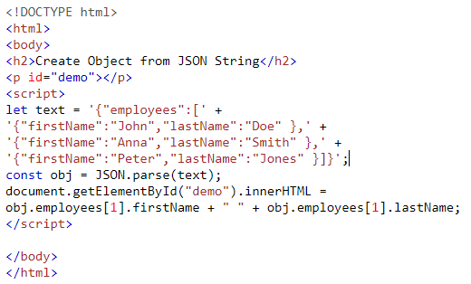
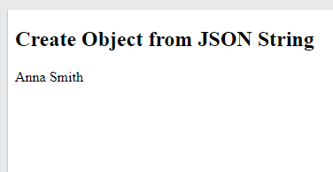

## **JS JSON**

**Content**

1\. What is JSON?

2\. The JSON Format Evaluates to JS Objects

3\. JSON Syntax Rules

4\. JSON Data - A Name and a Value

5\. JSON Objects

6\. JSON Arrays

7\. Converting a JSON Text to a JS Object

8\. References

## **1. What is JSON?**

-   JSON stands for **J**ava**S**cript **O**bject **N**otation
-   JSON is a format for storing and transporting data.
-   JSON is often used when data is sent from a server to a web page.
-   JSON is a lightweight data interchange format
-   JSON is language independent **\***
-   JSON is "self-describing" and easy to understand

\* The JSON syntax is derived from JS object notation syntax, but the JSON format is text only. Code for reading and generating JSON data can be written in any programming language.

## **2. The JSON Format Evaluates to JS Objects**

-   The JSON format is syntactically identical to the code for creating JS objects. Because of this similarity, a JS program can easily convert JSON data into native JS objects.

## **3. JSON Syntax Rules**

-   Data is in name/value pairs
-   Data is separated by commas
-   Curly braces hold objects
-   Square brackets hold arrays

**Example**

{  
"employees":[  
 {"firstName":"John", "lastName":"Doe"},  
 {"firstName":"Anna", "lastName":"Smith"},  
 {"firstName":"Peter", "lastName":"Jones"}  
]  
}

## **4. JSON Data - A Name and a Value**

-   JSON data is written as name/value pairs, just like JS object properties.
-   A name/value pair consists of a field name (in double quotes), followed by a colon, followed by a value: **"firstName":"John"**

**Note**

-   JSON names require double quotes. JS names do not.

## **5. JSON Objects**

-   JSON objects are written inside curly braces.
-   Just like in JS, objects can contain multiple name/value pairs: **{"firstName":"John", "lastName":"Doe"}**

## **6. JSON Arrays**

-   JSON arrays are written inside square brackets.
-   Just like in JS, an array can contain objects.

**Example**

"employees":[  
 {"firstName":"John", "lastName":"Doe"},  
 {"firstName":"Anna", "lastName":"Smith"},  
 {"firstName":"Peter", "lastName":"Jones"}  
]

-   In the example above, the object "employees" is an array. It contains three objects. Each object is a record of a person (with a first name and a last name).

## **7. Converting a JSON Text to a JS Object**

-   A common use of JSON is to read data from a web server, and display the data in a web page.
-   For simplicity, this can be demonstrated using a string as input.

**Step 1:** create a JavaScript string containing JSON syntax:

let text = '{ "employees" : [' +  
'{ "firstName":"John" , "lastName":"Doe" },' +  
'{ "firstName":"Anna" , "lastName":"Smith" },' +  
'{ "firstName":"Peter" , "lastName":"Jones" } ]}';

**Step 2:** use the JavaScript built-in function JSON.parse() to convert the string into a JavaScript object: **const obj = JSON.parse(text);**

**Step 3:** use the new JavaScript object in your page:

**Output**

****

## 8. **Refernces**

1.  https://www.w3schools.com/js/js_json.asp
