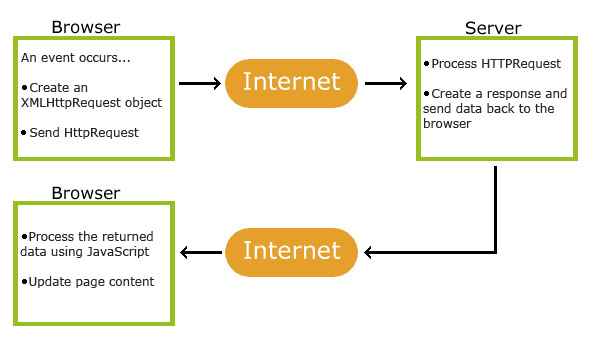
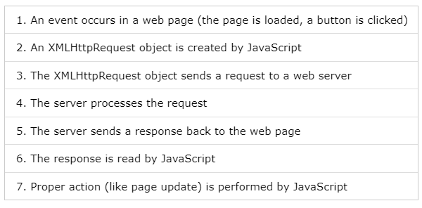

## AJAX

**Content**

**1. What is AJAX?**

1.1 How AJAX Works

**2. AJAX - The XMLHttpRequest Object**

2.1 Create an XMLHttpRequest Object

2.2 Define a Callback Function

2.3 Send a Request

**3. Fetch API**

4\*\*. References\*\*

## 1. What is AJAX?

-   AJAX = **A**synchronous **J**avaScript **A**nd **X**ML.
-   AJAX is not a programming language.
-   AJAX just uses a combination of:
1.  A browser built-in XMLHttpRequest object (to request data from a web server)
2.  JavaScript and HTML DOM (to display or use the data)
-   AJAX is a misleading name. AJAX applications might use XML to transport data, but it is equally common to transport data as plain text or JSON text.
-   AJAX allows web pages to be updated asynchronously by exchanging data with a web server behind the scenes. This means that it is possible to update parts of a web page, without reloading the whole page.

## 1.1 How AJAX Works

# 2. AJAX - The XMLHttpRequest Object

-   All modern browsers support the XMLHttpRequest object.
-   The XMLHttpRequest object can be used to exchange data with a web server behind the scenes. This means that it is possible to update parts of a web page, without reloading the whole page.

## 2.1 Create an XMLHttpRequest Object

-   All modern browsers (Chrome, Firefox, IE, Edge, Safari, Opera) have a built-in XMLHttpRequest object.

**Syntax**

*variable* = new XMLHttpRequest();

## 2.2 Define a Callback Function

-   A callback function is a function passed as a parameter to another function.
-   In this case, the callback function should contain the code to execute when the response is ready.

xhttp.onload = function() {  
// What to do when the response is ready  
}

## 2.3 Send a Request

-   To send a request to a server, you can use the open() and send() methods of the XMLHttpRequest object:

**Syntax**

xhttp.open("GET", "ajax_info.txt");  
xhttp.send();

**Example**

// Create an XMLHttpRequest object  
const xhttp = new XMLHttpRequest();

// Define a callback function  
xhttp.onload = function() {  
// Here you can use the Data  
}

// Send a request  
xhttp.open("GET", "ajax_info.txt");  
xhttp.send();

# 3. Fetch API

-   The Fetch API interface allows web browser to make HTTP requests to web servers.
-   No need for XMLHttpRequest anymore.
-   The example below fetches a file and displays the content:

**Example**-1

fetch(file)  
.then(x =\> x.text())  
.then(y =\> myDisplay(y));

-   Fetch is based on async and await, the example above might be easier to understand like this:

**Example-2**

async function getText(file) {  
let x = await fetch(file);  
let y = await x.text();  
myDisplay(y);  
}

Or even better: Use understandable names instead of x and y:

**Example-3**

async function getText(file) {  
let myObject = await fetch(file);  
let myText = await myObject.text();  
myDisplay(myText);  
}

## 4. References

1.  https://www.w3schools.com/js/js_ajax_intro.asp
2.  https://www.w3schools.com/js/js_ajax_http.asp
