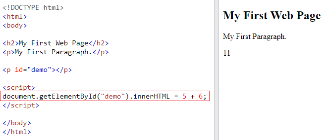
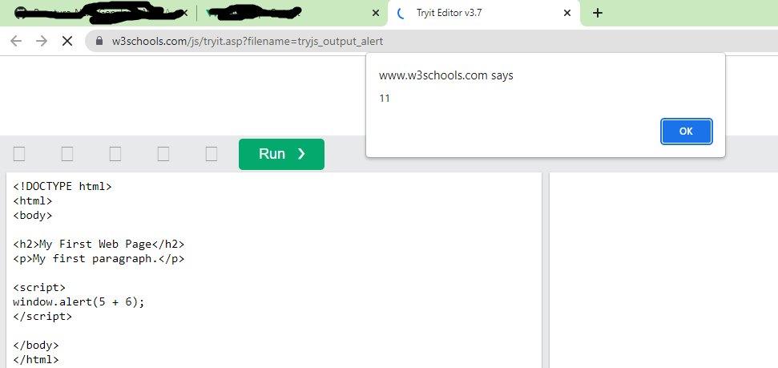

# JS Basics

**Content**

**1. JavaScript Display Possibilities**

1.1 Using innerHTML

1.2 Using document.write()

1.3 Using window.alert()

1.4 Using console.log()

**2. JavaScript Statements**

2.1 JavaScript Programs

2.2 JavaScript Statements

2.3 Semicolons;

2.4 JavaScript White Space

2.5 JavaScript Line Length and Line Breaks

2.6 JavaScript Keywords

**3. JavaScript Syntax**

3.1 JavaScript Identifiers / Names

3.2 JavaScript Values

3.2.1 JavaScript Literals

3.2.2 JavaScript Variables

3.3 JavaScript Comments

3.3.1 Single Line Comments

3.3.2 Multi-line Comments

3.4 JavaScript is Case Sensitive

**4. References**

# 1. JavaScript Display Possibilities

JavaScript can "display" data in different ways:

-   Writing into an HTML element, using innerHTML.
-   Writing into the HTML output using document.write().
-   Writing into an alert box, using window.alert().
-   Writing into the browser console, using console.log().

## 1.1 Using innerHTML

-   To access an HTML element, JavaScript can use the document.getElementById(id) method.
-   The id attribute defines the HTML element.
-   The innerHTML property defines the HTML content:

**Note:**

-   Changing the innerHTML property of an HTML element is a common way to display data in HTML.

## 1.2 Using document.write()

-   For testing purposes, it is convenient to use document.write():

**Note:**

-   Using document.write() after an HTML document is loaded, will **delete all existing HTML:**
-   The document.write() method should only be used for testing.

## 1.3 Using window.alert()

-   You can use an alert box to display data:

-   You can skip the **window** keyword.
-   In JavaScript, the window object is the global scope object, that means that variables, properties, and methods by default belong to the window object. This also means that specifying the **window** keyword is optional:

## 1.4 Using console.log()

-   For debugging purposes, you can call the console.log() method in the browser to display data.

# 2. JavaScript Statements

## 2.1 JavaScript Programs

-   A **computer program** is a list of "instructions" to be "executed" by a computer.
-   In a programming language, these programming instructions are called **statements**.
-   A **JavaScript program** is a list of programming **statements**.

**Note:**

-   In HTML, JavaScript programs are executed by the web browser.

## 2.2 JavaScript Statements

-   JavaScript statements are composed of: Values, Operators, Expressions, Keywords, and Comments.
-   Most JavaScript programs contain many JavaScript statements.
-   The statements are executed, one by one, in the same order as they are written.

Note:

-   JavaScript programs (and JavaScript statements) are often called JavaScript code.

## 2.3 Semicolons ;

-   Semicolons separate JavaScript statements.
-   Add a semicolon at the end of each executable statement:

### Examples

let a, b, c; // Declare 3 variables  
a = 5; // Assign the value 5 to a  
b = 6; // Assign the value 6 to b  
c = a + b; // Assign the sum of a and b to c

-   **When separated by semicolons, multiple statements on one line are allowed:**

a = 5; b = 6; c = a + b;

## 2.4 JavaScript White Space

-   JavaScript ignores multiple spaces. You can add white space to your script to make it more readable.
-   The following lines are equivalent:

let person = "Hege";  
let person="Hege";

## 2.5 JavaScript Line Length and Line Breaks

-   For best readability, programmers often like to avoid code lines longer than 80 characters.
-   If a JavaScript statement does not fit on one line, the best place to break it is after an operator:

**Example**

document.getElementById("demo").innerHTML =  
"Hello Dolly!";

## 2.6 JavaScript Keywords

-   JavaScript statements often start with a **keyword** to identify the JavaScript action to be performed.
-   Here is a list of some of the keywords:

**Note:**

JavaScript keywords are reserved words. Reserved words cannot be used as names for variables.

# 3. JavaScript Syntax

## 3.1 JavaScript Identifiers / Names

-   Identifiers are JavaScript names.
-   Identifiers are used to name variables and functions.
-   The rules for legal names are the same in most programming languages.
-   A JavaScript name must begin with:
-   A letter (A-Z or a-z)
-   A dollar sign (\$)
-   Or an underscore (_)

**Note**

-   Numbers are not allowed as the first character in names.

## 3.2 JavaScript Values

-   The JavaScript syntax defines two types of values:
1.  Fixed values
2.  Variable values
-   Fixed values are called **Literals**.
-   Variable values are called **Variables**.

## 3.2.1 JavaScript Literals

-   The two most important syntax rules for fixed values are:

1\. **Numbers** are written with or without decimals:

**Example**

10.50  
1001

2\. **Strings** are text, written within double or single quotes:

**Example**

"John Doe"  
'John Doe'

## 3.2.2 JavaScript Variables

**What are Variables?**

-   Variables are containers for storing data (storing data values).

**4 Ways to Declare a JavaScript Variable:**

1.  Using var
2.  Using let
3.  Using const
4.  Using nothing

**Declaring a JavaScript Variable**

-   Creating a variable in JavaScript is called "declaring" a variable.
-   You declare a JavaScript variable with the var or the let keyword:

**Example**

var carName;

or:

let carName;

-   After the declaration, the variable has no value (technically it is undefined).
-   **To assign a value to the variable, use the equal sign:**

carName = "Volvo";

-   **You can also assign a value to the variable when you declare it:**

let carName = "Volvo";

**Note**

-   It's a good programming practice to declare all variables at the beginning of a script.

**One Statement, Many Variables**

-   You can declare many variables in one statement.
-   Start the statement with let and separate the variables by **comma**:

**Example**

let person = "John Doe", carName = "Volvo", price = 200;

**Value = undefined**

-   A variable declared without a value will have the value undefined.

**Example**

let carName;

**Re-Declaring JavaScript Variables**

-   If you re-declare a JavaScript variable declared with var, it will not lose its value.
-   The variable carName will still have the value "Volvo" after the execution of these statements:

### Example

var carName = "Volvo";  
var carName;

**Note**

-   You cannot re-declare a variable declared with let or const.

**JavaScript Dollar Sign \$**

-   JavaScript treats a dollar sign as a letter, identifiers containing \$ are valid variable names:

**Example**

let \$ = "Hello World";  
let \$\$\$ = 2;  
let \$myMoney = 5;

**JavaScript Underscore (_)**

-   JavaScript treats underscore as a letter, identifiers containing \_ are valid variable names:

**Example**

let \_lastName = "Johnson";  
let \_x = 2;  
let \_100 = 5;

## 3.3 JavaScript Comments

-   JavaScript comments can be used to explain JavaScript code, and to make it more readable.
-   JavaScript comments can also be used to prevent execution, when testing alternative code.
-   Comments are ignored, and will not be executed:

**3.3.1 Single Line Comments**

-   Single line comments start with //.
-   Any text between // and the end of the line will be ignored by JavaScript (will not be executed).

**Example**

let x = 5; // Declare x, give it the value of 5  
let y = x + 2; // Declare y, give it the value of x + 2

**3.3.2 Multi-line Comments**

-   Multi-line comments start with /\* and end with \*/.
-   Any text between /\* and \*/ will be ignored by JavaScript.

**Example**

/\*  
The code below will change  
the heading with id = "myH"  
and the paragraph with id = "myP"  
in my web page:  
\*/  
document.getElementById("myH").innerHTML = "My First Page";  
document.getElementById("myP").innerHTML = "My first paragraph.";

**Note:**

-   It is most common to use single line comments.
-   Block comments are often used for formal documentation.

## 3.4 JavaScript is Case Sensitive

-   All JavaScript identifiers are **case sensitive**.
-   The variables lastName and lastname, are two different variables:

**Example:**

let lastname, lastName;  
lastName = "Doe";  
lastname = "Peterson";

# 4. References

1.  <https://www.w3schools.com/js/js_output.asp>
2.  <https://www.w3schools.com/js/js_statements.asp>
3.  https://www.w3schools.com/js/js_syntax.asp
4.  <https://www.w3schools.com/js/js_variables.asp>
