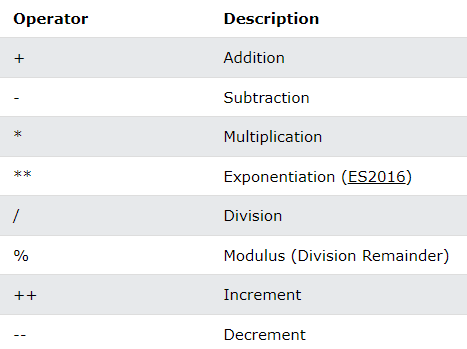
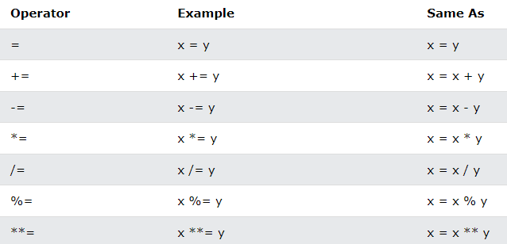
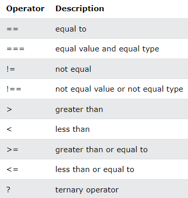
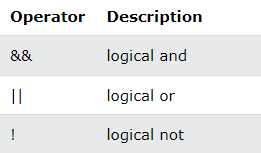
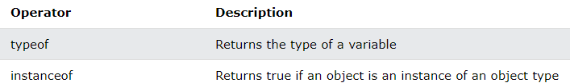
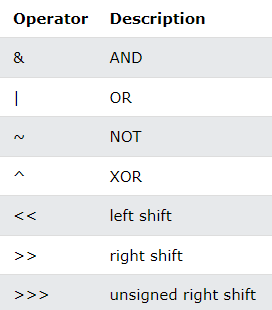

# JS Operators

**Content**

**1. JavaScript Operators**

1.1 JavaScript Arithmetic Operators

1.2 JavaScript Assignment Operators

1.3 JavaScript String Operators

1.4 JavaScript Comparison Operators

1.5 JavaScript Logical Operators

1.6 JavaScript Type Operators

1.7 JavaScript Bitwise Operators

**2. References**

# 1. JavaScript Operators

## 1.1 JavaScript Arithmetic Operators

-   Arithmetic operators are used to perform arithmetic on numbers:

## 1.2 JavaScript Assignment Operators

-   Assignment operators assign values to JavaScript variables.

## 1.3 JavaScript String Operators

-   The + operator can also be used to add (concatenate) strings.

**Example**

let text1 = "John";  
let text2 = "Doe";  
let text3 = text1 + " " + text2;

The **result** of text3 will be:

John Doe

-   The += assignment operator can also be used to add (concatenate) strings:

**Example**

let text1 = "What a very ";  
text1 += "nice day";

The **result** of text1 will be:

What a very nice day

**Adding Strings and Numbers**

-   Adding two numbers, will return the sum, but adding a number and a string will return a string:

### Example

let x = 5 + 5;  
let y = "5" + 5;  
let z = "Hello" + 5;

The **result** of *x*, *y*, and *z* will be:

10  
55  
Hello5

**Note:** If you add a number and a string, the result will be a string!

## 1.4 JavaScript Comparison Operators

## 1.5 JavaScript Logical Operators

## 1.6 JavaScript Type Operators

## 1.7 JavaScript Bitwise Operators

# 2. References

1.  https://www.w3schools.com/js/js_operators.asp
