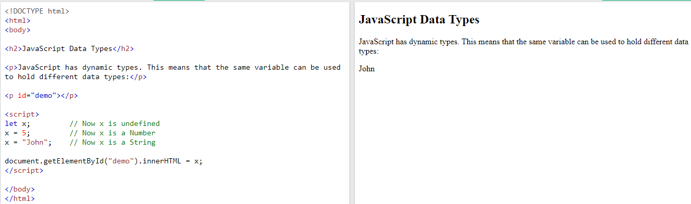
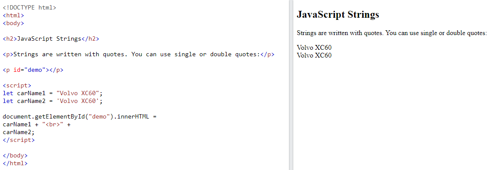
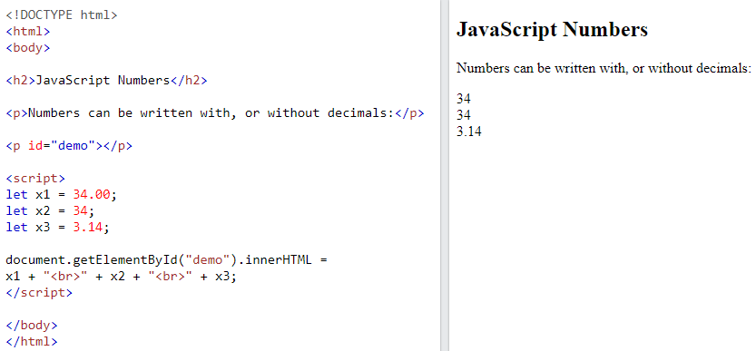
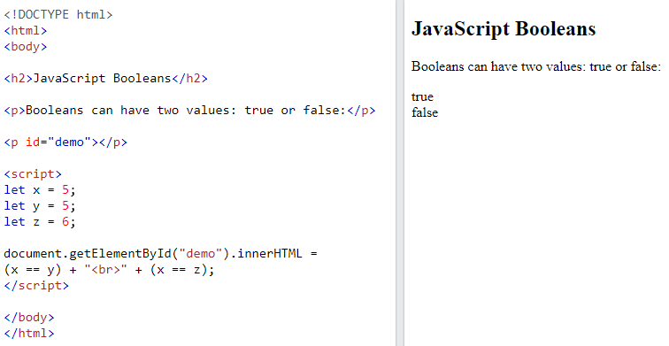
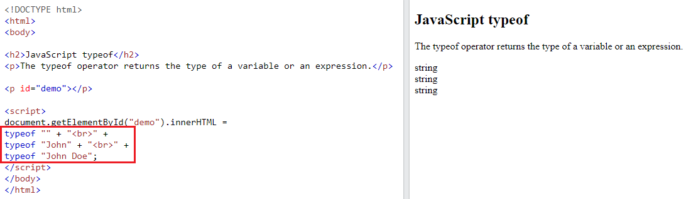
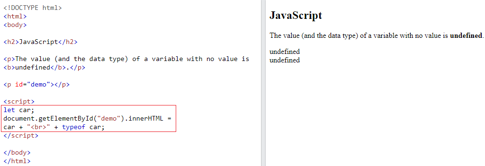
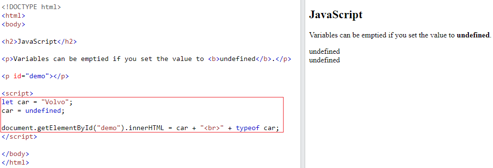
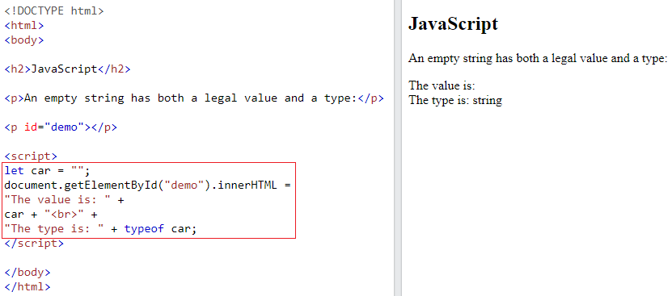

## JS Data Types

**Contents**

**1. The Concept of Data Types**

1.1 JS Types are Dynamic

1.2 JS Strings

1.3 JS Numbers

1.4 JS Booleans

1.5 The typeof Operator

1.6 Undefined

1.7 Empty Values

**2. References**

## 1. The Concept of Data Types

-   JavaScript variables can hold different data types: numbers, strings, objects and more:
-   In programming, data types is an important concept.
-   To be able to operate on variables, it is important to know something about the type.
-   Without data types, a computer cannot safely solve this:
-   When adding a number and a string, JavaScript will treat the number as a string.

## 1.1 JS Types are Dynamic

-   JavaScript has dynamic types. This means that the same variable can be used to hold different data types:

**Example**

## 1.2 JS Strings

-   A string (or a text string) is a series of characters like "John Doe".
-   Strings are written with quotes. You can use single or double quotes:

**Example-1**

-   You can use quotes inside a string, as long as they don't match the quotes surrounding the string:

**Example-2**

let answer1 = "It's alright"; // Single quote inside double quotes  
let answer2 = "He is called 'Johnny'"; // Single quotes inside double quotes  
let answer3 = 'He is called "Johnny"'; // Double quotes inside single quotes

## 1.3 JS Numbers

-   JavaScript has only one type of numbers.
-   Numbers can be written with, or without decimals:

**Example**

-   Extra large or extra small numbers can be written with scientific (exponential) notation:

**Example-2**

let y = 123e5; // 12300000  
let z = 123e-5; // 0.00123

## 1.4 JS Booleans

-   Booleans can only have two values: true or false.
-   Booleans are often used in conditional testing.

**Example**

## 1.5 The typeof Operator

-   You can use the JavaScript typeof operator to find the type of a JavaScript variable.
-   The typeof operator returns the type of a variable or an expression:

**Example**

## 1.6 Undefined

-   In JavaScript, a variable without a value, has the value undefined. The type is also undefined.

**Example-1**

-   Any variable can be emptied, by setting the value to undefined. The type will also be undefined.

**Example-2**

## 1.7 Empty Values

-   An empty value has nothing to do with undefined.
-   An empty string has both a legal value and a type.

**Example**

## 2. References

1\. https://www.w3schools.com/js/js_datatypes.asp
