## Linux/Unix File Commands Using Git Bash

## What is Linux/Unix?

Let's first start with the basic knowledge of the Linux and Unix operating system. To know more details about linux/unix [click here](https://github.com/content-development-2022/Revature-Next-Gen-Java-AWS-Angular-Extended-v3.1/blob/main/linux/supporting-files/linux-or-unix.md)

## What is Git?

-   **Git** is a version control system or VCS.
-   VCS, tracks the history of changes as people and teams collaborate on projects together. As developers make changes to the project, any earlier version of the project can be recovered at any time.
-   To know more information about git [click here](https://docs.github.com/en/get-started/using-git/about-git)

## What is Git Bash?

-   **Git Bash** is a Microsoft Windows application with a Git command-line interface.

## What is Bash?

-   **Bash** is an acronym for Bourne Again Shell, which is a GNU Project shell.
-   A shell is used to interface with an operating system by executing commands, and Bash is the default shell used on Linux and macOS.

## How to Install and Set Up Git Bash?

To know the procedure to install gitbash [click here](https://github.com/content-development-2022/Revature-Next-Gen-Java-AWS-Angular-Extended-v3.1/blob/main/linux/supporting-files/installing-gitbash.md)

## Linux File System Overview

-   Let’s take a moment and have an overview of file system: [click here](https://github.com/content-development-2022/Revature-Next-Gen-Java-AWS-Angular-Extended-v3.1/blob/main/linux/supporting-files/file-system-overview.md)

## Linux File Command Using Git Bash

Let’s now delve into the basic file management commands that will help you create and manage your files on your system.

-   **File Command** is used to determine the file type.
-   It does not care about the extension used for file.
-   File management commands that will help you create and manage your files on your system.

For this lesson, we will be running commands on the gitbash terminal.

The following are the top Linux commands:

1.  Pwd
2.  Mkdir
3.  Cd
4.  Touch
5.  Ls
6.  Cat
7.  Cp
8.  rmdir
9.  Find
10. locate

## 1. pwd

-   **pwd**, short for the print working directory, is a command that prints out the current working directory in a hierarchical order, beginning with the topmost root directory ( / ).
-   To know more information about print working directory [click here pwd](https://www.tecmint.com/pwd-command-examples/)

    **Syntax:** pwd

    **Output:**

**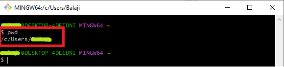**

## 2. mkdir

-   To create a new directory use the mkdir command (make directory).
-   To know more information about make directory [click here mkdir](https://www.tecmint.com/mkdir-tar-and-kill-commands-in-linux/)
-   **Syntax:** mkdir \<directory_name\>

**Output:**

**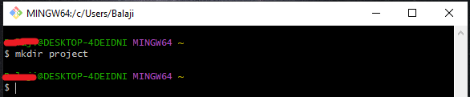**

## 3. cd

-   To change or navigate directories, use the cd command which is short for change directory.
-   To know more information about change directory [click here cd](https://www.tecmint.com/cd-command-in-linux/)

**Syntax: cd \<directory_name\>**

**Output:**

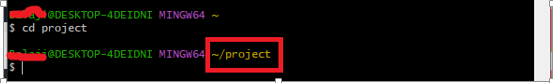

-   To go a directory up append two dots or periods in the end.

**Syntax:** cd ..

**Output:**

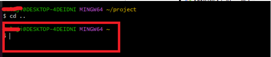

-   To go back to the home directory run the cd command without any arguments.

**Syntax:** cd

**Output:**

**NOTE**: To navigate into a subdirectory or a directory within your current directory, don’t use a forward slash ( / ) simply type in the name of the directory.

## 4. Touch

-   The touch command is used for creating simple files on a Linux system.
-   To know more information about creating simple files [click here touch](https://www.tecmint.com/8-pratical-examples-of-linux-touch-command/).

    **Syntax:** touch \<file_name\>

**Output:**

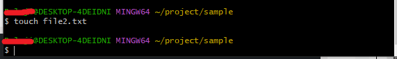

## 5.ls

-   The ls command is a command used for listing existing files or folders in a directory.
-   To know more information about listing an existing file [click here ls](https://www.tecmint.com/15-basic-ls-command-examples-in-linux/).

**Syntax:** ls

**Output:**

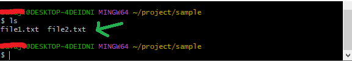

-   To list more information append the -lh flag as shown. The -l option stands for long listing and prints out additional information such as file permissions, user, group, file size, and date of creation. The -h flag prints out the file or directory size in a human-readable format.

**Syntax:** ls –lh

**Output:**

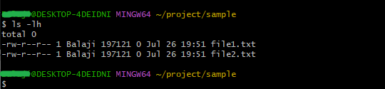

## 6. cat

-   To view the contents of a file, use the cat command
-   To know more information about cat [click here cat](https://www.tecmint.com/13-basic-cat-command-examples-in-linux/)

**Syntax:** cat \<file_name\>

**Output:**

**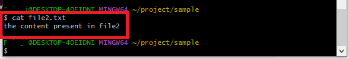**

## 7. cp

-   The cp command, short for copy.
-   Copies a file from one file location to another.
-   Unlike the move command, the **cp** command retains the original file in its current location and makes a duplicate copy in a different directory.
-   To know more information about coping the files [click here cp](https://www.tecmint.com/linux-commands-cheat-sheet/#cp)

**Syntax:** cp \<file_name\> \<destination_path\>

**Output:**

**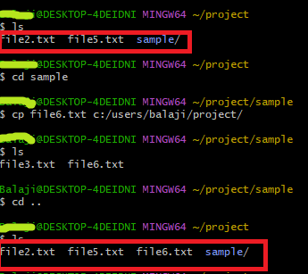**

## 8. rmdir

-   The **rmdir** command deletes an empty directory.
-   To know more information about deleting directory [click here rmdir](https://www.tecmint.com/linux-commands-cheat-sheet/#rmdir)

**Syntax:** rmdir \<directory_name\>

**Output:**

**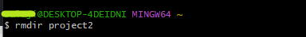**

-   If you try to remove a non-empty directory, you will get an error message as shown.

**Output:**

**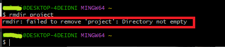**

## 9. find

-   Sometimes, you may want to search the location of a particular file. You can easily do this using either the **find** or **locate** commands.
-   The find command searches for a file in a particular location and takes two arguments: the search path or directory and the file to be searched.
-   To know more information about searching for a file [click here find](https://www.tecmint.com/find-files-quickly-in-linux-terminal/)

**Syntax:** find \<path\> -name \<file_name\>

**Output:**

****

## 10. locate

-   The locate command searches using a database of all the possible files and directories in the system
-   The **locate** command, just like the **find** command, plays the same role of searching files but only takes one argument as shown.
-   To know more information about searching for a file in the sysytem [click here locate](https://www.tecmint.com/linux-locate-command-practical-examples/).

**Syntax:** locate \<file_name\>

**Output:**

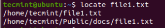

**NOTE**: The **locate** command is much faster than the **find** command. However, the **find** command is much more powerful and works in situations where **locate** does not produce the desired results.

## References:

1.  <https://www.tecmint.com/linux-file-management-commands/>
2.  <https://www.javatpoint.com/linux-commands>
3.  <https://www.javatpoint.com/linux-files>
4.  [https://www.javatpoint.com/architecture-of linux\#:\~:text=The%20Linux%20operating%20system's%20architecture,actions%20of%20the%20Linux%20OS](https://www.javatpoint.com/architecture-of%20linux#:~:text=The%20Linux%20operating%20system's%20architecture,actions%20of%20the%20Linux%20OS)
5.  <https://www.meted.ucar.edu/ucar/unix/navmenu.php?tab=1&page=2-1-0&type=flash>
