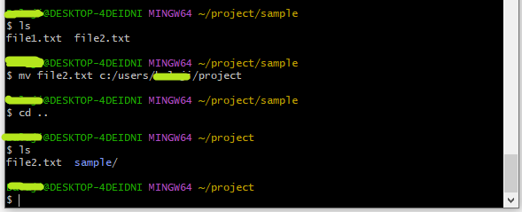
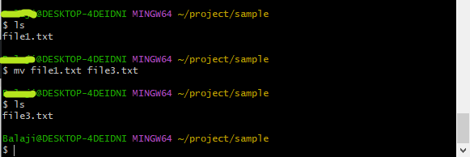
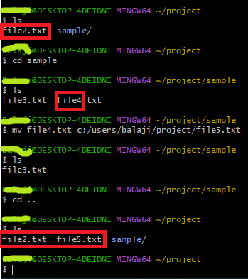
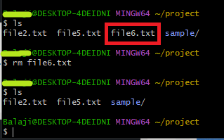
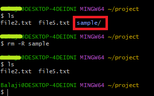

## Linux/Uniux Demo Moving and Deleting Files using Gitbash

## Moving Files

-   **mv** stands for **move**.
-   mv is used to move one or more files or directories from one place to another in a file system.
-   It has two distinct functions:  
    **(i)** It renames a file or folder.  
    **(ii)** It moves a group of files to a different directory.  
    No additional space is consumed on a disk during renaming. This command normally **works silently** means no prompt for confirmation.

**syntax :**

mv \<file_name\> \<destination_path\>

**Output:**

-   To rename a file, The command removes the original file name and assigns the second argument as the new file name.

**syntax:** mv \<existing_file_name\> \<new_file_name\>

**Output:**

-   Additionally, you can move and rename the file at the same time by specifying the destination folder and a different file name.
-   For example to move **file4.txt** to the location **Project** and rename it **file5.txt**

**Syntax:** mv \<existing-file-name\> \<destination-path/new_file_name\>

**Output:**

## Deleting Files

-   The **rm** (remove) command is used to delete a file.

**Synatx:** rm \<file_name\>

**Output:**

-   Additionally, you can remove or delete a directory recursively using the -R option. This could either be an empty or a non-empty directory.

**Syntax:** rm -R \<directory_name\>

**Output:**

## References

1.  https://www.tecmint.com/linux-file-management-commands/
2.  https://www.javatpoint.com/linux-commands
