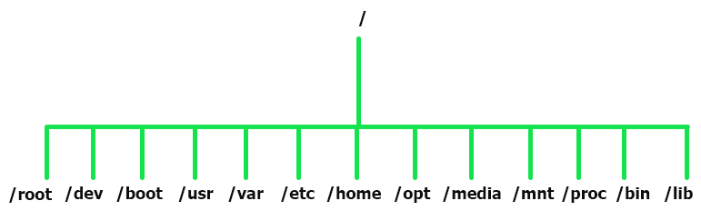

### Linux File System Overview

These are the most common file types.

##### **1. Regular Files**

Regular files contain human-readable text, program instructions, and ASCII characters.

Examples of regular files include:

-   Simple text files, pdf files
-   Multimedia files such as image, music, and video files
-   Binary files
-   Zipped or compressed files

And so much more.

##### **2. Special Files**

-   These are files that represent physical devices such as mounted volumes, printers, CD drives, and any I/O) input and output device.

##### **3. Directories**

-   A **directory** is a special file type that stores both regular and special files in a hierarchical order starting from the root ( / ) directory.
-   A directory is the equivalent of a folder in the Windows operating system.
-   Directories are created using the **mkdir** command, short for making the directory, as we shall see later on in this tutorial.

The Linux Directory Structure starts from the root directory and branches out to other directories as shown:

Let’s understand each directory and its usage.

-   The **/root** directory is the home directory for the root user.
-   The **/dev** directory contains device files such as **/dev/sda**.
-   Static boot files are located in the **/boot** directory.
-   Applications and user utilities are found in the **/usr** directory.
-   The **/var** directory contains log files of various system applications.
-   All system configuration files are stored in the **/etc** directory.
-   The **/home** directory is where user folders are located. These include Desktop, Documents, Downloads, Music, Public, and Videos.
-   For add-on application packages, check them out in the **/opt** directory.
-   The **/media** directory stores files for removable devices such as USB drives.
-   The **/mnt** directory contains subdirectories that act as temporary mount points for mounting devices such as CD-ROMs.
-   The **/proc** directory is a virtual filesystem that holds information on currently running processes. It’s a strange filesystem that is created upon a system boot and destroyed upon shutdown.
-   The **/bin** directory contains user command binary files.
-   The **/lib** directory stores shared library images and kernel modules.

# References:

1.  <https://www.tecmint.com/linux-file-management-commands/>
2.  [https://www.javatpoint.com/architecture-of-linux\#:\~:text=The%20Linux%20operating%20system's%20architecture,actions%20of%20the%20Linux%20OS](https://www.javatpoint.com/architecture-of-linux#:~:text=The%20Linux%20operating%20system's%20architecture,actions%20of%20the%20Linux%20OS)
3.  https://www.meted.ucar.edu/ucar/unix/navmenu.php?tab=1&page=2-1-0&type=flash
