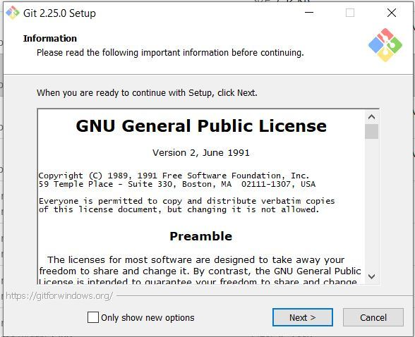
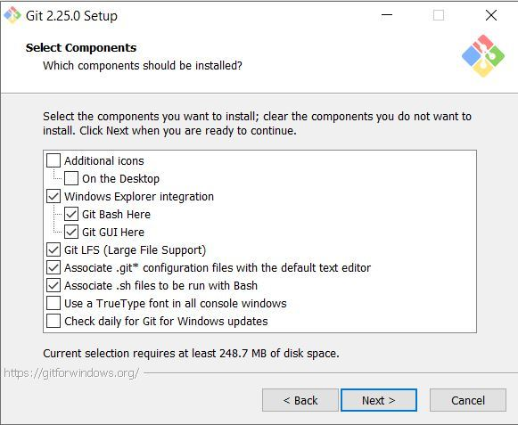
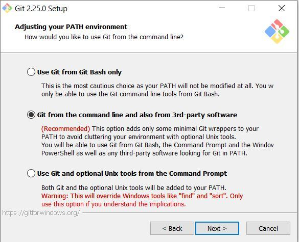
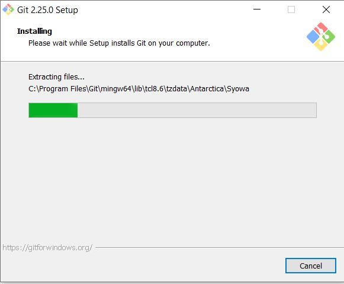
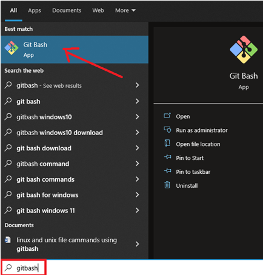
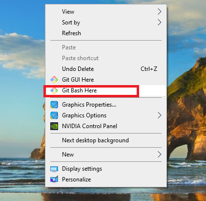
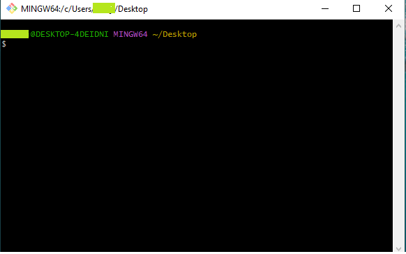

## Installing Git Bash

## How to Install and Set Up Git Bash (A Step-by-Step Guide)

**Step 1:** The .exe file installer for Git Bash can be downloaded from <https://gitforwindows.org/>  
Once downloaded execute that installer, following window will occur

**Step 2:** Select the components that you need to install and click on the Next button.

**Step 3:** Select how to use the Git from command-line and click on Next to begin the installation process.

**Step 4:** Let the installation process finish to begin using Git Bash.

### Step 5: Launch Git Bash

**Method1:** After installing Git, search for **Git Bash** in the start menu. Press **Enter** to launch the app.

**Method2:** Alternatively, to run Git Bash from a location where you want to keep your project files, press the right mouse button and click the **Git Bash Here** option from the dropdown menu.

**Step 6:** Git command-line interface

