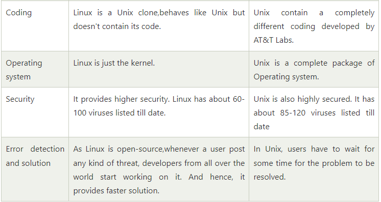

## Operating System

-   An operating system can be described as an interface among the computer hardware and the user of any computer.
-   The primary aim of an operating system is to provide a platform where a user can run any program conveniently or efficiently.

## Linux Operating System

-   Linux is an open source multi-tasking, multi-user operating system.
-   It was developed by Linus Torvalds in 1991.
-   Linux OS is one of the famous versions of the UNIX OS. It is developed to provide a low-cost or free OS for several personal computer system users.
-   Linux OS is widely used in desktops, mobiles, mainframes etc.

## Architecture of Linux System

The Linux operating system's architecture mainly contains of **Kernel, System Library, Hardware, System Utility,** and **Shell utility**.

## Kernel

-   The kernel is one of the core section of an operating system.
-   It is responsible for each of the major actions of the Linux OS.
-   This operating system contains distinct types of modules and cooperates with underlying hardware directly.
-   There are some of the important kernel types which are mentioned below:
1.  Monolithic Kernel
2.  Micro kernels
3.  Exo kernels
4.  Hybrid kernels

## System Library

-   These libraries can be specified as some special functions.
-   These are applied for implementing the operating system's functionality and don't need code access rights of the modules of kernel.

## System Utility

-   It is responsible for doing specialized level and individual activities.

## Hardware

-   Linux operating system contains a hardware layer that consists of several peripheral devices like [CPU](https://www.javatpoint.com/central-processing-unit), [HDD](https://www.javatpoint.com/hdd), and [RAM](https://www.javatpoint.com/ram).

## Shell

-   It is an interface among the kernel and user.
-   It can take commands through the user and runs the functions of the kernel.
-   The operating systems are categorized into two different types, which are the **graphical shells** and **command-line shells**.
-   The graphical line shells facilitate the graphical user interface, while the command line shells facilitate the command line interface.
-   Thus, both of these shells implement operations. However, the graphical user interface shells work slower as compared to the command-line interface shells.
-   There are a few types shells which are categorized as follows:
-   Korn shell
-   Bourne shell
-   C shell
-   POSIX shell

## Drawbacks of Linux

To know details about the drawback [click here](https://www.javatpoint.com/architecture-of-linux#:~:text=The%20Linux%20operating%20system's%20architecture,actions%20of%20the%20Linux%20OS)

## Unix

-   Unix is an operating system that can handle multiple users and processes at the same time.
-   Unix is multi-tasking, multi-user operating system but is not free to use and is not open source.
-   It was developed in 1969 by Ken Thompson team at AT&T Bell Labs.
-   It is widely used on servers, workstations etc.

## Unix Architecture

-   Unix is made up of 3 main parts: the kernel, the shell, and user commands and applications.

-   The kernel and shell are the heart and soul of the operating system.
-   The kernel ingests user input via the shell and accesses the hardware to perform things like memory allocation and file storage.
-   The shell is an interface that interprets the command line input and calls the necessary programs to do the work.
-   The commands that you enter are programs themselves, so once the work is done, the command line will return to a prompt and await further input.
-   **Example:** how the shell and kernel work together is copying a file?

    If you want to copy a file named "file1" and name the copy "file2", you would enter "cp file1 file2" at the command line. The shell will search for the program "cp" and then tell the kernel to run that program on "file 1" and name the output "file 2". When the copying is finished, the shell returns you to the prompt and awaits more commands.

## Difference between Linux and Unix

## References

1. https://www.javatpoint.com/architecture-of-linux#:~:text=The%20Linux%20operating%20system's%20architecture,actions%20of%20the%20Linux%20OS
2.  <https://www.meted.ucar.edu/ucar/unix/navmenu.php?tab=1&page=2-1-0&type=flash>
3.  https://www.javatpoint.com/unix-vs-linux
