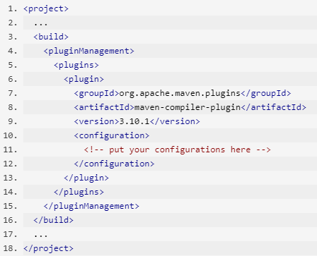

## MAVEN

**Content**

1\. Introduction of Maven

2\. Maven’s Objectives

3\. Build Lifecycle

3.1 Build Lifecycle Basics

3.2 Build Lifecycle Phases

3.3 A Build Phase is made up of Plugin Goals

4\. Archetype

5\. POM

5.1 Super POM

5.2 Minimal POM

6\. Project Interpolation and Variables

7\. Introduction to Repositories

7.1 Artifact Repositories

7.2 Using Repositories

7.3 Downloading from a Remote Repository

7.4 Using Mirrors for the Central Repository

8\. Maven Plugin

8.1 Available Plugins

8.2 Supported by the Maven Project

9\. References

## 1. Introduction of Maven

-   Maven is a powerful project management tool that is based on POM (project object model).
-   It is used for projects build, dependency and documentation.
-   It simplifies the build process like ANT. But it is too much advanced than ANT.
-   In short terms we can tell maven is a tool that can be used for building and managing any Java-based project.
-   Maven make the day-to-day work of Java developers easier and generally help with the comprehension of any Java-based project.

## 2. Maven's Objectives

-   Maven's primary goal is to allow a developer to comprehend the complete state of a development effort in the shortest period of time.
-   In order to attain this goal, Maven deals with several areas of concern:
1.  Making the build process easy
2.  Providing a uniform build system
3.  Providing quality project information
4.  Encouraging better development practices

## 3. Build Lifecycle

### 3.1 Build Lifecycle Basics

-   Maven is based around the central concept of a build lifecycle.
-   What this means is that the process for building and distributing a particular artifact (project) is clearly defined.
-   There are three built-in build lifecycles: default, clean and site.
1.  The **default** lifecycle handles your project deployment.
2.  The **clean** lifecycle handles project cleaning.
3.  The **site** lifecycle handles the creation of your project's web site.

### 3.2 Build Lifecycle Phases

-   Each of these build lifecycles is defined by a different list of build phases, wherein a build phase represents a stage in the lifecycle.
-   For example, the default lifecycle comprises of the following phases (for a complete list of the lifecycle phases):
1.  **validate** - validate the project is correct and all necessary information is available
2.  **compile** - compile the source code of the project
3.  **test** - test the compiled source code using a suitable unit testing framework. These tests should not require the code be packaged or deployed
4.  **package** - take the compiled code and package it in its distributable format, such as a JAR.
5.  **verify** - run any checks on results of integration tests to ensure quality criteria are met
6.  **install** - install the package into the local repository, for use as a dependency in other projects locally
7.  **deploy** - done in the build environment, copies the final package to the remote repository for sharing with other developers and projects.

These lifecycle phases are executed sequentially to complete the default lifecycle. Given the lifecycle phases above, this means that when the default lifecycle is used, Maven will first validate the project, then will try to compile the sources, run those against the tests, package the binaries (e.g. jar), run integration tests against that package, verify the integration tests, install the verified package to the local repository, then deploy the installed package to a remote repository.

### 3.3 A Build Phase is made up of Plugin Goals

-   Build phase is responsible for a specific step in the build lifecycle, the manner in which it carries out those responsibilities may vary. And this is done by declaring the plugin goals bound to those build phases.
-   A plugin goal represents a specific task (finer than a build phase) which contributes to the building and managing of a project.

**Example**

mvn clean package

## 4. Archetype

-   In short, Archetype is a Maven project templating toolkit.
-   Archetype will help authors create Maven project templates for users, and provides users with the means to generate parameterized versions of those project templates.
-   In a matter of seconds, a new user can have a working Maven project to use as a jumping board for investigating more of the features in Maven.

**There are three ways to create a maven project**

1.  Using maven commands, you can create the maven project.
2.  Using maven's eclipse plugin, you can create a new maven project in eclipse.
3.  Using maven's eclipse plugin, an existing project can be converted into a maven project in eclipse.

## 5.POM

-   A Project Object Model or POM is the fundamental unit of work in Maven.
-   It is an XML file that contains information about the project and configuration details used by Maven to build the project.
-   It contains default values for most projects.

**Example** for this is the build directory, which is target; the source directory, which is src/main/java; the test source directory, which is src/test/java; and so on. When executing a task or goal, Maven looks for the POM in the current directory. It reads the POM, gets the needed configuration information, then executes the goal.

### 5.1 Super POM

-   The Super POM is Maven's default POM.
-   All POMs extend the Super POM unless explicitly set, meaning the configuration specified in the Super POM is inherited by the POMs you created for your projects.

### 5.2 Minimal POM

The minimum requirement for a POM are the following:

-   project root
-   modelVersion - should be set to 4.0.0
-   groupId - the id of the project's group.
-   artifactId - the id of the artifact (project)
-   version - the version of the artifact under the specified group.

**Example:**

1.  \<project\>
2.  \<modelVersion\>4.0.0\</modelVersion\>
3.  \<groupId\>com.mycompany.app\</groupId\>
4.  \<artifactId\>my-app\</artifactId\>
5.  \<version\>1\</version\>
6.  \</project\>
-   A POM requires that its groupId, artifactId, and version be configured. These three values form the project's fully qualified artifact name.
-   This is in the form of \<groupId\>:\<artifactId\>:\<version\>.
-   If the configuration details are not specified, Maven will use their defaults.
-   One of these default values is the packaging type. Every Maven project has a packaging type. If it is not specified in the POM, then the default value "jar" would be used.
-   Furthermore, you can see that in the minimal POM the *repositories* were not specified. If you build your project using the minimal POM, it would inherit the *repositories* configuration in the Super POM. Therefore when Maven sees the dependencies in the minimal POM, it would know that these dependencies will be downloaded from https://repo.maven.apache.org/maven2 which was specified in the Super POM.

## 6. Project Interpolation and Variables

-   One of the practices that Maven encourages is don't repeat yourself.
-   However, there are circumstances where you will need to use the same value in several different locations.
-   To assist in ensuring the value is only specified once, Maven allows you to use both your own and pre-defined variables in the POM.

**Example**

-   To know more information about project interpolation and variables [click here](https://maven.apache.org/guides/introduction/introduction-to-the-pom.html#Project_Interpolation)

## 7. Introduction to Repositories

### 7.1 Artifact Repositories

-   A repository in Maven holds build artifacts and dependencies of varying types.
-   There are exactly two types of repositories:

1\. Local Repository

2\. Remote Repository

**Local Repository**

-   The local repository is a directory on the computer where Maven runs.
-   It caches remote downloads and contains temporary build artifacts that you have not yet released.

**Remote Repository**

-   Remote repositories refer to any other type of repository, accessed by a variety of protocols such as file:// and https://.
-   These repositories might be a truly remote repository set up by a third party to provide their artifacts for downloading (for example, [repo.maven.apache.org](https://repo.maven.apache.org/maven2/)).
-   Other "remote" repositories may be internal repositories set up on a file or HTTP server within your company, used to share private artifacts between development teams and for releases.

### 7.2 Using Repositories

-   In general, you should not need to do anything with the local repository on a regular basis, except clean it out if you are short on disk space (or erase it completely if you are willing to download everything again).

### 7.3 Downloading from a Remote Repository

-   Downloading in Maven is triggered by a project declaring a dependency that is not present in the local repository (or for a SNAPSHOT, when the remote repository contains one that is newer). By default, Maven will download from the [central](https://repo.maven.apache.org/maven2/) repository.

### 7.4 Using Mirrors for the Central Repository

-   There are [several official Central repositories](https://maven.apache.org/repository/) geographically distributed.
-   You can make changes to your settings.xml file to use one or more mirrors.
-   Instructions for this can be found in the guide [Using Mirrors for Repositories](https://maven.apache.org/guides/mini/guide-mirror-settings.html).

## 8. Maven Plugin

### 8.1 Available Plugins

-   Maven is - at its heart - a plugin execution framework; all work is done by plugins.
-   There are 2 plugins: the build and the reporting plugins:
1.  **Build plugins** will be executed during the build and they should be configured in the \<build/\> element from the POM.
2.  **Reporting plugins** will be executed during the site generation and they should be configured in the \<reporting/\> element from the POM. Because the result of a Reporting plugin is part of the generated site, Reporting plugins should be both internationalized and localized.
3.  To know more details about reporting plugin [click here](https://maven.apache.org/plugins/index.html)

### 8.2 Supported by the Maven Project

**Maven Compiler Plugin**

-   Compiles Java sources.

**Compiling Your Java Sources**

-   The goals for the Compiler Plugin are bound to their respective phases in the build lifecycle. So to compile your sources, you need only to tell maven until which lifecycle to execute.

**Configuring Your Compiler Plugin**

-   The Compiler Plugin executes automatically during their phases

**Note**: Maven 3.0 will issue warnings if you do not specify the version of a plugin.

**Maven Install Plugin**

-   Install the built artifact into the local repository.
-   To know more information about maven plugins [click here](https://maven.apache.org/plugins/index.html)

## 9. References

1.  <https://maven.apache.org/what-is-maven.html>
2.  <https://maven.apache.org/guides/introduction/introduction-to-repositories.html>
3.  https://maven.apache.org/plugins/index.html
