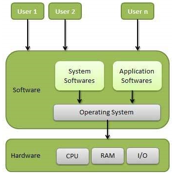
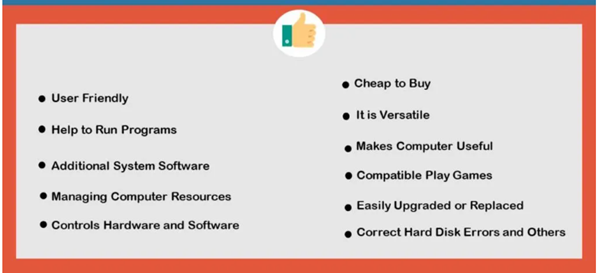
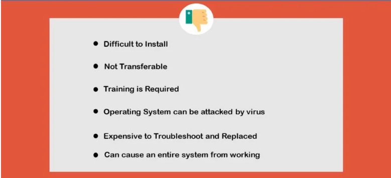

## Operating System: Fundamentals

## Operating System

-   An **Operating System** can be defined as an **interface between user and hardware**.
-   It is responsible for the execution of all the processes, Resource Allocation, CPU management, file Management and many other tasks.
-   The purpose of an operating system is to provide an environment in which a user can execute programs in convenient and efficient manner.
-   Some popular Operating Systems include Linux Operating System, Windows Operating System, VMS, OS/400, AIX, z/OS, etc.
-   Desktop computers, PDAs, laptop computers, notebook computers and even most mobile phones of today, come with an operating system.

## Structure of a Computer System

A Computer System consists of:

-   Users (people who are using the computer)
-   Application Software (Compilers, Databases, Games, Video player, Browsers, etc.)
-   System Software (Shells, Editors, Compilers, etc.)
-   Operating System ( A special program which acts as an interface between user and hardware )
-   Hardware ( CPU, Disks, Memory, etc)

## 

Following are some of important **functions of an operating System**

-   Memory Management
-   Processor Management
-   Device Management
-   File Management
-   Security
-   Control over system performance
-   Job accounting
-   Error detecting aids
-   Coordination between other software and users

## Memory Management

-   Memory management refers to management of Primary Memory or Main Memory. Main memory is a large array of words or bytes where each word or byte has its own address.
-   Main memory provides a fast storage that can be accessed directly by the CPU. For a program to be executed, it must be loaded in the main memory.
-   An Operating System does the following activities for memory management
1.  Keeps tracks of primary memory, i.e., what part of it are in use by whom, what part are not in use.
2.  In multiprogramming, the OS decides which process will get memory when and how much.
3.  Allocates the memory when a process requests it to do so.
4.  De-allocates the memory when a process no longer needs it or has been terminated.

## Processor Management

-   In multiprogramming environment, the OS decides which process gets the processor when and for how much time. This function is called **process scheduling**.
-   An Operating System does the following activities for processor management
1.  Keeps tracks of processor and status of process. The program responsible for this task is known as **traffic controller**.
2.  Allocates the processor (CPU) to a process.
3.  De-allocates processor when a process is no longer required.

## Device Management

-   An Operating System manages device communication via their respective drivers.
-   It does the following activities for device management
1.  Keeps tracks of all devices. Program responsible for this task is known as the **I/O controller**.
2.  Decides which process gets the device when and for how much time.
3.  Allocates the device in the efficient way.
4.  De-allocates devices.

## File Management

-   A file system is normally organized into directories for easy navigation and usage. These directories may contain files and other directions.
-   An Operating System does the following activities for file management −
1.  Keeps track of information, location, uses, status etc. The collective facilities are often known as **file system**.
2.  Decides who gets the resources.
3.  Allocates the resources.
4.  De-allocates the resources.

## Security

-   Providing security means preventing unauthorized access to programs and data. This can be achieved in various ways. One such technique is usage of password.

## Control over system performance

-   Recording delays between request for a service and response from the system.

## Job accounting

-   Keeping track of time and resources used by various jobs and users.

## Error detecting aids

-   Production of dumps, traces, error messages, and other debugging and error detecting aids.

## Coordination between other software’s and users

-   Coordination and assignment of compilers, interpreters, assemblers and other software to the various users of the computer systems.

## Advantages of Operating System

## Disadvantages of Operating System

**References:**

-   <https://www.javatpoint.com/os-tutorial>
-   https://www.tutorialspoint.com/operating_system/os_overview.htm
