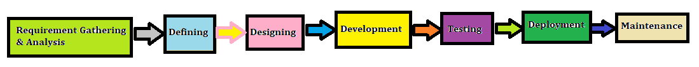
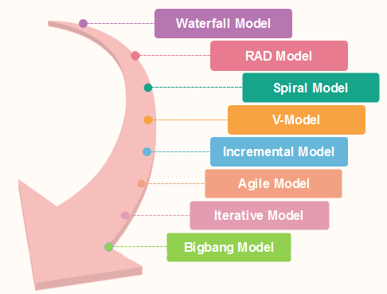

# SDLC – Software Development Life Cycle

**Contents**

1.Introduction of SDLC

2.Stages of SDLC

3.Benefits of SDLC

4.SDLC Models

5.Reference

# 1.Introduction of SDLC

-   **SDLC** stands for Software Development Life Cycle.
-   It is a process that gives a complete idea about developing, designing, and maintaining a software project by ensuring that all the functionalities along with user requirements, objectives, and end goals are addressed.
-   With SDLC, the software project’s quality and the overall software development process get enhanced.

# 2.Stages of SDLC

-   SDLC stages represents the process of developing software.
-   SDLC includes the following stages.

**Stage 1: Requirement Gathering & Analysis Phase**

In an SDLC, this is the first and most crucial phase for a software project’s success. In this phase, communication takes place between stakeholders, end-users, and project teams, as both functional and non-functional requirements are gathered from customers.

*The Requirement Gathering & Analysis Phase of SDLC involves the following*

-   Analysis of functionality and financial feasibility
-   Identifying and capturing requirements of stakeholders through customer interactions like interviews, surveys, etc.
-   Clearly defining and documenting customer requirements in an SRS (Software Resource Specification Document) comprising of all product requirements that need to be developed
-   Creating project prototypes to show the end-user how the project will look.

**For Example**, A client wants to have an application which concerns money transactions. In this method, the requirement has to be precise like what kind of operations will be done, how it will be done, in which currency it will be done, etc.

**Stage 2: Defining Phase**

-   Once the requirement analysis is done, the next stage is to certainly represent and document the software requirements and get them accepted from the project stakeholders.
-   This is accomplished through "SRS"- Software Requirement Specification document which contains all the product requirements to be constructed and developed during the project life cycle.

**Stage 3: Designing Phase**

In the design phase of an SDLC, the architectural design is proposed for the project based on the SRS Document requirements.

*The Designing Phase of SDLC involves the following*

-   Separation of hardware and software system requirements
-   Designing the system architecture based on gathered requirements
-   Creating Unified Modelling Language (UML) diagrams like- use cases, class diagrams, sequence diagrams, and activity diagrams

**Stage 4: Development Phase**

In the entire SDLC, the development phase is considered to be the longest one. In this phase, the actual project is developed and built.

*The Development Phase of SDLC involves the following*

-   Actual code is written
-   Demonstration of accomplished work presented before a Business Analyst for further modification of work
-   Unit testing is performed, i.e., verifying the code based on requirements

**Stage 5: Testing Phase**

Almost all stages of SDLC involves the testing strategy. However, SDLC’s testing phase refers to checking, reporting, and fixing the system for any bug/defect. In this phase, the on-going system or project is migrated to a test environment where different testing forms are performed. This testing continues until the project has achieved the quality standards, as mentioned in the SRS document during the requirement gathering phase.

*The Testing Phase involves the following-*

-   Testing the system as a whole
-   Performing different types of test in the system
-   Reporting and fixing all forms of bugs & defects

**Stage6: Deployment Phase**

-   Once the software is certified, and no bugs or errors are stated, then it is deployed.
-   Then based on the assessment, the software may be released as it is or with suggested enhancement in the object segment.
-   After the software is deployed, then its maintenance begins.

**Stage 7: Maintenance Phase**

-   Once when the client starts using the developed systems, then the real issues come up and requirements to be solved from time to time.
-   This procedure where the care is taken for the developed product is known as maintenance.

# 3.Benefits of SDLC

For any software project, SDLC offers the following benefits

-   With SDLC, one can address the goals and problems so that the project is implemented with the highest precision and accuracy
-   In SDLC, the project members cannot proceed ahead before completion & approval of the prior stages
-   Any installation in the project that has been executed using the SDLC has necessary checks so that it is tested with precision before entering the installation stage
-   With a well-defined SDLC in place, project members can continue the software development process without incurring any complications
-   SDLC offers optimal control with minimum problems, allowing the project members to run the project smoothly

# 4.SDLC Models

-   Various SDLC models are defined and designed to follow the software development process.
-   These models are also known as Software Development Process Models.
-   Each of these models follows a series of steps for ensuring the complete success of a project.

**Some of the most popular SDLC models used for software development include**

-   To know more details about the SDLC models [click here](https://www.javatpoint.com/software-engineering-sdlc-models)

# References

1.https://www.esds.co.in/blog/introduction-to-software-development-life-cycle-sdlc-phases-models/

2.https://www.javatpoint.com/software-engineering-sdlc-models
