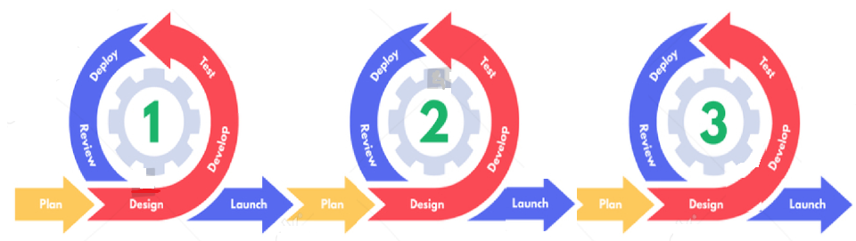
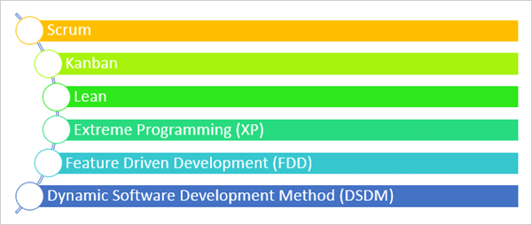
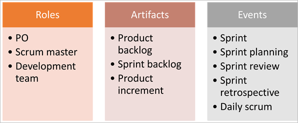
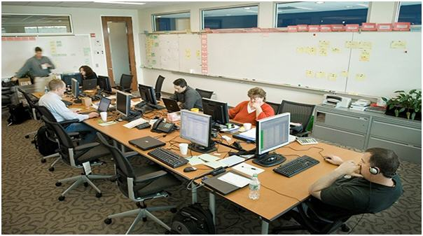
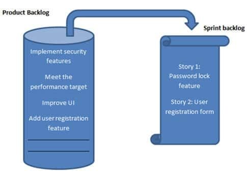
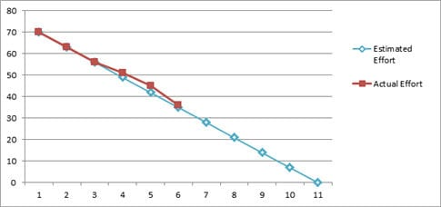
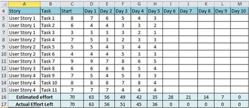
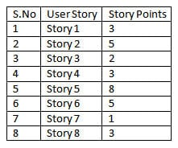

## SDLC- Agile

**Contents**

1.Agile in Software Development

2.History of Agile

3.Agile Challenges

4.What Exactly is Agile?

5.Advantages of Agile Methodology

6.Framework of Agile Methodologies

6.1 Scrum

6.2 Important Scrum Terminologies

6.3 Scrum ceremonies

6.3.1How to keep your Scrum ceremonies effective

6.3.2 Keep your team improving with Scrum ceremonies

7.References

## 1.Agile in Software Development

-   Agile is one of the world’s most widely used and recognized software development framework.
-   Most of the organizations have adopted it in some form or the other but there is still a long way to go in the maturity of their adoption programs.

## 2.History of Agile

-   Agile was born when on one fine day when 17 people with different development methodologies background, got together to brainstorm if there was a possible alternative solution to software development which could lead to faster development time and was less documentation heavy.
-   Thus these champions of different software engineering techniques got together and the end result of their meeting was what they called the “Agile manifesto’.
-   To know more details about “Agile manifesto” [click here.](https://agilemanifesto.org/)

## 3.Agile Challenges

-   Waterfall techniques, time were too cumbersome and had no provision for feedback until the final product was ready to be delivered. It was called a waterfall model of development because the team first finished one step completely and only after that they moved ahead to the next step.
-   This meant that there was no scope for course correction and the customer had no view on the progress until the whole product was ready. And that was what these experts wanted to avoid. They wanted a solution which would have scope for constant feedback in order to avoid the cost of rework at a later stage.
-   And that is why Agile is also about being adaptive and continuous improvement, as much as it is about constant feedback and speed of delivery.

## 4.What Exactly is Agile?

-   Agile is a software development approach where a self-sufficient and cross-functional team works on making continuous deliveries through iterations and evolves throughout the process by gathering feedback from the end users.

    

## 5.Advantages of Agile Methodology

-   The customers continuously get a look and feel of the project progress at the end of each iteration/sprint.
-   Each sprint provides the customer with a working software which meets their expectations as per the definition of done provided by them.
-   The development teams are quite responsive to the changing requirements and can accommodate changes even in the advanced stages of development.
-   There is constant two-way communication which keeps the customers involved, thus all stakeholders – business and technical – have clear visibility on the project’s progress.
-   The design of the product is efficient and fulfills the business requirements.

## 6.Framework of Agile Methodologies

-   There are several Agile methodologies in practice across the world.
-   All these methodologies focus on lean software development and help in building better software effectively and efficiently.
-   The below diagram represents the different frameworks of Agile methodologies.
-   We are going to learn more in detail about Scrum.

## 

## 6.1 SCRUM

**Introduction**

-   Scrum is just one of the frameworks by which you can implement Agile.
-   SCRUM is a process in Agile methodology which is a combination of the Iterative model and the incremental model.
-   The word scrum comes from sports rugby. Where the players huddle together in an interlocked position pushing against the opponents. Each player has a defined role in their position and can play both offensive and defensive as per the demand of the situation.
-   Similarly, the scrum in IT believes in empowered self-managed development teams with three specific and clearly defined roles.
-   These roles include – **Product Owner (PO), Scrum Master (SM) and the development team consisting of the programmers and testers**. They work together in iterative time boxed durations called sprints.
-   An easier way to remember all of this is to memorize the 3-3-5 framework. It means that a scrum project has 3 roles, 3 artifacts, and 5 events.

**Some of the key characteristics of SCRUM include:**

-   Self-organized and focused team.
-   No huge requirement documents, rather have a very precise and to the point stories.
-   The cross-functional teams work together as a single unit.
-   Close communication with the user representative to understand the features.
-   Has a definite timeline of maximum one month.
-   Instead of doing the entire “thing” at a time, Scrum does a little of everything at a given interval.
-   Resources capability and availability are considered before committing anything.

## 6.2 Important SCRUM Terminologies

**1) Scrum Team**

-   The scrum team is a team comprising of 7 with + or – two members.
-   These members are a mixture of competencies and comprise of developers, testers, database people, support people etc. along with the product owner and a scrum master.
-   All these members work together in close collaboration for a recursive and definite interval, to develop and implement the said features.
-   SCRUM team sitting arrangement plays a very important role in their interaction, they never sit in cubicles or cabins, but a huge table.

    

**2) Sprint**

-   Sprint is a predefined interval or time frame in which the work has to be completed and make it ready for review or ready for production deployment. This time box usually lies between 2 weeks to 1 month.
-   In our day to day life when we say that we follow 1-month Sprint cycle, it simply means that we work for one month on the tasks and make it ready for review by the end of that month.

**3) Product Owner**

-   The product owner is the key stakeholder or the lead user of the application to be developed.
-   The product owner is the person who represents the customer side. He/she has the final authority and should always be available for the team.
-   He/she should be reachable when anyone has any doubts that need clarification. It is important for the product owner to understand and not to assign any new requirement in the middle of the sprint or when the sprint has already started.

**4) Scrum Master**

-   Scrum Master is the facilitator of the scrum team.
-   He/she makes sure that the scrum team is productive and progressive.
-   In case of any impediments, scrum master follows up and resolves them for the team. SCRUM Master is the mediator between the PO and the team.
-   He/she keeps the PO informed about the progress of the Sprint. If there are any roadblocks or concerns for the team, discusses with the PO and gets them resolved.

**5) Business Analyst (BA)**

-   A Business Analyst plays a very important role in SCRUM. This person is responsible for getting the requirement finalized and drafted in the requirement docs (based on which the user stories are created).
-   If there are any ambiguities in the User Stories / Acceptance criteria, he/she is the one who is approached by the technical (SCRUM) team and he then takes it up to the PO or else if possible resolves on his own. In large scale projects, there may be more than 1 BA but in small-scale projects, the SCRUM Master may be acting as the BA as well.
-   It is always a good practice to have a BA when the project kick starts.

**6) User Story**

-   User stories are nothing but the requirements or feature which has to be implemented.
-   In the scrum, we don’t have those huge requirements documents, rather the requirements are defined in a single paragraph, typically having the format as:

As a \<User / type of user\>  
I want to \<Some achievable goal/target\>  
To achieve \<some result or reason for doing the thing\>

**7) Epics**

-   Epics are equivocal user stories or we can say that these are the user stories which are not defined and are kept for future sprints.
-   An Epic is just like you next year’s vacation plan, where you just know that you may want to go, but where, when, with whom, all these details you have no idea at this point of time.
-   In a similar way, there are features which are required to be implemented in the future whose details are not yet known. Mostly a feature begins with an Epic and then is broken down to stories which could be implemented.

**8) Product Backlog**

-   The product backlog is a kind of bucket or source where all the user stories are kept. This is maintained by the Product Owner. The product backlog can be imagined as a wishlist of the product owner who prioritizes it as per the business needs.
-   During the planning meeting, one user story is taken from the product backlog, then the team does the brainstorming, understands it and refines it and collectively decides which user stories to take, with the intervention of the product owner.

**9) Sprint Backlog**

-   Based on the priority, user stories are taken from the Product Backlog as one at a time.
-   The Scrum team brainstorms on it determines the feasibility and decides on the stories to work on a particular sprint.
-   The collective list of all the user stories which the scrum team works on a particular sprint is known as Sprint backlog.

**10) Story Points**

-   Story points are a quantitative indication of the complexity of a user story. Based on the story point, estimation and efforts for a story are determined.
-   A story point is relative and not absolute. In order to make sure that our estimate and efforts are correct, it’s important to check that the user stories are not big. The more precise and smaller is the user story, the more accurate will be the estimation.
-   Each and every user story is assigned to a story point based on the Fibonacci series (1, 2, 3, 5, 8, 13&21). Higher is the number, the complex is the story.

**To be precise**

-   If you give 1 / 2 / 3 story point it means that the story is small and of low complexity.
-   If you give points as 5 / 8, it is a medium complex and
-   13 and 21 are highly complex.

**11) Burn down chart**

-   Burn down chart is a graph which shows the estimated v/s actual effort of the scrum tasks.

-   It is a tracking mechanism by which for a particular sprint the day to day tasks are tracked to check whether the stories are progressing towards the completion of the committed story points or not.

**12) Velocity**

-   The total number of story point which a scrum team archives in a sprint, is called Velocity.
-   The Scrum team is judged or referenced by its velocity. Having said that, it should be kept in mind that the objective here is NOT achieving the maximum story points, but to have a quality deliverable, respecting the scrum team’s comfort level.
-   **For Example**: For a particular sprint: the total number of user stories are 8 having story points as shown below.

    

-   So here the velocity will be the sum of the story points = 30

## 6.3 Scrum Ceremonies

-   Scrum ceremonies—also known as Scrum events, Scrum meetings, or Agile ceremonies—are a key component of the Scrum process.
-   The four Scrum ceremonies are:
1.  [Sprint planning](https://www.workfront.com/project-management/methodologies/scrum/sprint-planning)
2.  [Daily stand-up](https://www.workfront.com/project-management/methodologies/agile/daily-stand-up)
3.  [Sprint review](https://www.workfront.com/project-management/methodologies/scrum/sprint-reviews)
4.  [Sprint retrospective](https://www.workfront.com/project-management/methodologies/scrum/sprint-retrospective)
-   These four Scrum ceremonies form the backbone of the Scrum methodology.
-   Sprint planning occurs before the sprint, daily stand-up meetings take place during the sprint, and the review and retrospective come after the sprint has ended.

**1.Sprint planning**

-   If your team starts sprinting without proper planning, everyone will end up running in different directions.
-   The first Scrum ceremony—sprint planning—creates a road map for the upcoming product development sprint.
-   The sprint planning session doesn’t have to be time-consuming; an hour or two should be enough to get everyone on the same page for a one- or two-week sprint.
-   The Scrum team, the product owner, and the Scrum Master should be present at the planning session.

    

-   During the sprint planning session, the team consults the backlog, which is a list of all desired features and bug fixes that the team can select from as they determine what to accomplish during the sprint.
-   During the sprint planning meeting, the Scrum team will estimate how many items from the backlog they can complete with their existing resources. The Scrum Master facilitates the meeting, the product owner clarifies the details and requirements of the backlog items, and the team members define the work and effort necessary to complete each backlog item chosen for the sprint. A centralized work management platform may be used to organize the full backlog as well as each individual sprint.

**2.Daily stand-up**

-   Stand-up meetings—also called the daily Scrum—ensure the sprint is proceeding effectively.
-   Traditionally, Scrum Masters keep the daily Scrum to no longer than 15 minutes. These stand-up meetings are informal gatherings designed to help identify any roadblocks and allow team members to describe their current tasks, goals, and obstacles.

    

-   Ideally, the daily Scrum should take place at the beginning of the day with the Scrum Master, product owner, and complete Scrum team. While many teams choose to have their daily meetings in-person, remote get-togethers are also effective.
-   One way to prevent daily Scrums from exceeding 15 minutes is to ensure everyone is on the same page before the meetings begin. Many Scrum teams use a modern work management platform to help track each component’s progress. If the Scrum Master or product owner notices that someone is falling behind, they can ask about the issue even before the daily meeting.
-   The daily Scrum keeps each team member accountable. While leaders should never belittle or embarrass team members at stand-ups, the requirement to report progress each day can motivate developers to stay efficient and productive.

**3.Sprint review**

-   After the team has completed the sprint, it’s time to meet with the stakeholders in a sprint review meeting (also called an “iteration review”).

    

-   The Scrum team, Scrum Master, and product owner meet with other teams, managers, and executives to showcase what they accomplished during the sprint. Ideally, the sprint review allows each team member to participate. The review’s tone should be enthusiastic and positive—it’s an excellent opportunity to celebrate the team’s accomplishments.
-   Of course, Scrum teams should also solicit feedback from stakeholders. In many cases, teams may need to change or update the products they built during the sprint. Revision requests aren’t a bad thing; a continually iterative, evolving process is the essence of the Scrum philosophy.
-   The sprint review should last as long as necessary to fully demonstrate the team’s new technology and have a productive conversation with stakeholders. After the sprint review, Scrum teams move on to the sprint retrospective.

**4.Sprint retrospective**

-   The final Scrum ceremony is the sprint retrospective. During this last phase, the development team, the Scrum Master, and the product owner meet to discuss the sprint’s successes, challenges, and insights. The retrospective usually lasts around an hour.
-   Using feedback from stakeholders and the Scrum Master, the team should identify how it can improve its processes to have more effective sprints in the future. Agility and adaptability are core values of the Scrum process, so teams should strive to identify potential improvements without blame or judgment.

    

## 6.3.1How to keep your Scrum ceremonies effective

-   One way to ensure your Scrum sprints and ceremonies are as efficient as possible is to designate a Scrum Master. The Scrum Master is a team member responsible for ensuring the team stays organized and on task during its sprint. Scrum Masters coordinate daily Scrums and ensure everyone is on the same page. Some Scrum Masters rely on work management software to help track questions, accountabilities, and progress.
-   Despite being called a “master,” Scrum Masters don’t have direct authority over other team members. Instead, the Scrum Master is a servant-leader who works alongside product developers. You can think of a Scrum Master as more of a coach or a guide than a direct supervisor in a hierarchical structure.

## 6.3.2 Keep your team improving with Scrum ceremonies

-   Scrum ceremonies are a vital part of the Scrum process. Don’t neglect them just because your team is short on time. According to the Scrum Alliance, 86% of respondents have initial planning sessions, 87% hold daily Scrum meetings, and 81% take the time for a Scrum retrospective. Scrum ceremonies empower teams to plan, maintain, and learn from sprints, ensuring a cycle of continuous improvement and steady productivity.

## 7.References

1.https://www.softwaretestinghelp.com/agile-scrum-methodology-for-development-and-testing/

2\. https://www.workfront.com/project-management/methodologies/scrum/ceremonies
